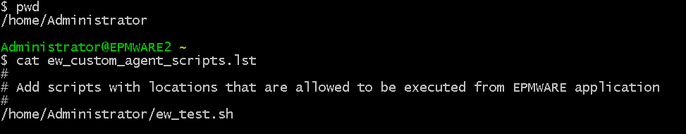

# **Agent API Functions**

**Package**: `EW_AGENT_API`  
**Usage**: `ew_agent_api.<function_name>`

The purpose of this package is to invoke custom agent scripts from the Logic Builder. Custom tasks in the workflow can leverage this API to execute certain commands on the remote server using the EPMware agent.

This API you can also transfer/send files for servers which have On- Prem Agents as well as those which do not have agents but SSH is enabled on those servers and its username and password or Identity key is provided in EPMWARE.

## Run Remote Script 

These functions can be referred to as ew_agent_api.exec_agent_cmd

Before calling this function, the following prerequisites need to be satisfied:

 - On the target server, add the name with the full path of the script to be executed by this remote agent in the file “ew_custom_agent_scripts.lst”. This file is located in the home directory of the EPMware target Agent.
 - Commands passed to the Agent API entered in this file will be matched and if they exist it will be executed. This will prevent calling any unauthorized script from the Agent API.

For example, as shown below, “ew_test.sh” is a remote script that could be executed by the Agent API.
<br/>

<br/>

```sql

  exec_agent_cmd
                   (p_app_name          IN VARCHAR2
                   ,p_agent_cmd         IN VARCHAR2
                   ,p_agent_type        IN VARCHAR2 DEFAULT 'D' -- Reserved
                   ,p_send_files        IN VARCHAR2 DEFAULT 'N'
                   ,p_output_file_name  IN VARCHAR2 DEFAULT NULL
                   ,p_output_file_loc   IN VARCHAR2 DEFAULT NULL
                   ,p_dep_file_loc      IN VARCHAR2 DEFAULT 'stage'
                   ,p_agent_cmd_type    IN VARCHAR2 DEFAULT NULL
                   ,p_timeout_minutes   IN NUMBER   DEFAULT 15
                   ,p_param_name_1      IN VARCHAR2 DEFAULT NULL
                   ,p_param_value_1     IN VARCHAR2 DEFAULT NULL
                   ,p_param_name_2      IN VARCHAR2 DEFAULT NULL
                   ,p_param_value_2     IN VARCHAR2 DEFAULT NULL
                   ,p_param_name_3      IN VARCHAR2 DEFAULT NULL
                   ,p_param_value_3     IN VARCHAR2 DEFAULT NULL
                   ,p_param_name_4      IN VARCHAR2 DEFAULT NULL
                   ,p_param_value_4     IN VARCHAR2 DEFAULT NULL
                   ,p_param_name_5      IN VARCHAR2 DEFAULT NULL
                   ,p_param_value_5     IN VARCHAR2 DEFAULT NULL
                   ,p_param_name_6      IN VARCHAR2 DEFAULT NULL
                   ,p_param_value_6     IN VARCHAR2 DEFAULT NULL
                   ,p_param_name_7      IN VARCHAR2 DEFAULT NULL
                   ,p_param_value_7     IN VARCHAR2 DEFAULT NULL
                   ,p_param_name_8      IN VARCHAR2 DEFAULT NULL
                   ,p_param_value_8     IN VARCHAR2 DEFAULT NULL
                   ,p_param_name_9      IN VARCHAR2 DEFAULT NULL
                   ,p_param_value_9     IN VARCHAR2 DEFAULT NULL
                   ,p_param_name_10     IN VARCHAR2 DEFAULT NULL
                   ,p_param_value_10    IN VARCHAR2 DEFAULT NULL
                   ,x_status            OUT VARCHAR2
                   ,x_message           OUT VARCHAR2
                  );
```

<br/>

| Parameter Name | Expected Value | Required |
| --- | --- | --- |
| p_app_name | Application Name | Yes |
| p_agent_cmd | Remote Script name with full path.<br>Note: This should match with the entry in the file “ew_custom_agent_scripts.lst” on the remote (Target) server. | Yes |
| p_agent_type | D (Reserved for future use) | Yes |
| p_send_files | N (Reserved for future use) | Yes |
| p_output_file_name | Name of the output file generated by the custom script. <br><br>Note: If value is not provided then default name will be generated based on TASK_ID and assigned. | No |
| p_output_file_loc | Location of the output file generated by the custom script<br>.<br>Note: If the value is not provided then the default location under “stage” folder will be used. | No |
| p_dep_file_loc | Stage (Reserved for future use) | No |
| p_agent_cmd_type | Agent Command Type (Reserved for future use) | No |
| p_timeout_minutes | Maximum Time (in Minutes) allocated for the Remote Agent script to complete its task. Default value is 15 minutes | No |
| p_param_name_<nn> | Parameter Name.<br><br>Note: Agent API Script will pass values for optional parameters. Parameter names are stored for audit purposes in EPMware. Only Values are passed. | No |
| p_param_value_<nn> | Parameter Value.<br><br>Note: Agent API Script will pass values for optional parameters. Parameter names are stored for audit purposes in EPMware. Only Values are passed. | No |
| x_status | RETURN Status code. S for success and E for Error | N/A |
| x_message | RETURN Error Message | N/A |


## Remote Custom Script requirements

Remote scripts will be passed the following parameters :

1.	Fixed Parameters

    - Task ID (There will be a folder created under the stage folder on the remote server automatically with this task id as the folder name. This folder can be used to generate log or output files by the custom script if needed).
    - Application Type
    - Action (Fixed value passed: CUSTOM)
    - Application Name
    - Application Version
    - Application User Name
    - Application Password
  
2.	Script Parameters

    - Parameter values (1 to 10)  passed to the Agent API 

## Send Files


Using ew_agent_api.send_files you can send files from EPMWARE to remote servers.

Pre-requisites

  - Server has to be registered in the EPMWARE application under the Infrastructure/Servers page. If the server does not have an On-Premise Agent installed and configured then the Username and password or Identity Key should be provided.
  - “Test Connection” should be successful before attempting to send files.


API : ew_agent_api.send_files


API Parameters :


| Parameter Name | Expected Value | Required |
| --- | --- | --- |
| p_app_name | Application Name | Yes |
| p_server_name | Server Name (EPMWARE Name of the Servers ) | Yes |
| p_file_name | File Name to be sent | Yes |
| p_file_data | File Data to be sent (BLOB type) | Yes |
| p_remote_loc | Remote Location where file to be saved | No |
| x_agent_task_id | RETURNS Agent Task ID | N/A |
| x_status | RETURN Status code. S for success and E for Error | N/A |
| x_message | RETURN Error Message | N/A |


## Get Files


Using ew_agent_api.get_files you can retrieve files from remote servers.

Pre-requisites:

  - Server has to be registered in the EPMWARE application under the Infrastructure/Servers page. If the server does not have an On-Premise Agent installed and configured then Username and Password or Identity Key should be provided.
  - “Test Connection” should be successful before attempting to send files.


API : ew_agent_api.get_files


API Parameters


| Parameter Name | Expected Value | Required |
| --- | --- | --- |
| p_app_name | Application Name | Yes |
| p_server_name | Server Name (EPMWARE Name of the Servers ) | Yes |
| p_file_wildcard | Files to be retrieved matching this wildcard (Use * as a wildcard) | Yes |
| p_remote_loc | Remote Location where file to be saved | No |
| p_delete_after_receive | Should files be deleted after successfully retrieving (Default is  N) | Yes |
| p_archive_loc | Directory where files are archived on the remote location after successfully retrieving (if Delete is not enabled). This is an optional parameter. | No |
| x_file_count | RETURNS # of files retrieved | N/A |
| x_files_tbl | RETURNS List of files retrieved<br><br>Data Type is ew_agent_api.g_files_tbl<br><br>This is a table of Records.<br>Record fields are<br>File_name<br>File_data (BLOB)<br>file_id | N/A |
| x_agent_task_id | RETURNS Agent Task ID | N/A |
| x_status | RETURN Status code. S for success and E for Error | N/A |
| x_message | RETURN Error Message | N/A |


## Execute Deployment


Using ew_agent_api.exec_direct_deploy API Direct Deployment can be triggered for a dimension and optionally for a request, request line. Example, if user wants to run an Export and use files generated by Export as a source for deployment then this API becomes useful. Another example is if users want to deploy metadata to a specific application from the custom task in a workflow.


Pre-requisites:

  - Deployment Manager already exists as specified in the parameter.


API : ew_agent_api. exec_direct_deploy

```sql 
  PROCEDURE exec_direct_deploy
                   (p_app_name                IN VARCHAR2
                   ,p_app_dimension_id        IN NUMBER DEFAULT NULL
                   ,p_request_line_id         IN NUMBER DEFAULT NULL
                   ,p_dep_file_name           IN VARCHAR2
                   ,p_dep_file_data           IN BLOB
                   ,p_override_agt_params     IN ew_global.g_value_tbl
                   ,p_dep_config_name         IN VARCHAR2
                   ,p_user_id                 IN NUMBER
                   ,x_deployment_id           OUT NUMBER
                   ,x_status                 OUT VARCHAR2
                   ,x_message                OUT VARCHAR2
                  );

```

API Parameters :


| Parameter Name | Expected Value | Required |
| --- | --- | --- |
| p_app_name | Application Name | Yes |
| p_app_dimension_id | Dimension ID (Can be Null) | No |
| P_request_line_id | Request Line ID (Can be Null) | No |
| P_dep_file_name | Deployment File Name | Yes |
| P_dep_file_data | Deployment File Data (BLOB type) | Yes |
| P_override_agt_params | Override Default Agent Parameters that are used for Direct Deployment of the Application<br>(Can be Null) | Yes |
| P_user_id | User ID for audit trail | Yes |
| x_deployment_id | RETURN Deployment ID submitted by the API | N/A |
| x_status | RETURN Status code. S for success and E for Error | N/A |
| x_message | RETURN Error Message | N/A |


*Example*: In this example, whenever an export is executed for one of the OneStream dimension for specific members of a dimension then it should automatically load that exported metadata into a custom table in OneStream application.

This script registered as a “Post Export Generation Tasks” Logic Script once attached to a specific Export will invoke this Direct Deploy API. It is assumed that OneStream Business Rule is already created in the OneStream Application.


```sql 


/* 
   Author  : Deven Shah
   Purpose : Export Metadata to Custom Table after Export is executed
   History
   --------------------------------------------------------------------
   Date      | By   | Notes
   --------------------------------------------------------------------
   19-May-25 | Deven| Initial Version 
*/
DECLARE
  c_script_name          VARCHAR2(50)  := 'EW_SPEND_EXPORT_TO_CUSTOM_TABLE';
  c_exp_id               NUMBER        := ew_lb_api.g_exp_id;
  c_dep_config_name      VARCHAR2(100) := 'OS_Export_Custom_Table';
  c_os_dm_sequence_step  VARCHAR2(100) := 'EPMWARE_LOAD_CUSTOM_TABLE';
  --
  l_message              VARCHAR2(2000);
  l_status               VARCHAR2(1);
  l_deployment_id        NUMBER;
  l_override_agt_params  ew_global.g_value_tbl;
  --
  CURSOR cur_exp
  IS
    SELECT c.app_name,e.output_file, e.output_file_name,e.created_by
    FROM ew_exp_executions e
        ,ew_exp_config_dims_v c
    WHERE 1=1
    AND e.exp_config_id = c.exp_config_id
    AND e.exp_id = c_exp_id
    ;  
  PROCEDURE log(p_msg IN VARCHAR2)
  IS
  BEGIN
    ew_debug.log(p_msg,ew_debug.show_always,c_script_name);
  END;
BEGIN
  ew_lb_api.g_status  := ew_lb_api.g_success;
  ew_lb_api.g_message := NULL;

  l_override_agt_params('OS_BIZ_RULE_SEQUENCE_NAME') := c_os_dm_sequence_step;
  FOR rec IN cur_exp
  LOOP
    ew_agent_api.exec_direct_deploy
                 (p_app_name                => rec.app_name
                 ,p_app_dimension_id        => NULL
                 ,p_request_line_id         => NULL
                 ,p_dep_file_name           => rec.output_file_name
                 ,p_dep_file_data           => rec.output_file
                 ,p_override_agt_params     => l_override_agt_params
                 ,p_dep_config_name         => c_dep_config_name
                 ,p_user_id                 => rec.created_by
                 ,x_deployment_id           => l_deployment_id
                 ,x_status                  => l_status
                 ,x_message                 => l_message
                );
    ew_debug.log('Deployment : '||l_deployment_id|| ' ' ||
                 l_status||' '||l_message);
  END LOOP;
END;

```


## Next Steps

- [Appendices](../../appendices/index.md)
- [API Overview](../index.md)
- [Script Examples](../../events/index.md)