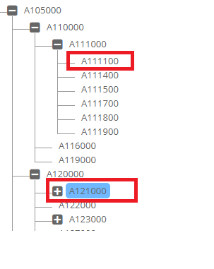

# **Hierarchy API Functions**

These functions can be referred to as ew_hierarchy."Function Name"


##Package : `EW_HIERARCHY`  

Usage   : `ew_hierarchy.<function_name>`


### Get Application Name

Returns the actual member name with correct case sensitivity.

```sql

FUNCTION get_app_name (p_app_id IN VARCHAR2)
RETURN VARCHAR2;
```


### Get Dimension ID


```sql

 FUNCTION get_app_dimension_id (p_app_name IN VARCHAR2
                               ,p_dim_name IN VARCHAR2
                                )
 RETURN NUMBER;

```

### Get Dimension Information


```sql

/* p_what will accept following parameter values
APP_ID
APP_NAME
DIMENSION_NAME
DIM_CLASS_NAME
APP_AND_DIM_NAME
*/

get_app_dim_attrib (p_app_dimension_id IN NUMBER
                   ,p_what             IN VARCHAR2
                   );


```

For example, if the app dimension id of application “ASO” is 123 then depending on parameter p_what following values will be returned by this function. 

Assumptions: App ID is 1, App Dimension id is 123, dimension class is Measures.


| P_WHAT | Returned Values | Example (Apply ew_hierarchy package prefix to function. For example, ew_hierarchy.get_app_dim_attrib) |
| --- | --- | --- |
| APP_ID | 1 | get_app_dim_attrib(123,’APP_ID’) |
| APP_NAME | ASO | get_app_dim_attrib(123,’APP_NAME’) |
| DIMENSION_NAME | Accounts | get_app_dim_attrib(123,’DIMENSION_NAME’) |
| DIM_CLASS_NAME | Measures | get_app_dim_attrib(123,’DIM_CLASS_NAME’) |
| APP_AND_DIM_NAME | ASO/Accounts | get_app_dim_attrib(123,’APP_AND_DIM_NAME’) |


### Get Property Display Value

Provide Display value for a given member's LOV type Property codes.<br/>
For example, the Internal stored property value for Data Storage property is X (Dynamic Calc) and you need to determine the display value which is “Dynamic Calc” then use this function.


```sql

  /* 
     Provide Display value for a given member's LOV type Property codes
     For example, the Internal stored property value for Data Storage property is X (Dynamic Calc) 
     and you need to determine the display value which is “Dynamic Calc” then use this function.
  */

  FUNCTION get_prop_disp_value (p_app_dimension_id IN NUMBER
                               ,p_prop_id          IN NUMBER
                               ,p_prop_value       IN VARCHAR2
                               )
  RETURN VARCHAR2;

```


### Is Leaf (OR Base member)


```sql

  -- Check if member is leaf (OR Base Member) or not
   
  FUNCTION is_leaf(p_member_id        IN NUMBER
                  ,p_app_dimension_id IN NUMBER
                  )
  RETURN VARCHAR2;

  FUNCTION is_leaf(p_app_name    IN VARCHAR2
                  ,p_dim_name    IN VARCHAR2
                  ,p_member_name IN VARCHAR2
                  )
  RETURN VARCHAR2;


```


### Get Member Property Value


```sql

FUNCTION get_member_prop_value
                  (p_app_name         IN VARCHAR2
                  ,p_dim_name         IN VARCHAR2
                  ,p_member_name      IN VARCHAR2
                  ,p_prop_label       IN VARCHAR2
                  );

```


### Get Ancestors Having Property Value


```sql
/*
  Provide list of Ancestors separated by comma (OR any other character) having a specific property value 
  for a specific prop.
  p_list_or_count parameter will accept the following options.
    - LIST
    - COUNT
    - EXISTS 
    - FIRST
    - LAST
   LIST will provide member names separated by a comma
*/

  FUNCTION ancestors_having_prop_value(p_app_dimension_id  IN NUMBER
                                      ,p_member_name       IN VARCHAR2
                                      ,p_prop_name         IN VARCHAR2
                                      ,p_prop_value        IN VARCHAR2
                                      ,p_sep               IN VARCHAR2 DEFAULT ','
                                      ,p_list_or_count     IN VARCHAR2 DEFAULT 'LIST'
                                      ,p_append_wildcard   IN VARCHAR2 DEFAULT 'N'
                                      )
  RETURN VARCHAR2;
  
  
/*
  SAME as above but accepts parent_member_name as an additional parameter. 
  Use this function if the branch on which this function need to be executed has Shared Instances of a member.
*/


  FUNCTION ancestors_having_prop_value(p_app_dimension_id  IN NUMBER
                                      ,p_parent_member_name IN VARCHAR2
                                      ,p_member_name       IN VARCHAR2
                                      ,p_prop_name         IN VARCHAR2
                                      ,p_prop_value        IN VARCHAR2
                                      ,p_sep               IN VARCHAR2 DEFAULT ','
                                      ,p_list_or_count     IN VARCHAR2 DEFAULT 'LIST'
                                      ,p_append_wildcard   IN VARCHAR2 DEFAULT 'N'
                                      )
  RETURN VARCHAR2;

```

### Get Descendants Having Property Value

```sql

-- Provide list or count of Descendants having value for specific prop
-- p_list_or_count parameter will accept the following options. 
-- LIST, COUNT, EXISTS, FIRST, LAST

  FUNCTION descendants_having_prop_value
              (p_app_dimension_id  IN NUMBER
              ,p_member_name       IN VARCHAR2
              ,p_prop_name         IN VARCHAR2
              ,p_prop_value        IN VARCHAR2
              ,p_sep               IN VARCHAR2 DEFAULT ','
              ,p_list_or_count     IN VARCHAR2 DEFAULT 'LIST'
              ,p_append_wildcard   IN VARCHAR2 DEFAULT 'N'
              )
  RETURN VARCHAR2;

```


### Check All Descendants Having Same Property Value

```sql

-- Return Y or N if all descendants have same property value or not
-- for a given property name
-- If p_prop_value parameter is provided then all descendants must have
-- that value for that property.

FUNCTION descendants_having_same_prop_value
                         (p_app_dimension_id  IN NUMBER
                         ,p_member_name       IN VARCHAR2
                         ,p_prop_name         IN VARCHAR2
                         ,p_prop_value        IN VARCHAR2 DEFAULT NULL
                         )
RETURN VARCHAR2

```


### Get Children Having Property Value

```sql

  -- Provide list or count of children having value for specific property
  -- p_list_or_count parameter will accept the following options. 
  -- LIST, COUNT, EXISTS, FIRST, LAST
  
  FUNCTION children_having_prop_value
            (p_app_dimension_id  IN NUMBER
            ,p_member_name       IN VARCHAR2
            ,p_prop_name         IN VARCHAR2
            ,p_prop_value        IN VARCHAR2
            ,p_sep               IN VARCHAR2 DEFAULT ','
            ,p_list_or_count     IN VARCHAR2 DEFAULT 'LIST'
            ,p_append_wildcard   IN VARCHAR2 DEFAULT 'N'
            )
  RETURN VARCHAR2;

```


### Get Parent Members

```sql

 FUNCTION get_parent_members 
     (p_app_dimension_id IN NUMBER
     ,p_member_name IN VARCHAR2
     ,p_top_member_name IN VARCHAR2 DEFAULT NULL
     ,p_node_type IN VARCHAR2 DEFAULT 'ALL'
     ,p_sep IN VARCHAR2 DEFAULT ','
     )
 RETURN VARCHAR2;

```


### Get Branch Member

```sql

/* Get a specific branch member for given member name in a dimension
    If level is +ve number then level is counted from top
     -> 1 is the top node
     -> 2 is the immediate parent member and so on until the current member is reached.
     
    If level is -ve number then current member level is -1 and its parent is -2 and so on.
  */


  FUNCTION get_branch_member  (p_app_dimension_id IN NUMBER
                              ,p_member_name      IN VARCHAR2
                              ,p_level            IN NUMBER
                              )
  RETURN VARCHAR2

```


### Get Branch Members that Qualify

```sql

/* 
  Get specific branch Member for given member name in a dimension
  within a specific branch
  Levels are counted from top
  1 is the root node and so on till the current member is reached.
  
  This is useful in Derived Properties when member’s primary or shared branch(es) need to be scanned for a specific level.
  As members can have multiple shared branches, top level members can be used to determine a specific branch of the member.
  Qualification criteria is a list of members the branch member of that level must match.
  You can specific multiple levels separated by ~ character
  
  Example,
  p_levels => 3,5,8,6
  p_level_lists => A101,A102~A501~A601~A701,A702
  Function will return member name if one of the levels qualifies in the order specified. 
  In this example, if Level 3 qualifies meaning if it is either A101 OR A102 then return that member. 
     If not, then check if Level 5 is A501 and so on.
  If nothing is qualified, then return null.
  */
  
  FUNCTION get_branch_member_qualified
               (p_app_dimension_id IN NUMBER
               ,p_top_member_name  IN VARCHAR2
               ,p_member_name      IN VARCHAR2
               ,p_levels           IN VARCHAR2 -- Example : 3,5,8,6
               ,p_level_lists      IN VARCHAR2 -- A101,A102~A501~A601~A701,A702
               )
  RETURN VARCHAR2
  

```

### Get Member Dimension Name

```sql

 /*
  Return Dimension Name of member in the application.
  If there are multiple dimensions having the same member then the function will return ALL dimensions separated by a comma. 
  Optionally you can specify the Dimension Class Name to search for the member in dimensions of that class only.
 */

  FUNCTION get_member_dim_names
                  (p_app_id      IN NUMBER
                  ,p_member_name IN VARCHAR2
                  ,p_dim_class_name IN VARCHAR2 DEFAULT NULL
                  )
  RETURN VARCHAR2;

```


### Get Ancestor having Specific Property Value

```sql

  -- Criteria : LIST, COUNT, EXISTS, FIRST, LAST
  -- FIRST or LAST (while traversing from bottom to top)
  -- * in prop value means any non null value in properties
  -- Note: This function uses Primary instance of the given member
  -- for getting ancestors having specific property value.
  -- For All (Primary as well as Shared instances) of a node
  -- having ancestors with specific property values, use overloaded
  -- function specified in the next section (Same Function name).
  
  FUNCTION get_ancestor_having_prop_value
                    (p_app_dimension_id  IN NUMBER
                    ,p_member_name       IN VARCHAR2
                    ,p_prop_name         IN VARCHAR2
                    ,p_prop_value        IN VARCHAR2
                    ,p_criteria          IN VARCHAR2 DEFAULT 'FIRST'
                    ,p_append_wildcard   IN VARCHAR2 DEFAULT 'N'
                    )
  RETURN VARCHAR2
 
  /* This is an overloaded API with one additional parameter p_parent_member_name
     This will help when ancestors of a Shared nodes need to be derived.
  */
    
  FUNCTION get_ancestor_having_prop_value
                    (p_app_dimension_id   IN NUMBER
                    ,p_parent_member_name IN VARCHAR2
                    ,p_member_name        IN VARCHAR2
                    ,p_prop_name          IN VARCHAR2
                    ,p_prop_value         IN VARCHAR2
                    ,p_criteria           IN VARCHAR2 DEFAULT 'FIRST'
                    ,p_append_wildcard    IN VARCHAR2 DEFAULT 'N'
                    )
  RETURN VARCHAR2

```


### Get Ancestors for a given Member Name

```sql

--  order type : LEVEL or GENERATION
--  Generation is from top to bottom ancestors and 
--  Level is from bottom to the top ancestors
--  Members are separated by Tilde character (~)

FUNCTION get_ancestors(p_app_dimension_id IN NUMBER
                      ,p_member_name      IN VARCHAR2
                      ,p_order_type       IN VARCHAR2 DEFAULT 'LEVEL'
                      ,p_include_member   IN VARCHAR2 DEFAULT 'N'
                      )
RETURN VARCHAR2;

```


### Get Descendant having Specific Property Value

```sql
  
  /*
    Criteria : LIST, COUNT, EXISTS, FIRST, LAST
    FIRST or LAST (while traversing from immediate descendant to the last base member)
  */
  
  FUNCTION get_descendant_having_prop_value
                    (p_app_dimension_id  IN NUMBER
                    ,p_member_name       IN VARCHAR2
                    ,p_prop_name         IN VARCHAR2
                    ,p_prop_value        IN VARCHAR2
                    ,p_criteria          IN VARCHAR2 DEFAULT 'FIRST'
                    ,p_append_wildcard   IN VARCHAR2 DEFAULT 'N'
                    )
  RETURN VARCHAR2;


```


### Get Descendants Count

```sql
  
  -- Pass Member ID as input parameter.

    FUNCTION get_descendants_count (p_member_id IN NUMBER)
    RETURN NUMBER;
  
  -- Pass Dimension ID and Member Name as input parameters.
  
    FUNCTION get_descendants_count (p_app_dimension_id IN NUMBER
                                   ,p_member_name      IN VARCHAR2
                                   )
    RETURN NUMBER;


```


### Get Descendants

Retrieves all descendants into a PL/SQL Collection (Array).
A Collection is an array of records. Record type is ew_hierarchy_members_v.

Node Type Parameter options are: BASE_MEMBERS, PARENT_MEMBERS or ALL


```sql
  
  -- Pass Member ID as input parameter.

  PROCEDURE get_descendants 
                     (p_app_dimension_id IN NUMBER
                     ,p_member_id        IN NUMBER
                     ,p_node_type        IN VARCHAR2
                     ,x_hier_members_tbl IN OUT g_hier_members_tbl
                     ) 
  G_hier_members_tbl is type defined in the EW_HIERARCHY Package as 
  TYPE g_hier_members_tbl IS TABLE OF ew_hierarchy_members_v%ROWTYPE
                            INDEX BY BINARY_INTEGER;
  
  Most useful Columns of the record:
   -  Member_id
   -  Member_Name
   -  Parent_member_id
   -  Parent_Member_name
   -  Primary_flag (Y or N)
   -  App_Dimension_id
   -  Member_Status

```


### Get Member Property Value

There are four functions to retrieve a member's specific property value.

If the property is an alias type (in EPMware it is also referred to as an Array type) then optionally specify the alias table name (or Array member Name) with a colon (:) as a separator.

For example, property Label parameters can be Alias, Alias:Default or Description:English


```sql
  
  -- Get property value for passed hierarchy_id and dimension_id
  FUNCTION get_member_prop_value
                          (p_prop_label       IN VARCHAR2
                          ,p_hierarchy_id     IN NUMBER
                          ,p_app_dimension_id IN NUMBER
                          )
  RETURN VARCHAR2;

 
  -- Get Property Value for a given member
  FUNCTION get_member_prop_value
                          (p_app_name          IN VARCHAR2
                          ,p_dim_name          IN VARCHAR2
                          ,p_member_name       IN VARCHAR2
                          ,p_prop_label        IN VARCHAR2
                          )
  RETURN VARCHAR2;

  -- Get Value using App Dimension ID, Member name and Property Name
  -- (Rather Property Label)
  FUNCTION get_member_prop_value
                          (p_app_dimension_id  IN NUMBER
                          ,p_member_name       IN VARCHAR2  
                          ,p_prop_name         IN VARCHAR2
                          )


  /* 
     Get Property Value for a given member and its parent member
     This is used for getting property values for Shared nodes where property can have a different value for its shared nodes.

     For example, Data Storage property will be “Shared” for Shared instances in Essbase and Planning apps.
  */
  FUNCTION get_node_prop_value
                          (p_app_name           IN VARCHAR2
                          ,p_dim_name           IN VARCHAR2
                          ,p_member_name        IN VARCHAR2
                          ,p_parent_member_name IN VARCHAR2
                          ,p_prop_label         IN VARCHAR2
                          )
  RETURN VARCHAR2;


```


### Get Child Member’s Property Values

This API will scan all child members (not descendants but just immediate child members) for specific property name and return its values separated by a comma. 

Maximum concatenation of such values should not exceed 2000 characters. If it exceeds then it will return first 2000 characters only.


```sql
  
ew_hierarchy.get_child_member_prop_values
  (p_app_dimension_id   IN NUMBER
  ,p_parent_member_name IN VARCHAR2 
  ,p_prop_name          IN VARCHAR2
  ,p_unique_values_only IN VARCHAR2 –-- Y or N
  ,p_sep                IN VARCHAR2 --- Default Value is comma char
  )
```


For example, the below SQL can be used in Derived Properties (Derived SQL of a property to show values UDA property of child members)

```sql

SELECT ew_hierarchy.get_child_member_prop_values
                     (p_app_dimension_id   => :app_dimension_id
                     ,p_parent_member_name => ':member_name' 
                     ,p_prop_name          => 'UDA'
                     ,p_unique_values_only => 'Y'
                     ,p_sep                =>  ','
                    ) child_props
FROM dual


```


## Get Ancestor Property Value

```sql

  get_ancestor_prop_value
           (p_app_dimension_id  IN NUMBER
           ,p_member_name       IN VARCHAR2
           ,p_prop_name         IN VARCHAR2
           ,p_level             IN NUMBER
           )

  /* Level 1 → root node
     Level 2 → Members under the Root node and so on
  */


```


## Get Child Nodes Count

```sql

  -- Get # of shared OR primary or total nodes for a parent member
  /*
    NODE_TYPE -> ALL Primary and Shared
                 PRIMARY_ONLY
                 SHARED_ONLY
  */
  
  FUNCTION get_child_nodes_count
                 (p_app_dimension_id    IN NUMBER
                 ,p_parent_member_name  IN VARCHAR2
                 ,p_node_type           IN VARCHAR2 DEFAULT 'ALL'
                 )
  RETURN NUMBER;

```


## Get Primary Parent Member

Use one of the following functions to retrieve the Primary Parent Member Name or ID of a Member.

```sql

  FUNCTION get_primary_parent_name(p_app_dimension_id IN NUMBER
                                  ,p_member_name      IN VARCHAR2
                                )
  RETURN VARCHAR2;


  -- Get Parent member of Primary node of given member
 
  FUNCTION get_primary_parent_name(p_app_name     IN VARCHAR2
                                  ,p_dim_name     IN VARCHAR2
                                  ,p_member_name  IN VARCHAR2
                                 )
  RETURN VARCHAR2;

  FUNCTION get_primary_hierarchy_rec (p_member_id IN NUMBER)
  RETURN ew_hierarchy_members_v%ROWTYPE;

  FUNCTION get_primary_hierarchy_id (p_member_id IN NUMBER)
  RETURN NUMBER;

  FUNCTION get_primary_hierarchy_id 
                 (p_app_dimension_id IN NUMBER
                 ,p_member_name      IN VARCHAR2
                 ,p_case_match       IN VARCHAR2 DEFAULT 'N'
                 )
  RETURN NUMBER;

```


## Get Parent Members List

This procedure will provide a list of parent members by scanning the hierarchy starting from the given top member name (default is root).<br/>
Optionally, filter records by specifying node type (Primary versus all shared nodes or both).


```sql

  /* Get All Parent Member Names 
    NODE_TYPE -> ALL Primary and Shared
                 PRIMARY_ONLY
                 SHARED_ONLY
  */
  PROCEDURE get_parent_members 
              (p_app_dimension_id IN NUMBER
              ,p_member_name      IN VARCHAR2
              ,p_top_member_name  IN VARCHAR2 DEFAULT NULL
              ,p_node_type        IN VARCHAR2 DEFAULT 'ALL'
              ,x_parent_members   OUT ew_global.g_char_tbl
              )

  Returned value is an array of VARCHAR2(2000).
  
  TYPE g_char_tbl   IS TABLE OF VARCHAR2(2000) INDEX BY BINARY_INTEGER;
  
  Note: You can declare a variable in your Logic Script for this type as
  l_parent_members ew_global.g_char_tbl;


```


## Check Ancestor having Property Value

If you need to determine if any of the ancestors of a given member has a specific property value for specific property.<br/> 
If found, then the member name of that ancestor will be returned.

```sql

  /* Get Property Value for any ancestor of a given member and if it matches then return that ancestor name
  */
  FUNCTION chk_ancestor_prop_value
                 (p_prop_label       IN VARCHAR2
                 ,p_member_id        IN NUMBER
                 ,p_app_dimension_id IN NUMBER
                 ,p_prop_value       IN VARCHAR2
                 ,p_direction IN VARCHAR2 DEFAULT 'TOP' -- or BOTTOM
                 )
  RETURN VARCHAR2


```


## Check Node Exists

The Following are multiple functions to determine whether a node exists in the application or not.

```sql

  -- Check whether a node exists or not in given App / Dim Name
  FUNCTION chk_node_exists
           (p_app_name           IN VARCHAR2
           ,p_dim_name           IN VARCHAR2 
           ,p_parent_member_name IN VARCHAR2
           ,p_member_name        IN VARCHAR2
           )
  RETURN VARCHAR2; – Y or N
  

  -- Check whether a node exists or not in given Dimension ID
  FUNCTION chk_node_exists
           (p_app_dimension_id   IN NUMER
           ,p_parent_member_name IN VARCHAR2
           ,p_member_name        IN VARCHAR2
           )
  RETURN VARCHAR2; – Y or N

```


## Get Member having Property Value

```sql

   /* Scan the app across one or more dimensions to find member having
    a specific value for the given property.
    Returns the first member that qualifies the criteria.
    If dimension name is specified in parameter
      then return Member Name only.
      For example : Cash
    If dimension name is NOT specified in parameter
      then return Dimension and Member Name both.
      For example : SummaryAccounts:Cash
  */
  
  FUNCTION get_member_having_prop_value
           (p_app_name                  IN VARCHAR2
           ,p_prop_label                IN VARCHAR2
           ,p_prop_value                IN VARCHAR2
           ,p_exclude_member_name       IN VARCHAR2
           ,p_exclude_array_member_name IN VARCHAR2 DEFAULT NULL
           ,p_dim_name                  IN VARCHAR2 DEFAULT NULL
           ,p_append_wildcard           IN VARCHAR2 DEFAULT 'N'
            )
  RETURN VARCHAR2;

```


## Get Members having Property Value

```sql

  /* Scan the app across one or more dimensions to detect member having 
     a specific property value for the given property.
     Returns all members that qualifies the criteria.
     If dimension name is specified in parameter
     then return Member Name only
       For example : Cash~Cash101
     If dimension name is NOT specified in parameter 
       then return Member Name and Dimension name both
       For example : SummaryAccounts:Cash~DetailAccounts:Cash101
  */
  FUNCTION get_members_having_prop_value
           (p_app_name                  IN VARCHAR2
           ,p_prop_label                IN VARCHAR2
           ,p_prop_value                IN VARCHAR2           
           ,p_exclude_member_name       IN VARCHAR2
           ,p_exclude_array_member_name IN VARCHAR2 DEFAULT NULL
           ,p_dim_name                  IN VARCHAR2 DEFAULT NULL
           ,p_append_wildcard           IN VARCHAR2 DEFAULT 'N'
           )

```


## Get Member having Property Value for Alias Type Properties


```SQL

  /* Scan the app across dimensions to detect members having
     property value for the given property within given array member
     name.
     Mainly useful for Essbase Alias uniqueness check
     Returns dimension and member name as concatenated value
  */
  FUNCTION get_member_array_prop_value
           (p_app_name                  IN VARCHAR2
           ,p_prop_label                IN VARCHAR2
           ,p_prop_value                IN VARCHAR2
           ,p_array_member_name         IN VARCHAR2
           ,p_exclude_member_name       IN VARCHAR2
           )
  RETURN VARCHAR2;

```


## Get Primary Branch Members


```SQL

  /* Get all the member names starting from the given member 
     to the root node (Primary Branch).
     Member names are separated by Tilde character ~
     For example, for member name 10111 in Account dimension
     this API will return 10111~Cash~Assets~Account
  */
  FUNCTION get_primary_branch_members (p_app_dimension_id IN NUMBER
                                      ,p_member_name      IN VARCHAR2
                                      )
  RETURN VARCHAR2;

```


## Get Last Child of a Parent Member


```sql

  /* 
    Get the last member for a given parent member using Dimension ID
  */
  FUNCTION get_last_member_name(p_app_dimension_id   IN NUMBER
                               ,p_parent_member_name IN VARCHAR2
                               )
  RETURN VARCHAR2;

  /* Get the last member for a given parent member using App and Dim Names
  */
  FUNCTION get_last_member_name(p_app_name IN VARCHAR2
                               ,p_dim_name  IN VARCHAR2 
                               ,p_parent_member_name IN VARCHAR2
                               )
  RETURN VARCHAR2;

```


## Check if the member is in the Branch


Determine if a member is under a specific top level parent member.

For example, in the following hierarchy, this function will return “Y” for A111100 for top Parent Member A110000. But it will return “N” for member the A121000. However, the function will return for both members if the top member passed is A105000.
<br/>

<br/>


```SQL

 /* 
  Return Y or N if the branch exists that contains a member and parent member at any level.
  If the member is deleted and you need to check if the deleted member was part of the branch, then pass value Y to p_chk_deleted parameter.
 */
 
  FUNCTION chk_primary_branch_exists
             (p_app_dimension_id   IN NUMBER
             ,p_parent_member_name IN VARCHAR2
             ,p_member_name       IN VARCHAR2
             ,p_chk_deleted       IN VARCHAR2 DEFAULT 'N'
             )
  RETURN VARCHAR2;

  FUNCTION chk_primary_branch_exists
            (p_app_name           IN VARCHAR2
            ,p_dim_name           IN VARCHAR2
            ,p_parent_member_name IN VARCHAR2
            ,p_member_name        IN VARCHAR2
            ,p_chk_deleted        IN VARCHAR2 DEFAULT 'N'
            )
  RETURN VARCHAR2;

```

## Is Member a Parent Member

```SQL

  FUNCTION is_parent_member (p_member_id       IN NUMBER)
  RETURN VARCHAR2;
```


## Is Member a Base Member

```SQL

  FUNCTION is_base_member (p_member_id         IN NUMBER)
  RETURN VARCHAR2;

  FUNCTION is_base_member (p_app_name          IN VARCHAR2
                          ,p_dim_name          IN VARCHAR2
                          ,p_member_name       IN VARCHAR2
                          )
  RETURN VARCHAR2;

```


## Is Node Primary

There are multiple APIs to determine whether a given node is Primary or not. Each API will have different input parameters and will return Y or N or NULL values.

Return “Y” if the node is Primary, “N” if it is not.
If the node does not exist, then return the NULL (blank) value.


```SQL


  FUNCTION is_hierarchy_primary (p_hierarchy_id IN NUMBER)
  RETURN VARCHAR2;

  FUNCTION is_hierarchy_primary (p_app_dimension_id IN NUMBER
                                ,p_parent_member_id IN NUMBER
                                ,p_member_id        IN NUMBER
                                )
  RETURN VARCHAR2;

  FUNCTION is_node_primary (p_app_dimension_id   IN NUMBER
                           ,p_parent_member_name IN VARCHAR2
                           ,p_member_name        IN VARCHAR2
                           )
  RETURN VARCHAR2;

```


## Check Member passes Custom Logic Script Validation or not

```SQL
 /* 
   Validate Property Value and return Y/N along with message
   for Properties which have Logic Script associated with it.
  */
  
FUNCTION chk_prop_val_custom(p_request_id           IN NUMBER
                            ,p_request_line_id      IN NUMBER
                            ,p_app_dimension_id     IN NUMBER
                            ,p_action_code          IN VARCHAR2
                            ,p_hierarchy_id         IN NUMBER
                            ,p_parent_member_name   IN VARCHAR2
                            ,p_prop_id              IN NUMBER
                            ,p_prop_label           IN VARCHAR2
                            ,p_prop_value           IN VARCHAR2
                            ,p_array_member_id      IN NUMBER
                            ,p_prop_value_clob      IN CLOB
                            ,p_vary_by_member_names IN VARCHAR2
                            ,p_source               IN VARCHAR2
                            ,x_msg                 OUT VARCHAR2
                              )
RETURN VARCHAR2 -- Y/N
```


## Check Member passes Custom Logic Script Validation or not

```SQL
 /* 
   Validate Property Value and return Y/N along with message
   for Properties which have Logic Script associated with it.
  */
  
FUNCTION chk_prop_val_custom(p_request_id           IN NUMBER
                            ,p_request_line_id      IN NUMBER
                            ,p_app_dimension_id     IN NUMBER
                            ,p_action_code          IN VARCHAR2
                            ,p_hierarchy_id         IN NUMBER
                            ,p_parent_member_name   IN VARCHAR2
                            ,p_prop_id              IN NUMBER
                            ,p_prop_label           IN VARCHAR2
                            ,p_prop_value           IN VARCHAR2
                            ,p_array_member_id      IN NUMBER
                            ,p_prop_value_clob      IN CLOB
                            ,p_vary_by_member_names IN VARCHAR2
                            ,p_source               IN VARCHAR2
                            ,x_msg                 OUT VARCHAR2
                              )
RETURN VARCHAR2 -- Y/N
```


## Check Member Status

If a member is being locked in any request, then this function will return “N”. <br/>
If this member is not being locked by any hierarchy action, then this function will return “Y”.

```SQL

FUNCTION is_member_active (p_member_id IN NUMBER)

```

## Get Member Description


```SQL

  FUNCTION get_member_desc (p_app_dimension_id IN NUMBER
                           ,p_member_id        IN NUMBER)
  RETURN VARCHAR2;

  FUNCTION get_member_desc (p_member_id        IN NUMBER)
  RETURN VARCHAR2;

  FUNCTION get_member_desc (p_app_name         IN VARCHAR2
                           ,p_dim_name         IN VARCHAR2
                           ,p_member_name      IN VARCHAR2
                           )
  RETURN VARCHAR2;

```

## Get Member Name using Description

```SQL

  FUNCTION get_member_name_using_desc
                           (p_app_dimension_id IN NUMBER
                           ,p_member_desc      IN VARCHAR2
                           )
  RETURN VARCHAR2;

```


## Get Parent Member Name

```SQL

  -- Get Parent Member Name
  
  FUNCTION get_parent_member_name (p_app_dimension_id IN NUMBER
                                  ,p_member_name      IN VARCHAR2
                                  )
  RETURN VARCHAR2
  ;
```


## Get Member Name

Following function (3 options) to check and get back actual member name within an application using either Dimension Class OR Dimension name OR member ID.

```SQL

  -- Get Parent Member Name
  
  /* Check Member Name (ignore case) - If found return member name
     using Dim Class
  */
  FUNCTION get_member_name  (p_app_id           IN NUMBER
                            ,p_dim_class_name   IN VARCHAR2
                            ,p_member_name      IN VARCHAR2
                            )
  RETURN VARCHAR2;
  
  FUNCTION get_member_name(p_member_id IN NUMBER)
  RETURN VARCHAR2;
  
  /* Check Member Name (ignore case) - If found return member name
  */
  FUNCTION get_member_name (p_app_dimension_id IN NUMBER
                           ,p_member_name      IN VARCHAR2
                           )
  RETURN VARCHAR2 ;

```


## Get Members

This API will provide Members for a given application and dimension and member name wildcard.

There are two overloaded functions for this API. First one will provide members in an array and the second one will provide members in one string (members are concatenated by a character).

```SQL

 /* 
   Returns Members found in an array
   P_remove_search_str if enabled (Y) then it will remove Search string from 
   the members found. 
   For example, if you are searching for members that begin with string US* 
   and members found are US101, US102 and so on then it will return 
   101, 102 and so on if this parameter (p_remove_search_str) is set to Y. 
   
   If set to N (Default) then it will return actual member names found. 
   In this case US101,US102 and so on.
   
   Note: Search is case insensitive.
  */

  PROCEDURE get_members (p_app_name      IN VARCHAR2
                        ,p_dim_name      IN VARCHAR2
                        ,p_search_str    IN VARCHAR2
                        ,p_wildcard_char IN VARCHAR2 DEFAULT '*'
                        ,x_member_list   OUT ew_global.g_char_tbl
                        ,p_remove_search_str IN VARCHAR2 DEFAULT 'N'
                        )
  
  /* Returns Members found in a string concatenated by given character
  */
  FUNCTION get_members  (p_app_name      IN VARCHAR2
                          ,p_dim_name      IN VARCHAR2
                          ,p_search_str    IN VARCHAR2
                          ,p_wildcard_char IN VARCHAR2 DEFAULT '*'
                          ,p_concate_char  IN VARCHAR2 DEFAULT ','
                          ,p_remove_search_str IN VARCHAR2 DEFAULT 'N'
                          )
  RETURN VARCHAR2;

```


## Get Member ID


```SQL

  FUNCTION get_member_id (p_app_dimension_id IN NUMBER
                         ,p_member_name      IN VARCHAR2
                         )
  RETURN NUMBER;

```


## Get Previous Sibling Member


```SQL

  -- Get Previous Sibling member Name
  FUNCTION get_prev_sibling (p_app_dimension_id   IN NUMBER
                            ,p_parent_member_id   IN NUMBER
                            ,p_member_id          IN NUMBER
                            )
  RETURN VARCHAR2;

  FUNCTION get_prev_sibling (p_app_dimension_id   IN NUMBER
                            ,p_parent_member_name IN VARCHAR2
                            ,p_member_name        IN VARCHAR2
                            )
  RETURN VARCHAR2;

  PROCEDURE get_prev_sibling(p_app_dimension_id   IN NUMBER
                            ,p_parent_member_id   IN NUMBER
                            ,p_member_id          IN NUMBER
                            ,x_member_name        OUT VARCHAR2
                            ,x_primary_flag       OUT VARCHAR2
                            ) ;
```


## Get Hierarchy ID


```SQL

  FUNCTION get_hierarchy_id (p_app_dimension_id   IN NUMBER
                            ,p_parent_member_name IN VARCHAR2
                            ,p_member_name        IN VARCHAR2
                            )
  RETURN NUMBER;

  FUNCTION get_hierarchy_id (p_app_dimension_id   IN NUMBER
                            ,p_parent_member_id   IN NUMBER
                            ,p_member_id          IN NUMBER
                            )
  RETURN NUMBER;

```


## Get Dimension Property

This function will return the Dimension’s property value. Dimension properties are configured under the Configuration -> Dimension -> Configuration screen and Properties tab.

```SQL

  FUNCTION get_app_dim_prop_value (p_app_dimension_id IN NUMBER
                                  ,p_prop_name        IN VARCHAR2
                                  )
  RETURN VARCHAR2;

```

## Check member Exists

The Following are multiple functions to determine whether a member exists in the application or not.

```SQL

  -- Check whether a member already exists in the application
  -- after excluding specific member id
  FUNCTION chk_member_exists_in_app
           (p_member_name       IN VARCHAR2
           ,p_app_name          IN VARCHAR2
           ,p_exclude_member_id IN NUMBER
           )
  RETURN VARCHAR2; -- Return Dimension name where it exists


  -- Check whether a member exists in the application (application name)
  FUNCTION chk_member_exists
           (p_member_name      IN VARCHAR2
           ,p_app_name         IN VARCHAR2
           )
  RETURN VARCHAR2; -- Y/N

  -- Check whether a member exists in the application (application id)
  FUNCTION chk_member_exists
           (p_member_name    IN VARCHAR2
           ,p_app_id         IN NUMBER
           )
  RETURN VARCHAR2; -- Y/N

  -- Check whether a member exists in the dimension (id)
  FUNCTION chk_member_exists
                      (p_app_dimension_id  IN NUMBER
                      ,p_member_name       IN VARCHAR2
                      ,p_case_match        IN VARCHAR2 DEFAULT 'N'
                      )
  RETURN VARCHAR2;

  -- Check whether a member exists in the dimension (name)
  FUNCTION chk_member_exists
                      (p_app_name          IN VARCHAR2
                      ,p_dim_name          IN VARCHAR2
                      ,p_member_name       IN VARCHAR2
                      ,p_case_match        IN VARCHAR2 DEFAULT 'N'
                      )
  RETURN VARCHAR2;

  -- Check whether a member exists in the application. If it exists
  -- then return its name
  FUNCTION chk_and_get_member_name
                      (p_app_name          IN VARCHAR2
                      ,p_dim_name          IN VARCHAR2
                      ,p_member_name       IN VARCHAR2
                      ,p_case_match        IN VARCHAR2 DEFAULT 'N'
                      )
  RETURN VARCHAR2;

  -- Check whether member exists in the dimension Class
  -- Return Dimension Name where member exists
  FUNCTION chk_member_exists_in_dim_class
                      (p_app_name       IN VARCHAR2
                      ,p_dim_class_name IN VARCHAR2
                      ,p_member_name    IN VARCHAR2
                      ,p_case_match     IN VARCHAR2 DEFAULT 'N'
                      )
  RETURN VARCHAR2;

```


## Get Member Active Flag

```sql

  -- For Generic Apps Member has Active Flag property
  FUNCTION get_member_active_flag (p_app_name IN VARCHAR2
                                  ,p_dim_name IN VARCHAR2
                                  ,p_member_name IN VARCHAR2
                                  )
  RETURN VARCHAR2;

  FUNCTION get_member_active_flag (p_member_id IN NUMBER)
  RETURN VARCHAR2;

  FUNCTION get_member_active_flag (p_app_dimension_id IN NUMBER
                                  ,p_member_name      IN VARCHAR2
                                  )
  RETURN VARCHAR2;

```


## Copy Member Properties

Copy member Properties from Source member to the Target Member.

This API is very useful when a solution is required to copy member properties from a source application to the target application without having dimension mapping logic.

Two APIs, one with IDs and the second with names.


```sql

-– Return Y if no errors else return N with error message

FUNCTION copy_member_properties_id
 (p_source_member_id IN NUMBER
 ,p_source_app_dim_id IN NUMBER
 ,p_target_member_id IN NUMBER
 ,p_target_app_dim_id IN NUMBER
 ,p_target_hierarchy_id IN NUMBER
 ,x_msg IN OUT VARCHAR2
 )
 RETURN VARCHAR2

-- Return Y if no errors else return N with error message

 FUNCTION copy_member_properties_name
 (p_source_member_name IN VARCHAR2
 ,p_source_app_name IN VARCHAR2
 ,p_source_dim_name IN VARCHAR2
 --
 ,p_target_member_name IN VARCHAR2
 ,p_target_app_name IN VARCHAR2
 ,p_target_dim_name IN VARCHAR2
 ,x_msg IN OUT VARCHAR2
 )
 RETURN VARCHAR2;

```


## Set Dimension Mapping Method

If we are using Dimension Mapping Logic Script and, in that script, if we need to set Logic Script variables for SYNC or SMARTSYNC method then this API will do that task. 

For example, we need to map certain branches of a dimension between two applications then the first thing we do in the script is apply those conditions. Once those conditions determine that mapping needs to continue then setting Logic Script variables (OUT variables) gets complicated and this API can resolve this problem.


```sql

ew_hierarchy.set_dim_mapping_method
           (p_mapping_method => 'SMARTSYNC' – OR ‘SYNC’
           ,x_status         => ew_lb_api.g_status
           ,x_message        => ew_lb_api.g_message
           );


```


## Next Steps

- [Hierarchy Statistical APIs](hierarchy_stats_api.md)
- [Request APIs](request_api.md)
- [Application APIs](application_api.md)