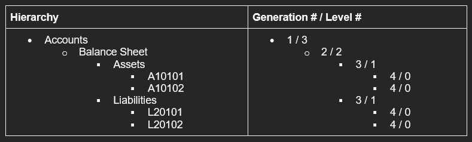

# **Hierarchy Statistical API Functions**

This package contains some useful functions for getting statistical information for a given member OR a node (Parent/Child combination is referred to here as a Node). 

In this package we refer to Generations and Levels. Generations are # ancestors starting from the root and Levels are counted from the base members (Level 0 is a base member) and counted upwards towards the root member.

Generations count from the top (# 1) whereas Levels are counted from the bottom (# 0).


For Example :

<br/>


**Package**: `EW_STATISTICS`  
**Usage**: `ew_statistics.<function_name>`

## Get Member Name for a Specific Generation Number

```sql

  -- Provide Member name at specific Generation for a given node
  
  FUNCTION get_generation_member(p_app_dimension_id IN NUMBER
                                ,p_hierarchy_id     IN NUMBER
                                ,p_generation_num   IN NUMBER
                                )
  RETURN VARCHAR2;

```


## Get Parent Member Name

```sql

  -- Provide Parent Member for a given node
  
  FUNCTION get_parent_name (p_hierarchy_id IN NUMBER)
  RETURN VARCHAR2;

```


## Get Generation Number for a specific node

```sql

  -- Provide Generation # for given node
  FUNCTION get_generation  (p_app_dimension_id IN NUMBER
                           ,p_hierarchy_id     IN NUMBER
                           )
  RETURN VARCHAR2;

```

## Get Level # for a specific Node

```sql

  -- Provide Level # for given node
  
  FUNCTION get_level    (p_app_dimension_id IN NUMBER
                        ,p_hierarchy_id     IN NUMBER
                         )
  RETURN NUMBER;

  -- Provide Level # for given member
  
  FUNCTION get_level       (p_app_dimension_id IN NUMBER
                            ,p_member_name      IN VARCHAR2
                           )
  RETURN NUMBER;

```


## Get Descendants Count under given member id

```sql

  -- Provide # of Descendants (Traverse entire branch) 
  -- for a given member id
  FUNCTION get_descendant_count (p_app_dimension_id IN NUMBER
                                ,p_parent_member_id IN NUMBER
                                )
  RETURN NUMBER;

```

## Get Sibling Count for a given member id

```sql

  -- Provide # of Sibling members for a given member id
  FUNCTION get_sibling_count (p_app_dimension_id IN NUMBER
                             ,p_parent_member_id IN NUMBER
                             )
  RETURN NUMBER;
```


## Get Level Zero (Base Members) Count under given member id

```sql

  -- Provide # of Level 0 members (Traverse entire branch) 
  -- for a given member id
  FUNCTION get_level_zero_count (p_app_dimension_id IN NUMBER
                                ,p_parent_member_id IN NUMBER
                                ,p_primary_only     IN VARCHAR2
                                )
  RETURN NUMBER;

```


## Get Descendants List (Concatenated list)


```sql

  -- Provide list of Descendants separated by separator character
  -- String will be limited upto 32K characters
  FUNCTION get_descendants 
                  (p_app_name             IN VARCHAR2
                  ,p_dim_name             IN VARCHAR2
                  ,p_parent_member_name   IN VARCHAR2
                  ,p_base_members_only    IN VARCHAR2 DEFAULT 'N'
                  ,p_primary_members_only IN VARCHAR2 DEFAULT 'N'
                  ,p_active_members_only  IN VARCHAR2 DEFAULT 'N'
                  ,p_separator_char       IN VARCHAR2 DEFAULT ','
                  ,p_enclosed_by_char     IN VARCHAR2 DEFAULT NULL
                  )
  RETURN VARCHAR2;

```

## Get Descendants List (In Table format)

```sql

  -- Provide list of Descendants in PL/SQL Table type format
  FUNCTION get_descendants_tbl
                   (p_app_name             IN VARCHAR2
                   ,p_dim_name             IN VARCHAR2
                   ,p_parent_member_name   IN VARCHAR2
                   ,p_base_members_only    IN VARCHAR2 DEFAULT 'N'
                   ,p_primary_members_only IN VARCHAR2 DEFAULT 'N'
                   ,p_active_members_only  IN VARCHAR2 DEFAULT 'N'
                   ,p_separator_char       IN VARCHAR2 DEFAULT ','
                   ,p_enclosed_by_char     IN VARCHAR2 DEFAULT NULL
                   )
  RETURN ew_member_tab_type PIPELINED;
```

## Get Descendants information for a given member id

```sql

   PROCEDURE get_descendants_info
                    (p_app_dimension_id     IN NUMBER
                    ,p_parent_member_id     IN NUMBER
                    ,x_hierarchy_ids       OUT ew_global.g_num_tbl
                    ,x_member_names        OUT ew_global.g_char_tbl
                    ,x_parent_member_names OUT ew_global.g_char_tbl
                     );

```


## Get Ancestors for a given hierarchy id


```sql

-- Generation is from top to bottom ancestors and 
-- Level is from bottom to the top ancestors
-- Members are separated by Tilde character (~)
FUNCTION get_ancestors(p_app_dimension_id IN NUMBER
                      ,p_hierarchy_id     IN NUMBER
                      ,p_order_type       IN VARCHAR2 DEFAULT 'LEVEL'
                      ,p_include_member   IN VARCHAR2 DEFAULT 'N'
                      )
RETURN VARCHAR2;

```

## Next Steps


- [Dimension Mapping APIs](dimension_mapping_api.md)
- [Application APIs](application_api.md)
- [Workflow APIs](workflow_api.md)
- [String APIs](string_api.md)