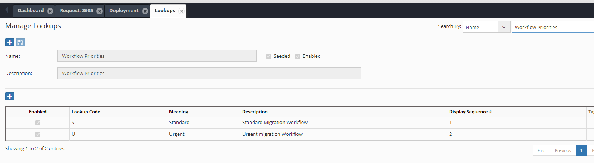

# **Request API Functions**

## Package: EW_REQ_API

These functions can be referred to as ew_req_api."Function Name"

## Get Request Header Attribute

```sql

  /* 
    Get information from Request Header
     Valid parameter values for p_what are
     UDF1, UDF2, UDF3, REQUESTED_BY, PRIORITY_CODE
     WORKFLOW_NAME, DESCRIPTION, REQUEST_DATE, DUE_DATE
  */
  
  FUNCTION get_req_attrib  (p_request_id IN NUMBER
                           ,p_what       IN VARCHAR2
                           )
  RETURN VARCHAR2;

```

## Insert Request Note

```sql

 PROCEDURE ins_req_note
            (p_user_id     IN NUMBER
            ,p_request_id  IN NUMBER
            ,p_notes       IN VARCHAR2
            );

```

## Check if Request has any file attached

```sql

/* Return Y if the request has at least one file attached.
  */
 -- Check if the Request has files attached or not
 -- Optionally check to exclude Zero byte attachments as well as
    check
 -- files having specific extensions (Separated by comma char)
    for example
 -- xls, xlsx and so on
 -- In addition it can also check if filename without extension 
    matches
 -- and file having string or not. (File has to be non-binary)
 
FUNCTION chk_req_has_attachments
(p_request_id IN NUMBER
 ,p_exclude_null_atts IN VARCHAR2 DEFAULT 'N'
 ,p_file_extensions IN VARCHAR2 DEFAULT NULL
 ,p_file_name_without_ext IN VARCHAR2 DEFAULT NULL
 ,p_file_search_str IN VARCHAR2 DEFAULT NULL
 )
 RETURN VARCHAR2;


```


## Check if Request has a line for a Specific Application

```sql

/* Return Y if the request has at least one non canceled line in the request for the given application.
   Return N if no such line is found.
  */
  FUNCTION chk_req_has_app_lines  (p_request_id IN NUMBER
                                  ,p_app_name   IN VARCHAR2
                                  )
  RETURN VARCHAR2;

```

## Check if Request has a line for a Specific Dimension

```sql

/* Return Y if the request has at least one non canceled line in the request for the given application and its specific dimension.
   Return N if no such line is found.
  */
  FUNCTION chk_req_has_dim_lines  (p_request_id IN NUMBER
                                  ,p_app_name   IN VARCHAR2
                                  ,p_dim_name   IN VARCHAR2
                                  )
  RETURN VARCHAR2;

```


## Check if Request has a line for a Specific Hierarchy Action

```sql

/* Return Y if the request has at least one non canceled line in the request for the given application and its specific dimension and specific Action Name. See full list of Action Names in Appendix B
   Return N if no such line is found.
  */
  FUNCTION chk_req_has_action_lines(p_request_id  IN NUMBER
                                   ,p_app_name    IN VARCHAR2
                                   ,p_dim_name    IN VARCHAR2
                                   ,p_action_name IN VARCHAR2
                                   )
  RETURN VARCHAR2;

```


## Check User Action Allowed

Return Values are Y if action is allowed. Else N.
X_msg -> Will return an error message if any is encountered.


```sql

FUNCTION chk_action_allowed
              (p_user_id            IN NUMBER
              ,p_request_id         IN NUMBER
              ,p_app_dimension_id   IN NUMBER
              ,p_action_code        IN VARCHAR2
              ,p_hierarchy_id       IN NUMBER              
              ,p_new_member_name    IN VARCHAR2
              ,p_moved_to_member_id IN NUMBER 
              ,p_chk_line_exists    IN VARCHAR2
              ,x_msg                IN OUT VARCHAR2
             )
  RETURN VARCHAR2;


```

Parameters


| Parameter Name | Description |
| --- | --- |
| p_user_id | User ID performing the action |
| p_request_id | Request ID on which action check is being performed |
| p_app_dimension_id | Application Dimension ID on which action check is being performed |
| p_action_code | Action Code. <br>.<br>Please check with your target application to ensure which actions are valid or not.<br> |
| p_hierarchy_id | Hierarchy ID on which action is being taken upon |
| p_new_member_name | New Member Name (pass NULL if the action is not creating a new member) |
| p_moved_to_member_id | Moved to Member ID (Pass NULL if the action is not moved member) |
| p_chk_line_exists | Pass Y or N to Check if the line already exists with the same action on the dimension |
| x_msg | OUT parameter<br>Returns error message if the function encountered any unexpected error |


## Check Pending Action from a User

Return Values are Y or N.


```sql

FUNCTION chk_user_action_required 
                     (p_request_id   IN NUMBER
                     ,p_user_id      IN NUMBER
                     )             
  RETURN VARCHAR2;

```


## Check User Action Allowed

Return Values are Y or N.


```sql

FUNCTION chk_hier_action_allowed 
                               (p_user_id           IN NUMBER
                               ,p_request_id        IN NUMBER
                               ,p_app_dimension_id  IN NUMBER
                               ,p_action_code       IN VARCHAR2
                               )
RETURN VARCHAR2;

```

Parameters


| Parameter Name | Description |
| --- | --- |
| p_user_id | User ID performing the action |
| p_request_id | Request ID on which action check is being performed |
| p_app_dimension_id | Application Dimension ID on which action check is being performed |
| p_action_code | Action Code. <br>.<br>Please check with your target application to ensure which actions are valid or not. |


## Check if user Approved any line in a request for a Stage


```sql

  -- This API will pass Y or N if the user has approved any
  -- request line in given workflow stage of a given request id
  
  FUNCTION chk_user_approved_stage (p_request_id     IN NUMBER
                                   ,p_wf_stage_name  IN VARCHAR2
                                   ,p_user_id        IN NUMBER
                                   )
  RETURN VARCHAR2;

```

## Check if a member is in Create or Edit mode

```sql

  /* 
     Check if the given hierarchy id is in Create or Edit mode in the given request.
     Return Request Line Id and flag to indicate Y/N if line exists.
  */
  
  PROCEDURE get_mem_prop_line_id
              (p_request_id        IN  NUMBER
              ,p_app_dimension_id  IN  NUMBER
              ,p_hierarchy_id      IN  NUMBER
              ,x_request_line_id   OUT NUMBER
              ,x_line_exists       OUT VARCHAR2
              );

```

## Get Request Line Number

```sql

FUNCTION get_req_line_num
 (p_request_id IN NUMBER
 ,p_app_dimension_id IN NUMBER
 ,p_member_name IN VARCHAR2
 ,p_action_name IN VARCHAR2 DEFAULT NULL
 )
 RETURN NUMBER;
 
----

FUNCTION get_req_line_num
 (p_request_id IN NUMBER
 ,p_app_name IN VARCHAR2
 ,p_dim_name IN VARCHAR2
 ,p_member_name IN VARCHAR2
 ,p_action_name IN VARCHAR2 DEFAULT NULL
 )
 RETURN NUMBER;

```


## Get Request Line Record

```sql

PROCEDURE get_req_line_rec (p_request_line_id IN NUMBER
                           ,x_rec    OUT ew_request_lines%ROWTYPE
                           );  

```

## Get Request Header Record

```sql

PROCEDURE get_req_rec
              (p_request_id   IN  NUMBER
              ,x_rec          OUT ew_request_headers%ROWTYPE
              );

```


## Get Request Line ID

This API will provide an internal Request line ID for a given set of parameters (Application name, Dimension Name, Member Name, Parent Member Name and Action Name).


```sql

/*
    Get non canceled request line ID within a request which
    Matches given member name and Action Name
    Following Action Names can be used as a parameter
     - Activate Member
     - Inactivate Member
     - Create Member
     - Delete Member
     - Edit Properties
     - Move Member
     - Insert Shared Member
     - Remove Shared Member
     - Rename Member
     - Reorder Children
  */
  
  FUNCTION get_req_line_id (p_request_id         IN NUMBER
                           ,p_app_dimension_id   IN NUMBER
                           ,p_member_name        IN VARCHAR2
                           ,p_action_name        IN VARCHAR2
                           )
  RETURN NUMBER;

  FUNCTION get_req_line_id (p_request_id         IN NUMBER
                           ,p_app_name           IN VARCHAR2
                           ,p_dim_name           IN VARCHAR2
                           ,p_member_name        IN VARCHAR2
                           ,p_action_name        IN VARCHAR2
                           )
  RETURN NUMBER;

  FUNCTION get_req_line_id (p_request_id         IN NUMBER
                           ,p_app_dimension_id   IN NUMBER
                           ,p_member_name        IN VARCHAR2
                           ,p_parent_member_name IN VARCHAR2
                           ,p_action_name        IN VARCHAR2
                           )
  RETURN NUMBER;


---

```


## Get Request Status

```sql

  FUNCTION get_req_status
              (p_request_id   IN NUMBER
              )
  RETURN VARCHAR2;


```

Valid Values returned:

 - Cancelled
 - Completed
 - New
 - Submitted


## Get Request Status Code

```sql

  FUNCTION get_req_status_code
              (p_request_id   IN NUMBER
              )  
  RETURN VARCHAR2;

```

Valid Values returned:

 - X (Cancelled)
 - C (Completed)
 - N (New requests not submitted in the workflow)
 - S (Open Requests Submitted in the workflow)
 
 
## Get User ID

```sql

  FUNCTION get_user_id  (p_user_name IN VARCHAR2)
  RETURN NUMBER;

```

## Get Request Header Workflow Status

```sql

  FUNCTION get_req_hdr_wf_status
              (p_request_id       IN NUMBER
              )  
  RETURN VARCHAR2;

```

## Get Request Line Workflow Status

```sql

  FUNCTION get_req_line_wf_status
              (p_request_id       IN NUMBER
              ,p_request_line_id  IN NUMBER 
              )  
  RETURN VARCHAR2;

```


## Check if workflow stage exists

Returns Y if the stage exists else Returns N

```sql

  FUNCTION chk_wf_stage_exists
              (p_request_id       IN NUMBER
              ,p_wf_stage_name    IN VARCHAR2
              ) ;

```

## Get Current Workflow Stage


```sql

  FUNCTION get_req_current_wf_stage
              (p_request_id   IN NUMBER
              )  
  RETURN VARCHAR2;

```

## Get Pending Action Group Name

Valid if the given Request is in the Review or Approve stage of the workflow.

```sql

  /* 
     Return Group Name of pending action from for a request
  */
  
  FUNCTION get_pending_action_from
              (p_request_id   IN NUMBER
              )  
  RETURN VARCHAR2;

```


## Is property value modified


```sql

  -- Return Y or N if property is modified in the given request
  -- for given hierarchy id and property name
  
  FUNCTION is_prop_value_modified
              (p_request_id       IN NUMBER
              ,p_hierarchy_id     IN NUMBER
              ,p_prop_name        IN VARCHAR2
              )
  RETURN NUMBER;

```

## Get Request Lines Count 

```sql

  FUNCTION get_req_lines_count 
                   (p_request_id       IN NUMBER
                   ,p_app_name         IN VARCHAR2 DEFAULT NULL
                   ,p_dim_name         IN VARCHAR2 DEFAULT NULL
                   ,p_ignore_cancelled IN VARCHAR2 DEFAULT 'Y' 
                   )
  RETURN NUMBER


```


## Get Request Line ID

This API will return Request Line ID if a line exists in the request for a given dimension, member and specific action which is not canceled. 

There are four different versions of this API (Overloaded functions) with different parameters to provide this functionality.

```sql

  FUNCTION get_req_line_id (p_request_id         IN NUMBER
                             ,p_app_dimension_id   IN NUMBER
                             ,p_member_name        IN VARCHAR2
                             ,p_action_name        IN VARCHAR2 
                             )
  RETURN NUMBER;
  
  FUNCTION get_req_line_id (p_request_id         IN NUMBER
                             ,p_app_name           IN VARCHAR2
                             ,p_dim_name           IN VARCHAR2
                             ,p_member_name        IN VARCHAR2
                             ,p_action_name        IN VARCHAR2 
                             )
  RETURN NUMBER;
  
  FUNCTION get_req_line_id 
        (p_request_id         IN NUMBER
        ,p_app_dimension_id   IN NUMBER
        ,p_member_name        IN VARCHAR2
        ,p_parent_member_name IN VARCHAR2
        ,p_action_name        IN VARCHAR2
        ,p_moved_from_member_name IN VARCHAR2 DEFAULT NULL
        )
  RETURN NUMBER;


```

## Delete Line 

This API will delete the given request line id

```sql

  /* Return Y if line is deleted successfully else return N and error message in the x_msg OUT variable*/
  
  FUNCTION delete_line
                (p_user_id            IN NUMBER
                ,p_request_id         IN NUMBER
                ,p_request_line_id    IN NUMBER
                ,x_msg                IN OUT VARCHAR2
               )
  RETURN VARCHAR2;

```


## Cancel Line

This API will cancel the given request line id

```sql

  -- Return Y if line is canceled successfully 
  -- else return N and error message in the x_msg OUT variable
  
  
  FUNCTION cancel_line
                (p_user_id            IN NUMBER
                ,p_request_id         IN NUMBER
                ,p_request_line_id    IN NUMBER
                ,x_msg                IN OUT VARCHAR2
               )
  RETURN VARCHAR2;

```

## Get Request Line Members

This procedure will provide a list of members upon which specific hierarchy actions are performed for a given application and dimension. The function will return a list of member names in an array.

Refer to Hierarchy Action Codes list in Appendix A

Note: Pass CM to get Create Members (As Child or as Sibling both). Similarly, Pass ISM to get Shared Members created as a Child or as a Sibling.


```sql

  FUNCTION get_req_line_members
              (p_request_id       IN NUMBER
              ,p_app_name         IN VARCHAR2
              ,p_dim_name         IN VARCHAR2
              ,p_action_code      IN VARCHAR2
              )
  RETURN ew_global.g_char_tbl;

```


## Create Request Header Record


```sql

  -- Returns Y or N. If Y then request ID is created successfully
  -- x_request_id and x_msg are OUT parameters
  FUNCTION create_request_header
                (p_requestor_user_name  IN VARCHAR2
                ,p_priority_code        IN VARCHAR2
                ,p_wf_code              IN VARCHAR2
                ,p_request_date         IN DATE     DEFAULT SYSDATE
                ,p_due_date             IN DATE     DEFAULT NULL
                ,p_description          IN VARCHAR2 DEFAULT NULL
                ,p_udf1                 IN VARCHAR2 DEFAULT NULL
                ,p_udf2                 IN VARCHAR2 DEFAULT NULL
                ,p_udf3                 IN VARCHAR2 DEFAULT NULL
                ,x_request_id          OUT NUMBER 
                ,x_msg                 OUT VARCHAR2
               )
  RETURN VARCHAR2;

```

Workflow Priority codes are configured in the Lookup ‘Workflow Priorities” as shown below:


<br/>


## Create Request Lines

Using the EW_REQ_API package, various hierarchy actions can be performed, and corresponding request lines can be created using Logic Scripts.

P_related_line_id is an optional parameter and, if passed, can link the new request line to this request line id. Linked request lines cannot be deleted or cancelled by themselves. If their parent request lines are deleted or cancelled, then these linked lines automatically get deleted or cancelled.


### Delete Member


```sql

  FUNCTION create_line_delete_member
              (p_user_id                 IN NUMBER
              ,p_request_id              IN NUMBER
              ,p_app_dimension_id        IN NUMBER
              ,p_member_name             IN VARCHAR2
              ,p_related_line_id         IN NUMBER DEFAULT NULL
              ,p_chk_security            IN VARCHAR2 DEFAULT 'Y' 
              ,x_msg                     IN OUT VARCHAR2
             )
  RETURN VARCHAR2;

```

### Remove Shared Member

```sql

  FUNCTION create_line_remove_shared_mem
              (p_user_id                 IN NUMBER
              ,p_request_id              IN NUMBER
              ,p_app_dimension_id        IN NUMBER
              ,p_parent_member_name      IN VARCHAR2
              ,p_member_name             IN VARCHAR2
              ,p_related_line_id         IN NUMBER DEFAULT NULL
              ,p_chk_security            IN VARCHAR2 DEFAULT 'Y' 
              ,x_msg                     IN OUT VARCHAR2
             )
  RETURN VARCHAR2;

```


### Rename  Member

```sql

  FUNCTION create_line_rename_member
              (p_user_id                 IN NUMBER
              ,p_request_id              IN NUMBER
              ,p_app_dimension_id        IN NUMBER
              ,p_member_name             IN VARCHAR2
              ,p_new_member_name         IN VARCHAR2
              ,p_related_line_id         IN NUMBER DEFAULT NULL
              ,p_chk_security            IN VARCHAR2 DEFAULT 'Y' 
              ,x_msg                     IN OUT VARCHAR2
             )
  RETURN VARCHAR2;


```


### Create New Member

```sql

  FUNCTION create_line_new_member
              (p_user_id                  IN NUMBER
              ,p_request_id               IN NUMBER
              ,p_app_dimension_id         IN NUMBER
              ,p_parent_member_name       IN VARCHAR2
              ,p_new_member_name          IN VARCHAR2
              ,p_prev_sibling_member_name IN VARCHAR2
              ,p_related_line_id          IN NUMBER DEFAULT NULL
              ,p_chk_security             IN VARCHAR2 DEFAULT 'Y' 
              ,x_msg                      IN OUT VARCHAR2
             )
  RETURN VARCHAR2;

```


### Move Member

```sql

  FUNCTION create_line_move_member
          (p_user_id                 IN NUMBER
          ,p_request_id              IN NUMBER
          ,p_app_dimension_id        IN NUMBER
          ,p_member_name             IN VARCHAR2
          ,p_moved_to_member_name    IN VARCHAR2
          ,p_new_prev_sibling_member IN VARCHAR2 -- New Prev Sibling
          ,p_related_line_id         IN NUMBER DEFAULT NULL
          ,p_chk_security            IN VARCHAR2 DEFAULT 'Y' 
          ,x_msg                     IN OUT VARCHAR2
          )
  RETURN VARCHAR2;


```

### Reorder Children

```sql

  FUNCTION create_line_reorder_children
              (p_user_id                 IN NUMBER
              ,p_request_id              IN NUMBER
              ,p_app_dimension_id        IN NUMBER
              ,p_parent_member_name      IN VARCHAR2
              ,p_member_name             IN VARCHAR2
              ,p_new_prev_sibling_member IN VARCHAR2
              ,p_related_line_id         IN NUMBER DEFAULT NULL
              ,p_chk_security            IN VARCHAR2 DEFAULT 'Y' 
              ,x_msg                     IN OUT VARCHAR2
             )
  RETURN VARCHAR2;

```

### Reorder Member

This API can be used to reposition a newly created member or after moving a member under its parent member automatically using either member name or description as a criterion.

For example, if you create a new member as a child member under a parent and you prefer to position this new member at a correct location based on its name then calling this API in the Post Hierarchy Action Logic script can achieve that task.


```sql

  -- p_reorder_criteria -> 'MEMBER_NAME' OR 'MEMBER_DESCRIPTION' 
  FUNCTION reorder_member
          (p_user_id            IN NUMBER
          ,p_request_id         IN NUMBER
          ,p_app_dimension_id   IN NUMBER
          ,p_parent_member_name IN VARCHAR2
          ,p_member_name        IN VARCHAR2
          ,p_reorder_criteria   IN VARCHAR2 DEFAULT 'MEMBER_NAME'
          ,x_msg                IN OUT VARCHAR2
          )
  RETURN VARCHAR2;


```


### Edit Property

This API will create a request line for a given member in the Edit mode. It will not change any member property values


```sql

  FUNCTION create_line_edit_action
              (p_user_id            IN NUMBER
              ,p_request_id         IN NUMBER
              ,p_app_dimension_id   IN NUMBER
              ,p_parent_member_name IN VARCHAR2
              ,p_member_name        IN VARCHAR2
              ,p_related_line_id    IN NUMBER DEFAULT NULL
              ,p_chk_security       IN VARCHAR2 DEFAULT 'Y' 
              ,x_msg                IN OUT VARCHAR2
             )
  RETURN VARCHAR2;

```


### Edit Property Value

This API will create a request line for a given member in the Edit mode and change the property value of a given property. If Parent Member Name is not provided, then the API will use Primary Instance of the member.


```sql

  /*
  p_create_for_changed_val_only -> Create Request line only if new property value 
                                   is different from the existing property value.
  Default : Create line regardless of value same or different
  */
  
  FUNCTION create_line_edit_prop
              (p_user_id            IN NUMBER
              ,p_request_id         IN NUMBER
              ,p_app_dimension_id   IN NUMBER
              ,p_parent_member_name IN VARCHAR2 DEFAULT NULL
              ,p_member_name        IN VARCHAR2
              ,p_prop_label         IN VARCHAR2
              ,p_prop_value         IN VARCHAR2
              ,p_related_line_id    IN NUMBER DEFAULT NULL
              ,p_chk_security       IN VARCHAR2 DEFAULT 'Y'
              ,p_create_for_changed_val_only IN VARCHAR2 DEFAULT 'N'
              ,x_msg                IN OUT VARCHAR2
             )
  RETURN VARCHAR2;

```


### Edit Multiple Properties

This API helps update more than one Property of a member to aprovide performance improvement.

This API opens a member in the Edit Properties action mode if member
is not already opened in the Edit mode and edits set of given properties

```sql

Parameter p_props_list --> is a list of properties and its values.
Array Index --> is Property Label and Array Value is Property Value 

Note : Property Value size upto 2k chars. CLOB types props more than 2K chars
       should not use this API.
p_create_for_changed_val_only  -> Create Request line only if new property
                                  value is different from the existing value
  */
  FUNCTION create_line_edit_props
              (p_user_id                     IN NUMBER
              ,p_request_id                  IN NUMBER
              ,p_app_dimension_id            IN NUMBER
              ,p_parent_member_name          IN VARCHAR2 DEFAULT NULL
              ,p_member_name                 IN VARCHAR2
              ,p_props_list                  IN ew_global.g_value_tbl
              ,p_related_line_id             IN NUMBER DEFAULT NULL
              ,p_chk_security                IN VARCHAR2 DEFAULT 'Y'
              ,p_create_for_changed_val_only IN VARCHAR2 DEFAULT 'N'
              ,x_msg                         IN OUT VARCHAR2
             )
  RETURN VARCHAR2 ;
```


### Edit Property Value Without Request Line

This API will update member’s properties directly without creating request lines. This API is useful when no audit trail is required and many member’s properties to be updated directly for performance benefits.
If the property is Hierarchy Type (meaning property is configured as Hierarchy Type) then hierarchy_id parameter is required. Hierarchy ID basically points to Member and Parent Member. 

This API will return three variables. 
X_prop_changed (Y or N) to indicate whether property is indeed different from what is passed.
X_old_value will return the existing property value before it gets updated with the new value.
X_msg in case API fails and returns N.

If the API is able to successfully update the property value then it will return Y.


```sql

  /*
  p_create_for_changed_val_only -> Create Request line only if new property value is different from the existing property value.
  Default : Create line regardless of value same or different
  */
  
  FUNCTION upd_member_prop_direct
                 (p_app_dimension_id  IN NUMBER
                 ,p_member_id         IN NUMBER
                 ,p_hierarchy_id      IN NUMBER   DEFAULT NULL
                 ,p_prop_name         IN VARCHAR2
                 ,p_prop_value        IN VARCHAR2
                 ,p_array_member_name IN VARCHAR2 DEFAULT NULL
                 ,x_prop_changed     OUT VARCHAR2
                ,x_old_value OUT VARCHAR2               
                ,x_msg       OUT VARCHAR2        
               )
  RETURN VARCHAR2;


```


### Insert Shared Member

This API will create a request line for a given member in the Edit mode and change the property value of a given property. If Parent Member Name is not provided, then the API will use Primary Instance of the member.


```sql

  FUNCTION create_line_shared_member
              (p_user_id             IN NUMBER
              ,p_request_id          IN NUMBER
              ,p_app_dimension_id    IN NUMBER
              ,p_parent_member_name  IN VARCHAR2
              ,p_member_name  IN VARCHAR2
              ,p_prev_sibling_member IN VARCHAR2
              ,p_related_line_id    IN NUMBER DEFAULT NULL
              ,p_chk_security       IN VARCHAR2 DEFAULT 'Y' 
              ,x_msg                OUT VARCHAR2
               )
  RETURN VARCHAR2;

```

### Create Line (Multiple Actions)


```sql

-- This is a generic API to create a request line. Depending on the action code various
-- parameters will need to be passed. Such as if the Action code is RM (Rename Member)
-- then New Member name parameters will be required to be passed.


  FUNCTION create_line
              (p_user_id                  IN NUMBER
              ,p_request_id               IN NUMBER
              ,p_app_name                 IN VARCHAR2
              ,p_dim_name                 IN VARCHAR2
              ,p_action_code              IN VARCHAR2
              ,p_member_name              IN VARCHAR2
              ,p_parent_member_name       IN VARCHAR2
              ,p_moved_to_member_name     IN VARCHAR2
              ,p_prev_sibling_member_name IN VARCHAR2
              ,p_new_member_name          IN VARCHAR2
              ,p_related_line_id          IN NUMBER   DEFAULT NULL
              ,p_chk_security             IN VARCHAR2 DEFAULT 'Y'
              ,x_msg                      IN OUT VARCHAR2
             )
  RETURN VARCHAR2;


```


### Create New Member using Application and Dimension Names

Create a Request line to add a new member by calling the following function. 

```sql

FUNCTION create_line_new_member_app
          (p_user_id IN NUMBER
          ,p_request_id IN NUMBER
          ,p_app_name IN VARCHAR2
          ,p_dim_name IN VARCHAR2
          ,p_parent_member_name IN VARCHAR2
          ,p_new_member_name IN VARCHAR2
          ,p_prev_sibling_member_name IN VARCHAR2
          ,p_related_line_id IN NUMBER DEFAULT NULL
          ,x_msg IN OUT VARCHAR2
          )
RETURN VARCHAR2; – Y for success and N for Error


```

### Create Rename Member line using Application and Dimension Names

Create a Request line to rename a member by calling the following function

```sql

FUNCTION create_line_rename_member_app
          (p_user_id IN NUMBER
          ,p_request_id IN NUMBER
          ,p_app_name IN VARCHAR2
          ,p_dim_name IN VARCHAR2
          ,p_member_name IN VARCHAR2
          ,p_new_member_name IN VARCHAR2
          ,p_related_line_id IN NUMBER DEFAULT NULL
          ,p_chk_security IN VARCHAR2 DEFAULT 'Y'
          ,x_msg IN OUT VARCHAR2
          )
RETURN VARCHAR2;


```


### Update Hierarchy Property

This will add a line in request for Edit Property Action for a specifc node if line does not exist. If line exists then it will update the property value for the member in that request line

```sql

/* 
  Returns Y if the API is successful. Else returns N 
  This accepts hierarchy_id as input
*/

FUNCTION update_hierarchy_prop
          (p_user_id IN NUMBER
          ,p_request_id IN NUMBER
          ,p_app_dimension_id IN NUMBER
          ,p_hierarchy_id IN NUMBER
          ,p_prop_label IN VARCHAR2
          ,p_prop_value IN VARCHAR2
          ,p_prop_value_clob IN CLOB DEFAULT NULL
          ,p_vary_by_member_names IN VARCHAR2 DEFAULT NULL
          ,p_related_line_id IN NUMBER DEFAULT NULL
          ,x_msg OUT VARCHAR2
          )
RETURN VARCHAR2;


  -- This API accepts Member name and parent name  


  FUNCTION update_hierarchy_prop
            (p_user_id              IN NUMBER
            ,p_request_id           IN NUMBER
            ,p_app_dimension_id     IN NUMBER
            ,p_parent_member_name   IN VARCHAR2
            ,p_member_name          IN VARCHAR2
            ,p_prop_label           IN VARCHAR2
            ,p_prop_value           IN VARCHAR2
            ,p_prop_value_clob      IN CLOB     DEFAULT NULL
            ,p_vary_by_member_names IN VARCHAR2 DEFAULT NULL
            ,p_related_line_id      IN NUMBER   DEFAULT NULL
            ,x_msg                 OUT VARCHAR2
            )
  RETURN VARCHAR2;


```

<br/>


## Sync Member Properties using Property Mapping Configurations

Sync Member Properties using API

This API will be useful when regular Dimension Mapping based Property Mapping is not applicable, but process need to rely on other events like property values to trigger property mapping across dimensions.


```sql

FUNCTION sync_member_prop_mappings
 (p_source_app_dimension_id IN NUMBER
 ,p_source_member_name IN VARCHAR2
 ,p_target_app_dimension_id IN NUMBER
 ,p_target_member_name IN VARCHAR2
 ,x_msg OUT VARCHAR2
 )
 RETURN VARCHAR2 –-- Y for Success and N for Error


```


## Create Sync Nodes

This API will synchronize node creation from the source application to the target application depending on the mapping value for the parent member passed in the parameter. This is very useful when members are mapped depending on the custom property being used to specify parent members of the mapped (target) dimension in the source application.
     
Supports the following actions for synchronization:

  1. Create Member
  2. Edit Properties
  3. Rename Member
  4. Shared Instances


```sql

  FUNCTION create_line_sync_node
              (p_user_id                   IN NUMBER
              ,p_request_id                IN NUMBER
              ,p_source_app_name           IN VARCHAR2
              ,p_source_dim_name           IN VARCHAR2
              ,p_member_name               IN VARCHAR2
              ,p_target_app_name           IN VARCHAR2
              ,p_target_dim_name           IN VARCHAR2
              ,p_target_parent_member      IN VARCHAR2
              ,p_orig_member_name          IN VARCHAR2 DEFAULT NULL
              ,p_prev_sibling_member_name  IN VARCHAR2 DEFAULT NULL
              ,p_target_delete_member      IN VARCHAR2 DEFAULT 'N'
              ,p_create_related_line_link  IN VARCHAR2 DEFAULT 'Y'
              ,p_source_request_line_id    IN NUMBER   DEFAULT NULL
              ,p_shared_instance           IN VARCHAR2 DEFAULT 'N'
              ,p_curr_target_shared_parent IN VARCHAR2 DEFAULT NULL
              ,x_msg                       IN OUT VARCHAR2
             )
  RETURN VARCHAR2;


```

Example:

Requirement: A Client has two applications, called HFM and Essbase. Whenever a user creates or edits a member in the HFM application, corresponding members in the Essbase application need to be updated or new members need to be created in the Essbase application. Members in the Essbase application do not have the same rollups, so parent members can be totally different from the HFM application. Therefore, standard dimension mapping is not used in this scenario and hence the user provides which parent member will be used in the target Essbase application.


Implementation: Create a custom property called “Essbase Parent Member” and assign it to the HFM dimension. The List of Values assigned to this property will show the values from the Essbase application. Please refer to the Property Configurations chapter in the Administrator’s Guide. You can use the Property Associations tab to show members from the Essbase application.

Create a Logic Script of the Property Validation type and assign it to this custom property. Whenever a user selects an Essbase member in this property (or changes from a previously selected value) it will automatically synchronize it in the Essbase application. For example, if Essbase Parent “A” was selected for the first time then new members will be created under that parent. If a user changes this property to Essbase Parent “B” then this script will automatically place the member under the new parent member in the Essbase application.


## Recall Request

Recall requests to a specific workflow stage:

```sql

  FUNCTION recall_request
              (p_user_id       IN NUMBER 
              ,p_request_id    IN NUMBER
              ,p_wf_stage_name IN VARCHAR2 -- recall to this WF stage
              ,p_notes         IN VARCHAR2 DEFAULT NULL
              ,x_msg           IN OUT VARCHAR2
              )
  RETURN VARCHAR2;

```


## Rewind Stages

Recall requests to a specific workflow stage by specifying how many stages to rewind. Default value is 1 which means the request will be recalled to the stage before the current stage.

```sql

  FUNCTION rewind_stages
              (p_user_id       IN NUMBER 
              ,p_request_id    IN NUMBER
              ,p_num_of_stages IN NUMBER DEFAULT 1
              ,p_notes         IN VARCHAR2 DEFAULT NULL
              ,x_msg           IN OUT VARCHAR2
              )
  RETURN VARCHAR2 ;

```


## Remove Lines from Workflow Approvals

This API removes a given request line from needing Approvals for a specific Workflow Stage and its Task.

For example, if the requirement is to conditionally require approval for lines that have specific property values, then the following API can be called by a workflow custom task that would precede the Review or Approve stage. 

API : ew_req_api.remove_req_line_wf_approvals

```sql

  -- Remove lines from approvals required
  
  PROCEDURE remove_req_line_wf_approvals 
              (p_request_id       IN NUMBER
              ,p_wf_stage_name    IN VARCHAR2
              ,p_wf_task_name     IN VARCHAR2
              ,p_line_num         IN NUMBER
              ,x_sts              OUT VARCHAR2
              ,x_msg              OUT VARCHAR2
              )

```


## Add Lines for Workflow Approvals

This API adds an Approval requirement for a specific request line, Workflow Stage and Task which were removed previously using a custom Logic Script.


For example, if the requirement is to conditionally require approval for lines that have specific property values, then the following API can be called by a workflow custom task that would precede the Review or Approve stage. 

API : ew_req_api.remove_req_line_wf_approvals

```sql

  -- Add lines from approvals required
  PROCEDURE add_req_line_wf_approvals 
              (p_request_id       IN NUMBER
              ,p_wf_stage_name    IN VARCHAR2
              ,p_wf_task_name     IN VARCHAR2
              ,p_line_num         IN NUMBER
              ,x_sts              OUT VARCHAR2
              ,x_msg              OUT VARCHAR2
              )

```


## Check if Line Requires Workflow Approvals

This API checks whether a given request line requires Approvals for a specific Workflow Stage and its Task.


API : ew_req_api.chk_line_needs_approvals
Returns Y if lines are part of the Approval requirement. Else N,


```sql
  
  FUNCTION chk_line_needs_approvals
              (p_request_id       IN NUMBER
              ,p_wf_stage_name    IN VARCHAR2
              ,p_wf_task_name     IN VARCHAR2
              ,p_line_num         IN NUMBER
              )
   RETURN VARCHAR2

```


## Send Reminder Email


```sql
  
  PROCEDURE send_reminder_email
              (p_user_id          IN NUMBER
              ,p_request_id       IN NUMBER
              ,p_email_to_user_id IN NUMBER
              ,p_notes            IN VARCHAR2
              ,x_status          OUT VARCHAR2
              ,x_message         OUT VARCHAR2
             );

```


## Update Workflow Task Approvals Count

Using this API, you can update the # of Approvals required to be zero or any other integer value for the Request’s workflow task.

Note: This API does not affect workflow configuration but only the instance of it associated with the request itself.


```sql
  
  PROCEDURE upd_wf_stage_task_approval_cnt
              (p_request_id       IN NUMBER
              ,p_wf_stage_name    IN VARCHAR2
              ,p_wf_task_name     IN VARCHAR2
              ,p_num_of_approvals IN NUMBER
              ,x_sts          OUT VARCHAR2
              ,x_msg         OUT VARCHAR2
             );

```


## Remove Workflow Stage

Using this API, you can remove the workflow stage from the Request’s workflow.

Note: This API does not affect workflow configuration but only the instance of it associated with the given request id.


```sql
  
  PROCEDURE remove_wf_stage_name
              (p_request_id       IN NUMBER
              ,p_wf_stage_name    IN VARCHAR2
              ,x_sts             OUT VARCHAR2 -- S or E Success/Error
              ,x_msg             OUT VARCHAR2
             );

```


## Add Workflow Stage

Using this API, you can add the workflow stage back in the request’s workflow.

Note: This API does not affect workflow configuration but only the instance of it associated with the given request ID.


```sql
  
  PROCEDURE add_wf_stage_name
              (p_request_id       IN NUMBER
              ,p_wf_stage_name    IN VARCHAR2
              ,x_sts             OUT VARCHAR2 -- S or E Success/Error
              ,x_msg             OUT VARCHAR2
             );


```


## Submit Request in the Workflow

Using this API request can be submitted in the Workflow. This function will return Y if action is successful else N along with Error Message.

```sql
  
  FUNCTION submit_wf
          (p_user_id IN NUMBER
          ,p_request_id IN NUMBER
          ,x_msg IN OUT VARCHAR2
           )
  RETURN VARCHAR2

```


## Split Request

Using this API request can be split into multiple requests. 

p_src_line_num_list : This Parameter provides an array of Line Numbers that need to be removed from the Source Request and moved to the new Request.

```sql
  
  FUNCTION split_request  
        (p_src_request_id       IN NUMBER
        ,p_src_line_num_list    IN ew_global.g_num_tbl
        ,p_requestor_user_name  IN VARCHAR2
        ,p_priority_code        IN VARCHAR2
        ,p_wf_code              IN VARCHAR2
        ,p_request_date         IN DATE     DEFAULT SYSDATE
        ,p_due_date             IN DATE     DEFAULT NULL
        ,p_description          IN VARCHAR2 DEFAULT NULL
        ,p_udf1                 IN VARCHAR2 DEFAULT NULL
        ,p_udf2                 IN VARCHAR2 DEFAULT NULL
        ,p_udf3                 IN VARCHAR2 DEFAULT NULL
        ,p_submit_wf            IN VARCHAR2 DEFAULT 'N'
        ,p_source_ref_code      IN VARCHAR2 DEFAULT NULL
        ,x_request_id          OUT NUMBER 
        ,x_msg                 OUT VARCHAR2
        )
  RETURN VARCHAR2


```


## Convert Member to an Extended Member

If a member in an extended dimension needs to be converted to an Extended Member, then this API can be used. For example, in OneStream application whenever a member is moved from a parent to a specific parent member and upon this event, member needs to be created in the parent dimension and only its relationship node needs to be created in the current dimension. To achieve this automation, Post Hierarchy Action Logic script on hierarchy action “Move Member” can use this API.
```sql
  
  -- Convert member to an extended member.
  -- Member is moved to Parent Dimension and a relationship type node
  -- is created in the current dimension where given member exists.
  FUNCTION convert_to_extended_member
              (p_request_line_id     IN NUMBER
              ,p_app_dimension_id    IN NUMBER
              ,p_member_id           IN NUMBER
              ,p_parent_dim_name     IN VARCHAR2
              ,p_parent_member_name  IN VARCHAR2
              ,x_msg                 IN OUT VARCHAR2
             )
  RETURN VARCHAR2;

```


## Delete Request

Using this API request can be deleted. This function will return Y if action is successful else N along with Error Message.


```sql
  
  FUNCTION delete_request 
            (p_request_id IN NUMBER
            ,x_msg IN OUT VARCHAR2
            )
  RETURN VARCHAR2;
```

## Cancel Request

Using this API request can be cancelled. This function will return Y if action is successful else N along with Error Message.

```sql
  
  FUNCTION cancel_request 
            (p_request_id IN NUMBER
            ,x_msg IN OUT VARCHAR2
            )
  RETURN VARCHAR2;
```


## Next Steps

- [ERP Import APIs](erp_import_api.md)
- [Hierarchy APIs](hierarchy_api.md)
- [Hierarchy Statistical APIs](hierarchy_stats_api.md)