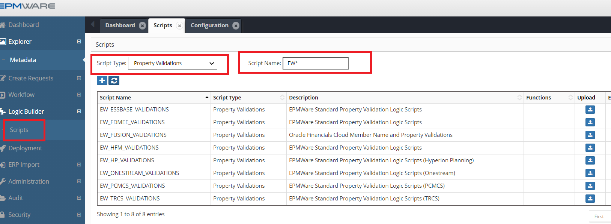
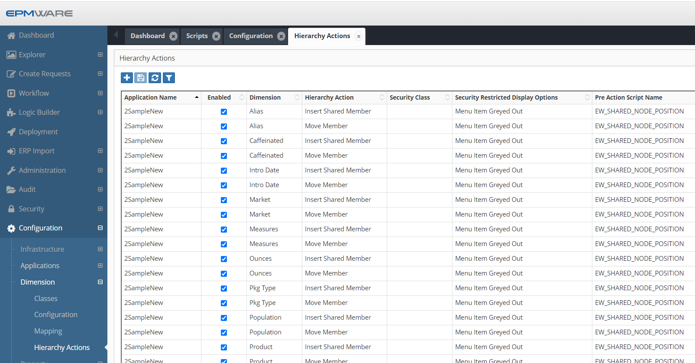
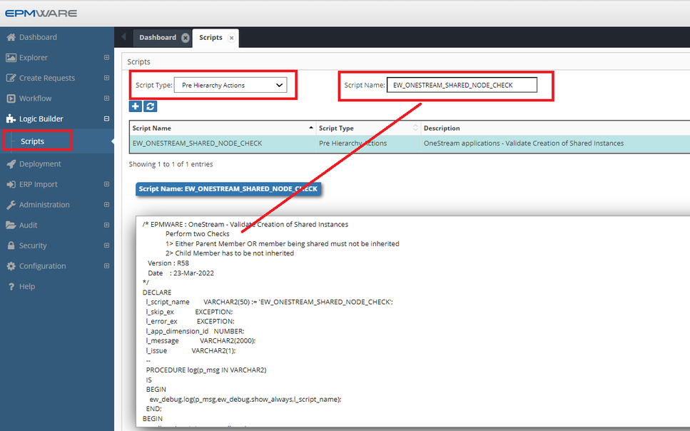
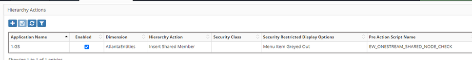
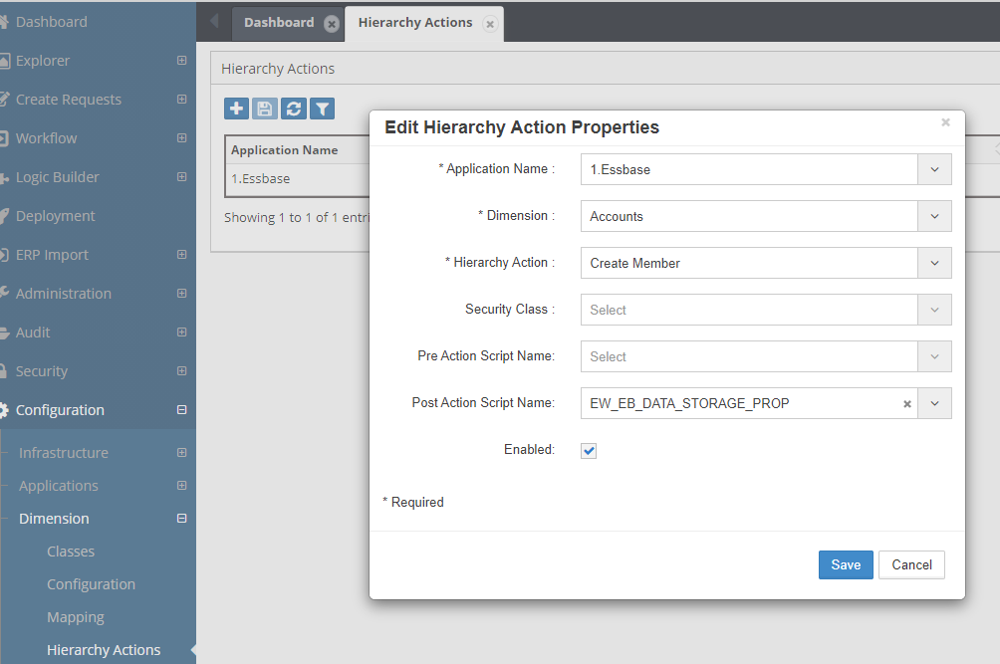
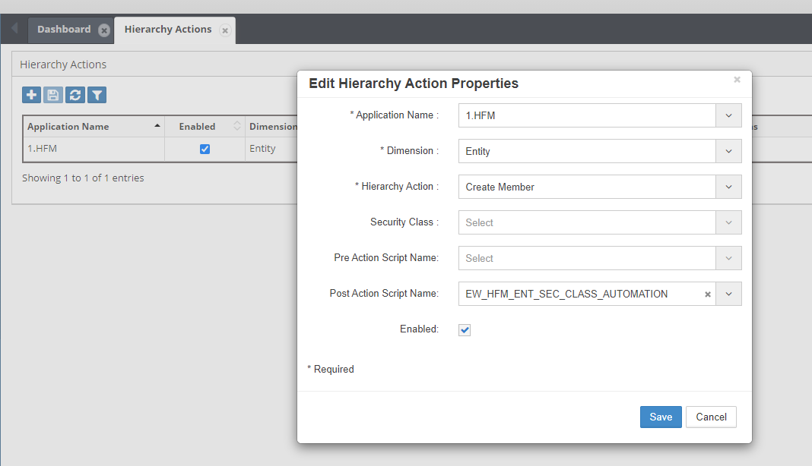

# **Appendix B - Out of the box Logic Scripts**

EPMware provides a comprehensive library of out-of-the-box Logic Scripts that are automatically assigned to applications upon creation.
These standard scripts handle common validation and automation requirements across different EPM application types.

## Standard Validation Scripts

This section will provide a list of all standard validation Logic Scripts that are supplied as out of the box Logic Scripts and also get automatically assigned when their corresponding applications are registered in EPMWARE.

Note: 
!!! warning "Important"
    If you need to modify any of these scripts, either create a new one by making a copy of it or create a new one with additional logic in it. It is possible that EPMware updates or Patch releases may modify these scripts in future releases.

### Standard Property Validations

The following Logic Scripts are of “Property Validation Types” and are automatically assigned to the Applications as soon as they are registered under Application Configuration page.

| Logic Script Name | Application Types |
| --- | --- |
| EW_ESSBASE_VALIDATIONS | Essbase (On Prem and Cloud) |
| EW_HFM_VALIDATIONS | HFM |
| EW_HP_VALIDATIONS | Planning (On Prem and Cloud) |
| EW_PCMCS_VALIDATIONS | Oracle PCMCS Cloud |
| EW_TRCS_VALIDATIONS | Oracle TRCS Cloud |
| EW_FDMEE_VALIDATIONS | Oracle FDMee (OR Data Management) |
| EW_FUSION_VALIDATIONS | Oracle EBS (Fusion) |
| EW_ONESTREAM_VALIDATIONS | OneStream Applications (On Prem and Cloud) |

 

Script Names starting with `EW*` are EPMWare Standard Scripts
 

 

## Pre-Hierarchy Action Scripts

The following Logic Scripts are of “Pre-Hierarchy Action Types” and are automatically assigned to the Essbase Applications as soon as they are imported into EPMWARE. The purpose of this Logic Script is to ensure Shared Nodes do not come prior to its Primary instance in the hierarchy.

### Script: EW_SHARED_NODE_POSITION

#### 📜 Script Details

| Field | Description |
|------|------------|
| **Script Name** | `EW_SHARED_NODE_POSITION` |
| **Application Type** | Essbase (On Prem and Cloud), Planning, PBCS |

#### 🎯 Purpose

This Script checks whether a Shared Instance of a member comes before to its Primary instance.

#### ⚙️ Configuration

 - The script is automatically assigned to all dimensions
 - Applicable to Essbase and Planning applications
 - Assignment happens during application import into EPMWARE

Please refer to the example below for a typical configuration assignment.

 

### Script: EW_ONESTREAM_SHARED_NODE_CHECK

#### 📜 Script Details

| Field | Description |
|------|------------|
| **Script Name** | `EW_ONESTREAM_SHARED_NODE_CHECK` |
| **Application Type** | OneStream |

#### 🎯 Purpose

The logic script `EW_ONESTREAM_SHARED_NODE_CHECK` is a standard OneStream logic script that is automatically assigned to all Extended Dimensions when a OneStream application is imported.

This script prevents users from creating a shared instance of a member in an extended dimension unless the shared instance belongs to the same extended dimension.

#### ⚙️ Configuration

 - The script is automatically assigned to all Extended Dimensions
 - No manual configuration is required
 - Applies only to OneStream applications
  
 
 

 

## Post-Hierarchy Action Scripts

The following Logic Scripts are of “Post Hierarchy Action Types” and are not automatically assigned to the target Applications. They need to be assigned manually if required..

### Script: EW_EB_DATA_STORAGE_PROP

#### 📜 Script Details

| Field | Description |
|------|------------|
| **Script Name** | `EW_EB_DATA_STORAGE_PROP` |
| **Application Types** | Essbase (On-Prem & Cloud) |

#### 🎯 Purpose

For Essbase applications, this logic script ensures that the Data Storage property is set to Dynamic Calc whenever a base member becomes a parent member.

This helps maintain correct aggregation behavior and prevents invalid storage settings.

#### ⚙️ Configuration

 - This script is not assigned automatically
 - Manual configuration is required
 - The script must be assigned as a Post-Hierarchy Action

Please refer to the example below for the manual assignment configuration.

 
*Figure: Manual configuration of Data Storage automation*

### Script: EW_HFM_ENT_SEC_CLASS_AUTOMATION

#### 📜 Script Details

| Field | Description |
|------|------------|
| **Script Name** | `EW_HFM_ENT_SEC_CLASS_AUTOMATION` |
| **Application Types** | HFM  |

#### 🎯 Purpose

This script automatically create Security Classes for Entities. 

This script is provided as an example only. In this script it is assumed that the user wants to create new security class for all new entities which conform to the syntax E#####. (E followed by a 5 digit numerical value). 

!!! note "Customization Required"
     Clone this script and modify as needed. Assign this script to the Hierarchy actions such as “Create Member”.

#### ⚙️ Configuration

 - Manual configuration is required
 - Assign the (cloned) script to the appropriate Hierarchy Action
 - Applicable only to HFM applications

Please refer to the example below for the manual assignment configuration.

 
*Figure: Security class automation configuration*

---

## See Also

- [Appendix C](appendix_c_erp-import-table.md) -  ERP Import Table 
