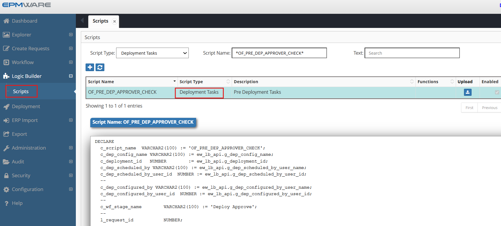
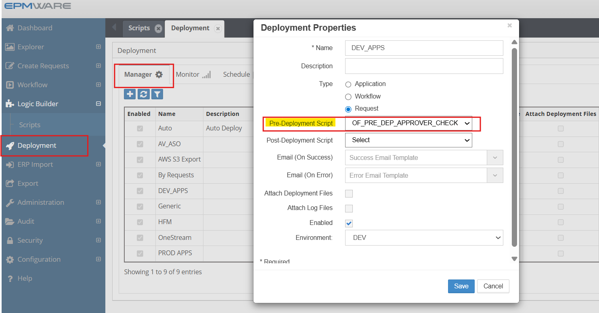

# 💡**Deployment Tasks Examples**

**Requirement** : Check whether the user who either configured or scheduled the current Deployment is not the same as the user who provided approvals in the workflow stage “Deploy Approve” for those requests which are part of that deployment. 

This will be an example of a Pre Deployment Logic Script. If the above check fails then the deployment will not proceed.

```sql

DECLARE
  c_script_name  VARCHAR2(100) := 'OF_PRE_DEP_APPROVER_CHECK';
  c_dep_config_name VARCHAR2(100) := ew_lb_api.g_dep_config_name;
  c_deployment_id   NUMBER        := ew_lb_api.g_deployment_id;
  c_dep_scheduled_by VARCHAR2(100) := ew_lb_api.g_dep_scheduled_by_user_name;
  c_dep_scheduled_by_user_id  NUMBER := ew_lb_api.g_dep_scheduled_by_user_id;
  --
  c_dep_configured_by VARCHAR2(100) := ew_lb_api.g_dep_configured_by_user_name;
  c_dep_configured_by_user_id  NUMBER := ew_lb_api.g_dep_configured_by_user_id;
  --
  c_wf_stage_name        VARCHAR2(100) := 'Deploy Approve';
  --
  l_request_id           NUMBER;
  --
  PROCEDURE log (p_msg VARCHAR2)
  IS
  BEGIN
    ew_debug.log(p_msg,ew_debug.show_always,c_SCRIPT_NAME);
  END log;
BEGIN
  ew_lb_api.g_status  := ew_lb_api.g_success;
  ew_lb_api.g_message := NULL;
  
  log('Pre Deployment Script - Start');
  
  log('Deployment ID   : '||c_deployment_id);
  log('Deployment Name : '||c_dep_config_name);
  log('Deployment Scheduled by : (ID: '||c_dep_scheduled_by_user_id||') (Name: '||c_dep_scheduled_by||')');
  log('Deployment Configured by : (ID: '||c_dep_configured_by_user_id||') (Name: '||c_dep_configured_by||')');
  log('Request count : '||ew_lb_api.g_dep_request_id_list.COUNT);
  
  -- Check if deployment scheduler has approved any line in the 
  -- Deployment Review stage in the workflow
  FOR i IN 1..ew_lb_api.g_dep_request_id_list.COUNT
  LOOP
    l_request_id := ew_lb_api.g_dep_request_id_list(i);
    log('Request ID : '||l_request_id);
    IF ew_req_api.chk_user_approved_stage
                   (p_request_id     => l_request_id
                   ,p_wf_stage_name  => c_wf_stage_name
                   ,p_user_id        => c_dep_scheduled_by_user_id 
                   ) = 'Y'
    THEN
      log('check if deployment is scheduled by user who approved for Deployment');
      ew_lb_api.g_status  := ew_lb_api.g_error;
      ew_lb_api.g_message := 'Pre Deployment Validation Failed. '||
                             'Request ['||l_request_id||'] '||
                             'is approved by the same user that '||
                             'scheduled UAT deployment for it.';
      EXIT;
    ELSIF ew_req_api.chk_user_approved_stage
                   (p_request_id     => l_request_id
                   ,p_wf_stage_name  => c_wf_stage_name
                   ,p_user_id        => c_dep_configured_by_user_id
                   ) = 'Y'
    THEN
      log('Check if Deployment is configured by user who approved for UAT Deployment');
      ew_lb_api.g_status  := ew_lb_api.g_error;
      ew_lb_api.g_message := 'Pre Deployment Validation Failed. '||
                             'Request ['||l_request_id||'] '||
                             'is approved by the same user that '||
                             'configured requests in this deployment.';
      EXIT;
    ELSE
      log('Request is Ok to be deployed..');
    END IF;
  END LOOP;      

  log('Pre Deployment Script - End'); 

EXCEPTION
  WHEN OTHERS THEN
    ew_lb_api.g_status  := ew_lb_api.g_error;
    ew_lb_api.g_message := 'Error : '||SQLERRM;
    log(ew_lb_api.g_message);
END;


```

## Configuration

1.Create Pre deployment Logic Script as shown below:
<br/>

<br/>


2.Assign this Logic Script as shown below:
<br/>

<br/>


## Next Steps

- [ERP Interface Tasks](../erp-interface/index.md) - ERP Interface Tasks Details
- [API Reference](../../api/packages/index.md) - Supporting functions


