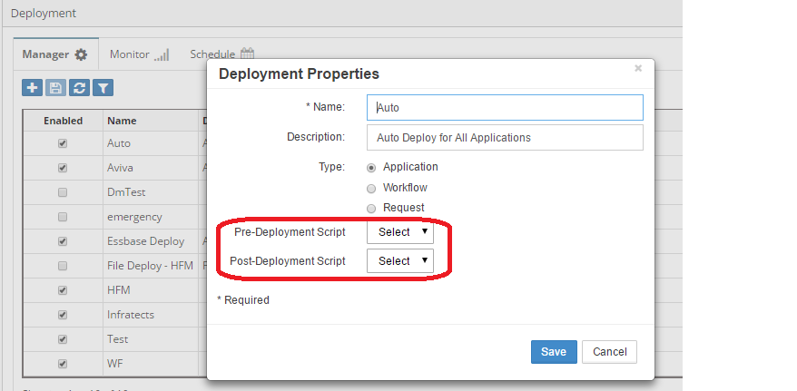

# Deployment Task Scripts

Deployment Task scripts execute before (Pre) or after (Post) deployment operations, enabling validation, preparation, and cleanup tasks during metadata deployment to target applications.

## Overview

Deployment scripts provide:
- **Pre-deployment Validation**: Ensure readiness
- **Environment Preparation**: Set up target state
- **Post-deployment Verification**: Confirm success
- **Cleanup Operations**: Remove temporary data
- **Notification**: Alert stakeholders
- **Rollback Logic**: Handle failures


*Figure: Deployment script execution flow*

## Deployment Script Types

### Pre-Deployment Tasks
**When**: Before deployment starts
**Purpose**: Validate and prepare
**Can Block**: Yes - prevent deployment

### Post-Deployment Tasks
**When**: After deployment completes
**Purpose**: Verify and cleanup
**Can Block**: No - deployment complete

## When to Use

Deployment scripts are essential for:
- Validating deployment prerequisites
- Backing up existing metadata
- Preparing target environment
- Verifying deployment success
- Cleaning temporary data
- Sending deployment notifications
- Integrating with CI/CD pipelines

## Key Features

- **Environment-aware**: Different logic per environment
- **Rollback capable**: Support deployment reversal
- **Audit trail**: Track deployment history
- **Integration ready**: Connect to external systems
- **Error handling**: Graceful failure management

## Configuration

Navigate to deployment configuration and associate scripts with deployment managers.


*Figure: Deployment task configuration*

## Common Patterns

### Pattern 1: Environment Validation
```sql
-- Pre-deployment: Validate target environment
BEGIN
  -- Check target application status
  IF get_app_status(ew_lb_api.g_target_app) != 'READY' THEN
    ew_lb_api.g_status := ew_lb_api.g_error;
    ew_lb_api.g_message := 'Target application not ready for deployment';
  END IF;
  
  -- Check maintenance window
  IF NOT in_maintenance_window() THEN
    ew_lb_api.g_status := ew_lb_api.g_error;
    ew_lb_api.g_message := 'Deployment only allowed during maintenance window';
  END IF;
END;
```

### Pattern 2: Backup Before Deployment
```sql
-- Pre-deployment: Create backup
BEGIN
  create_metadata_backup(
    p_app_name => ew_lb_api.g_target_app,
    p_backup_name => 'PRE_DEPLOY_' || TO_CHAR(SYSDATE, 'YYYYMMDD_HH24MISS')
  );
  
  ew_debug.log('Backup created successfully');
END;
```

### Pattern 3: Post-Deployment Verification
```sql
-- Post-deployment: Verify success
DECLARE
  l_errors VARCHAR2(4000);
BEGIN
  -- Verify hierarchy integrity
  l_errors := verify_hierarchy_structure(ew_lb_api.g_target_app);
  
  IF l_errors IS NOT NULL THEN
    -- Log issues but don't fail
    ew_debug.log('Verification warnings: ' || l_errors);
    send_admin_alert('Deployment verification warnings', l_errors);
  END IF;
END;
```

### Pattern 4: Cleanup Operations
```sql
-- Post-deployment: Clean up
BEGIN
  -- Remove temporary staging data
  cleanup_staging_tables(ew_lb_api.g_deployment_id);
  
  -- Archive deployment logs
  archive_deployment_logs(ew_lb_api.g_deployment_id);
  
  -- Clear caches
  clear_application_cache(ew_lb_api.g_target_app);
END;
```

## Input Parameters

| Parameter | Type | Description |
|-----------|------|-------------|
| `g_deployment_id` | NUMBER | Unique deployment identifier |
| `g_source_app` | VARCHAR2 | Source application name |
| `g_target_app` | VARCHAR2 | Target application name |
| `g_deployment_type` | VARCHAR2 | Full/Incremental/Merge |
| `g_user_id` | NUMBER | User initiating deployment |
| `g_deployment_config` | VARCHAR2 | Configuration name |

## Best Practices

### 1. Environment-Specific Logic
```sql
-- Different validation per environment
CASE ew_lb_api.g_target_app
  WHEN 'PROD' THEN
    require_executive_approval();
    require_backup();
    require_maintenance_window();
  WHEN 'UAT' THEN
    require_backup();
  WHEN 'DEV' THEN
    NULL; -- Minimal restrictions
END CASE;
```

### 2. Comprehensive Logging
```sql
-- Log all deployment details
ew_debug.log('Deployment ID: ' || ew_lb_api.g_deployment_id);
ew_debug.log('Source: ' || ew_lb_api.g_source_app);
ew_debug.log('Target: ' || ew_lb_api.g_target_app);
ew_debug.log('Type: ' || ew_lb_api.g_deployment_type);
ew_debug.log('User: ' || ew_lb_api.g_user_id);
```

### 3. Error Recovery
```sql
BEGIN
  -- Pre-deployment preparation
  prepare_deployment();
EXCEPTION
  WHEN OTHERS THEN
    -- Attempt rollback
    rollback_preparation();
    -- Re-raise error
    RAISE;
END;
```

### 4. Notification Strategy
```sql
-- Notify stakeholders
send_deployment_notification(
  p_to => get_app_owners(ew_lb_api.g_target_app),
  p_subject => 'Deployment to ' || ew_lb_api.g_target_app,
  p_status => ew_lb_api.g_status
);
```

## Testing Deployment Scripts

### Test Scenarios

1. **Normal Deployment**: Standard deployment flow
2. **Validation Failure**: Prerequisites not met
3. **Backup Creation**: Verify backup created
4. **Rollback**: Test failure recovery
5. **Notifications**: Verify emails sent
6. **Cleanup**: Ensure cleanup completes

## Performance Considerations

- **Pre-deployment**: Keep validation fast
- **Backup Operations**: Consider size and time
- **Post-deployment**: Can be more thorough
- **Async Processing**: Queue heavy operations
- **Caching**: Clear after deployment

## Advanced Features

### Integration with CI/CD
```sql
-- Trigger CI/CD pipeline
trigger_jenkins_job(
  p_job => 'post-deployment-tests',
  p_params => 'APP=' || ew_lb_api.g_target_app
);
```

### Automated Testing
```sql
-- Run automated tests post-deployment
run_test_suite(
  p_app => ew_lb_api.g_target_app,
  p_test_level => 'FULL'
);
```

### Rollback Capability
```sql
-- Store rollback information
store_rollback_point(
  p_deployment_id => ew_lb_api.g_deployment_id,
  p_backup_id => l_backup_id
);
```

## Next Steps

- [Pre-Deployment Tasks](pre-deployment.md) - Validation and preparation
- [Post-Deployment Tasks](post-deployment.md) - Verification and cleanup
- [API Reference](../../api/) - Supporting functions

---

!!! tip "Best Practice"
    Always include comprehensive error handling and logging in deployment scripts. Failed deployments should be easy to diagnose and recover from.