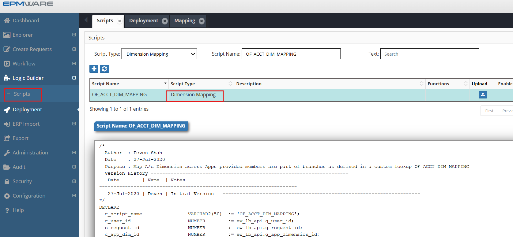
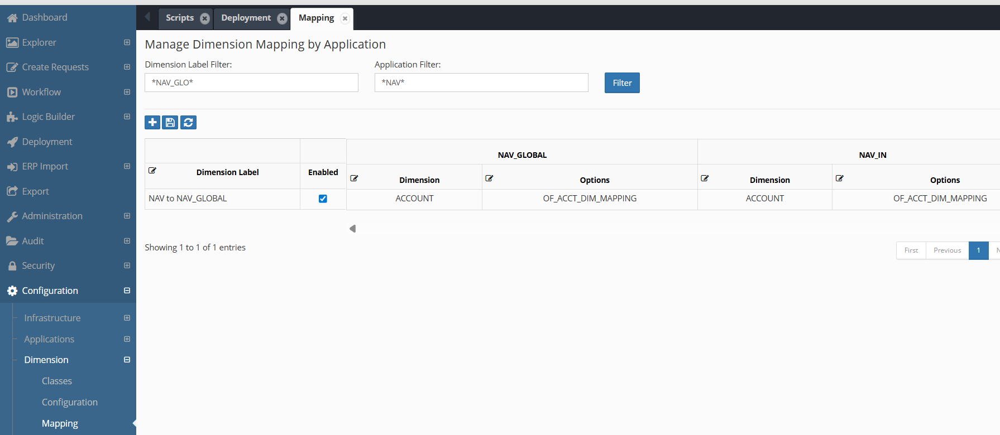

# 💡**Dimension Mapping Examples**

Requirement: Map nodes across applications provided they are part of certain branches. Branches are defined in a custom lookup.

```sql

/* 
  Author  : Deven Shah
  Date    : 27-Jul-2020
  Purpose : Map A/c Dimension across Apps provided members are part of branches as defined in a custom lookup OF_ACCT_DIM_MAPPING
  Version History ---------------------------------------------------------------------
   Date        | Name  | Notes
---------------------------------------------------------------------
   27-Jul-2020 | Deven | Initial Version   ---------------------------------------------------------------------
*/
DECLARE
  c_script_name                VARCHAR2(50)  := 'OF_ACCT_DIM_MAPPING';
  c_user_id                    NUMBER        := ew_lb_api.g_user_id;
  c_request_id                 NUMBER        := ew_lb_api.g_request_id;
  c_app_dim_id                 NUMBER        := ew_lb_api.g_app_dimension_id;
  c_new_member_name            VARCHAR2(100) := ew_lb_api.g_new_member_name;
  c_member_name                VARCHAR2(100) := ew_lb_api.g_member_name;
  c_prev_sibling_member_name   VARCHAR2(100) := ew_lb_api.g_prev_sibling_member_name;
  c_parent_member_name         VARCHAR2(100) := ew_lb_api.g_parent_member_name;
  c_action_code                VARCHAR2(10)  := ew_lb_api.g_action_code;
  c_mapped_app_dim_id          NUMBER        := ew_lb_api.g_mapped_app_dimension_id;
  c_app_name                   VARCHAR(200)  := ew_lb_api.g_app_name;
  c_shared_members_tbl         ew_lb_api.g_members_tbl_t := ew_lb_api.g_shared_members_tbl; -- Shared Instances Members
  --
  c_account_mapping_lkup       VARCHAR2(100) := 'OF_ACCT_DIM_MAPPING';
  --
  l_lkup_tag                   VARCHAR2(50)  := C_APP_NAME; -- Source App Name
  --
  l_sts                        VARCHAR2(1);
  l_ignore_ex                  EXCEPTION;
  l_error_ex                   EXCEPTION;
  l_found                      VARCHAR2(1) := 'N';  
  l_shared_member_name         VARCHAR2(100);
  l_parent_member_name         VARCHAR2(100);
  --
  CURSOR cur_lkup
  IS
    SELECT lookup_code,meaning
    FROM ew_lookup_codes_v
    WHERE lookup_name = c_account_mapping_lkup
      AND enabled_flag = 'Y'
      AND UPPER(tag)   = UPPER(l_lkup_tag)
    ORDER BY lookup_code
    ;
  --
  PROCEDURE log (p_msg IN VARCHAR2)
  IS
  BEGIN
    ew_debug.log(p_text       => p_msg
                ,p_source_ref => c_script_name
                );
  END;
  
  --  FYI
  --  OUT member names are what going to be used in the mapped app
  PROCEDURE set_out_variables (p_mapped_parent_member_name IN VARCHAR2)
  IS
  BEGIN
    --
    ew_lb_api.g_out_new_member_name := c_new_member_name;
    ew_lb_api.g_out_member_name     := c_member_name;
   
    -- This is required specifically for Move action
    IF ew_lb_api.g_moved_to_member_name IS NOT NULL
    THEN
      ew_lb_api.g_out_moved_to_member_name := ew_lb_api.g_moved_to_member_name;
    END IF;
      
    -- Check if Prev Sibling member exists in the mapped app
    -- If exists then set else do not set.
    IF 'Y' = ew_hierarchy.chk_member_exists
               (p_app_dimension_id => c_mapped_app_dim_id
               ,p_member_name      => c_prev_sibling_member_name
                )
    THEN
      ew_lb_api.g_prev_sibling_member_name := c_prev_sibling_member_name;
    END IF;
      
    IF c_action_code IN ('ISMC','ISMS') -- Insert Shared member (Child / Sibling)
    THEN
      -- There could be one or more members selected for Insert Shared member action
      -- Hence, loop through each member that is inserted in Source app 
      -- and check if they exist in the mapped app. If they exist then include them
      -- in the mapped app.
      log('Insert Shared Members Table : '||ew_lb_api.g_shared_members_tbl.COUNT);
      --
      IF c_action_code = 'ISMC'
      THEN
        l_parent_member_name := c_member_name;
      ELSE
        l_parent_member_name := c_parent_member_name;
      END IF;
        
      FOR i IN 1..c_shared_members_tbl.COUNT
      LOOP
        -- checked if the member exists in the mapped app..
        l_shared_member_name := c_shared_members_tbl(i);
        log('Shared member Name : '||l_shared_member_name);
          
        IF ew_hierarchy.chk_member_exists
               (p_app_dimension_id   => c_mapped_app_dim_id
               ,p_member_name        => l_shared_member_name
               ) = 'N'
        THEN
          ew_lb_api.g_message := 'Member ['||l_shared_member_name||'] not found in the mapped app';
          RAISE l_error_ex;
        ELSE
          -- Check if the member is moved to another parent..
          -- if so then move the member
          IF ew_hierarchy.chk_node_exists (p_app_dimension_id   => c_mapped_app_dim_id
                                          ,p_parent_member_name => l_parent_member_name
                                          ,p_member_name        => l_shared_member_name
                                          ) = 'Y'
          THEN
            log('Node already exists');
          ELSE
            ew_lb_api.g_out_shared_members_tbl(ew_lb_api.g_out_shared_members_tbl.COUNT+1) := l_shared_member_name;
          END IF;
            
        END IF; -- Check whether shared member already exists in the mapped app or not
          
      END LOOP; -- Shared Members List
        
    END IF;  -- Insert shared member action

  END set_out_variables;
  
BEGIN
  ew_lb_api.g_status := ew_lb_api.g_success;
  ew_lb_api.g_message := NULL;

  log('Map Hierarchy Action from the source to the Mapped app.');
  
  log('+  Source App : '||C_APP_NAME);
  log('+  Member : '||C_MEMBER_NAME);
  log('+  Parent : '||C_PARENT_MEMBER_NAME);
  log('+  New Member : '||C_NEW_MEMBER_NAME);
  log('+  Action Code : '||c_action_code);

  
  -- Check if the hierarchy in HFM is one of the mapped one based on the lookup codes.
  -- If it is, then propagate the change in the mapped dimension.
  -- 
  FOR rec IN cur_lkup
  LOOP
	log('Check current member or new member in Branch : '||rec.lookup_code);
	IF 'Y' = ew_hierarchy.chk_primary_branch_exists
             (p_app_dimension_id   => C_APP_DIM_ID
             ,p_parent_member_name => rec.lookup_code
		  ,p_member_name => NVL(C_NEW_MEMBER_NAME,C_MEMBER_NAME)
             )
	THEN
      
      log(NVL(C_NEW_MEMBER_NAME,C_MEMBER_NAME) || ' is found in the branch : '||rec.lookup_code);
      
      -- member is the top member of the branch itself
      IF c_member_name = rec.lookup_code
      THEN
        ew_lb_api.g_out_parent_member_name  := ew_hierarchy.get_primary_parent_name
												 (p_app_dimension_id => c_mapped_app_dim_id
												 ,p_member_name      => c_member_name
												 );
      ELSE
        ew_lb_api.g_out_parent_member_name  := c_parent_member_name;
      END IF;
      -- Check if the member exists in the mapped app
      -- if it exists then continue else ignore
      IF 'Y' = ew_hierarchy.chk_member_exists
                        (p_app_dimension_id => c_mapped_app_dim_id
                        ,p_member_name      => c_member_name
                        )
      THEN
        l_found := 'Y';
        set_out_variables(ew_lb_api.g_out_parent_member_name);    
      ELSE
        log('Ignore the action for this member as it does not exist in the mapped app..');
      END IF;

	END IF;
  END LOOP;

  IF l_found = 'N'
  THEN
    RAISE l_ignore_ex;
  ELSE
    log('Member mapping done successfully.');
  END IF;
  
EXCEPTION
  WHEN l_ignore_ex THEN
    ew_lb_api.g_out_ignore_flag := 'Y';
    log('Ignore action on the mapped dim');
  WHEN l_error_ex THEN
    ew_lb_api.g_status := ew_lb_api.g_error;
    log(ew_lb_api.g_message);
  WHEN OTHERS THEN
    ew_lb_api.g_status := ew_lb_api.g_error;
    ew_lb_api.g_message := SQLERRM;
    log(ew_lb_api.g_message);
END;

```

## Configuration

1.Create Dimension Mapping Logic Script as shown below:
<br/>

<br/>


2.Assign this Logic Script in the Dimension -> Mappings screen as shown below:
<br/>

<br/>

## Next Steps

- [Property Mapping](../property-mapping/index.md) - Property Mappings Event details
- [API Reference](../../api/packages/index.md) - Supporting APIs
- [Dimension Mapping APIs](../../api/packages/dimension_mapping_api.md)

---

!!! tip "Development Tip"
    Start with a simple mapping script and gradually add complexity. Always test with a small subset of members before running on the entire dimension.