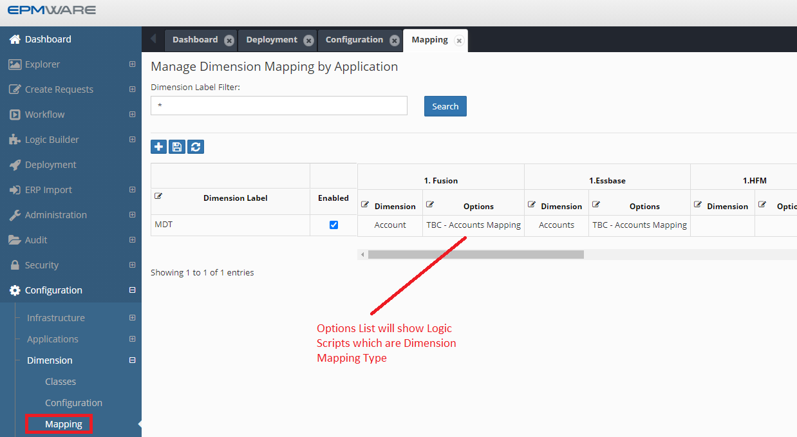

# :material-arrow-left-right:{ .lg .middle } **Dimension Mapping**

Dimension mapping Logic Scripts are used to map nodes between two or more applications. 
Whenever an action is performed on the source application such as Create Member, Rename Member or Edit Properties, the corresponding action will be performed on the mapped application. 

There are the three options for dimension mappings:

 - Sync
 - Smart Sync
 - Dimension Mapping Logic Script

### Sync & Smart Sync

The Sync and Smart Sync options do not require any Logic Scripts. They automatically replicate actions from the source application to mapped applications.

- **Sync** → Throws an error if the node is not found in the target application  
- **Smart Sync** → Does not throw an error if the node is missing  

For more details, refer to the [Administrator Guide – Dimension Mapping](https://admin-guide.epmware.com/configuration/dimensions/#dimension-mapping)

### 🧠 Dimension Mapping Logic Script

When the built-in options are not sufficient and custom logic is required the Dimension Mapping Logic Script type can be used.

The Logic Builder provides input parameters for each request action, such as:

- Member name  
- Parent member name  
- Action code  

The script must then populate the appropriate output parameters so the action can be successfully applied in the mapped application.

!!! info
    All input and output parameters are declared in the `EW_LB_API` package  
    (for example: `ew_lb_api.g_member_name`).

## 🔗 Script Association

Dimension Mapping Logic Scripts are assigned from the Dimension Mapping configuration screen, as shown below:

 
*Figure: Dimension Mapping script assignment screen*

## Related Topics

- [Dimension Mapping Input Parameters](input-parameters.md)
- [Dimension Mapping Output Parameters](output-parameters.md)
- [Property Mapping Event](../property-mapping/index.md)
- [Dimension Mapping APIs](../../api/packages/dimension_mapping_api.md)