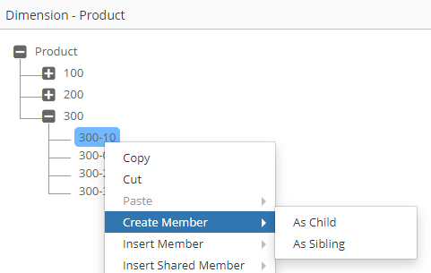

# 📤**Dimension Mapping Output Parameters**

Depending on the hierarchy action, specific output parameters can be populated to perform the same hierarchy action on the mapped dimension, or they can be skipped based on the business requirement.

## Output Parameters

All Logic Scripts must set these standard outputs:

### Status and Message

| Parameter | Type | Required | Description | Valid Values |
|-----------|------|----------|-------------|--------------|
| `g_status` | VARCHAR2 | Yes | Script execution status | 'S' (Success), 'E' (Error) |
| `g_message` | VARCHAR2 | No | User-facing message | Any text up to 4000 chars |

```sql
-- Success example
ew_lb_api.g_status := ew_lb_api.g_success;  -- 'S'
ew_lb_api.g_message := 'Member mapped successfully';

-- Error example
ew_lb_api.g_status := ew_lb_api.g_error;    -- 'E'
ew_lb_api.g_message := 'Invalid member name format';
```
</br>


### ***Hierarchy Action: Create Member***


The “Create Member” action has two sub actions. “As Child” or “As Sibling”. Depending on the sub action, Member Name, Parent Member Name get populated for Input Parameters and correspondingly Output Parameters will be required for the mapped dimension.


| Output Parameter | Description |
| --- | --- |
| g_out_ignore_flag | Y or N to indicate whether action needs to be ignored in the mapped dimension or not.  Default value is N. |
| g_out_parent_member_name | Parent Member Name from the mapped dimension |
| g_out_member_name | Member Name from the mapped dimension |
| g_out_new_member_name | New Member name for the mapped dimension |
| g_status | Status Values are either ‘S’ for Success or ‘E’ for Error.<br><br>Alternatively use the following method to set values in your code.<br><br>ew_lb_api.g_status  := ew_lb_api.g_success<br>OR<br>ew_lb_api.g_status  := ew_lb_api.g_error |
| g_message | Error Message if the status is Error. |


Note: Parent Member Name and Member Name of the mapped dimension determines where the new member will be created in that mapped dimension. 

If the Action Code is CMS (Crate Member as Sibling) then a New Member will be created after the Member Name under the parent member name provided in the output variables.

If the Action Code is CMC (Create Member as Child) then a New Member will be created under the Member Name. In this case g_out_member_name will be used as a parent member under which a new member will be created in the mapped dimension.

For example, if the user chooses “As Child” versus “As Sibling” action on the member “300-10” then different values will be populated for Input Parameters and corresponding Output Parameters will be anticipated in the Logic Script. New Member Name is 300-90. In the mapped application, you are required to add prefix P against member names such as P300-90
<br/>

<br/>


Input Parameters:


| Parameter | Create Member - As Child | Create Member - As Sibling |
| --- | --- | --- |
| g_parent_member_name | 300 | 300 |
| g_member_name | 300-10 | 300-10 |
| g_new_member_name | 300-90 | 300-90 |
| g_action_code | CMC | CMS |


Output Parameters:


In this example, we will add prefix P for all member names to create a new member in the mapped application.


| Parameter | Create Member - As Child | Create Member - As Sibling |
| --- | --- | --- |
| g_out_parent_member_name | P300 | P300 |
| g_out_member_name | P300-10 | P300-10 |
| g_out_new_member_name | P300-90 | P300-90 |
| Result | P300-90 will be created as the Last child member of P300-10 | P300-90 will be created as a sibling member of P300-10 (Child member of P300) |


### ***Hierarchy Action: Rename Member***


The following table will provide a list of Input and Output Parameters specifically for Rename Member Action.<br/>
Please refer to the main table above under Dimension Mapping for a complete list of all Input Parameters.


| Input Parameter | Description |
| --- | --- |
| g_renamed_from_member_name | Original Member name before it was Renamed. Use this variable for the Rename Member action to get the original member name. |
| g_action_code | RM |


| Output Parameter | Description |
| --- | --- |
| g_out_ignore_flag | Y or N to indicate whether action needs to be ignored in the mapped dimension or not. Default value is N. |
| g_out_parent_member_name | Parent Member Name from the mapped dimension |
| g_out_member_name | Member Name from the mapped dimension |
| g_out_new_member_name | Renamed Member Name for the Mapped dimension |
| g_status | Status Values are either ‘S’ for Success or ‘E’ for Error.<br><br>Alternatively use the following method to set values in your code.<br><br>ew_lb_api.g_status  := ew_lb_api.g_success<br>OR<br>ew_lb_api.g_status  := ew_lb_api.g_error |
| g_message | Error Message if the status is Error. |


### ***Hierarchy Action: Edit Properties, Remove Shared Member, Delete Member***


The following table will provide a list of Output Parameters required for Edit Properties, Remove Shared and Delete Member Actions.<br/>
Please refer to the main table above under Dimension Mapping for a complete list of all the Input Parameters.


| Input Parameter | Description |
| --- | --- |
| g_member_name | Member Name being Reordered |
| g_parent_member_name | Parent Member of the Member Name being Reordered |
| g_action_code | P   -> Edit Properties<br>RSM -> Remove Shared Member<br>DM  -> Delete Member |


| Output Parameter | Description |
| --- | --- |
| g_out_ignore_flag | Y or N to indicate whether action needs to be ignored in the mapped dimension or not. Default value is N. |
| g_out_parent_member_name | Parent Member Name from the mapped dimension |
| g_out_member_name | Member Name from the mapped dimension |
| g_status | Status Values are either ‘S’ for Success or ‘E’ for Error.<br><br>Alternatively use the following method to set values in your code.<br><br>ew_lb_api.g_status  := ew_lb_api.g_success<br>OR<br>ew_lb_api.g_status  := ew_lb_api.g_error |
| g_message | Error Message if the status is Error. |


### ***Hierarchy Action: Reorder Children***


The following table will provide a list of Input and Output Parameters specifically for Reorder Children Action.<br/>
Please refer to the main table above under Dimension Mapping for a complete list of all the Input Parameters.


| Input Parameter | Description |
| --- | --- |
| g_member_name | Member Name being Reordered |
| g_parent_member_name | Parent Member of the Member Name being Reordered |
| g_new_prev_sibling_member | New Previous Sibling of the member being reordered. |
| g_action_code | RM |


| Output Parameter | Description |
| --- | --- |
| g_out_ignore_flag | Y or N to indicate whether action needs to be ignored in the mapped dimension or not. Default value is N. |
| g_out_parent_member_name | Parent Member Name from the mapped dimension |
| g_out_member_name | Member Name from the mapped dimension |
| g_out_new_prev_sibling_member | Previous Sibling Member for the member in the mapped dimension |
| g_status | Status Values are either ‘S’ for Success or ‘E’ for Error.<br><br>Alternatively use the following method to set values in your code.<br><br>ew_lb_api.g_status  := ew_lb_api.g_success<br>OR<br>ew_lb_api.g_status  := ew_lb_api.g_error |
| g_message | Error Message if the status is Error. |


### ***Hierarchy Action: Move Member***


The following table will provide a list of Input and Output Parameters specifically for Move Member Action.<br/>
Please refer to the main table above under Dimension Mapping for a complete list of all the Input Parameters.


| Input Parameter | Description |
| --- | --- |
| g_moved_from_member_name | When a member is moved from a source parent member to the target parent member then this variable provides the member name of the source parent member. |
| g_moved_to_member_name | When a member is moved from a source parent member to the target parent member then this variable provides the member name of the target parent member. |
| g_moved_from_hierarchy_id | When a member is moved from a source parent member to the target parent member then this ID provides the hierarchy id of the source parent member. |
| g_moved_from_member_id | When a member is moved from a source parent member to the target parent member then this ID provides the member id of the source parent member. |
| g_moved_to_hierarchy_id | When a member is moved from a source parent member to the target parent member then this ID provides the hierarchy id of the target parent member. |
| g_moved_to_member_id | When a member is moved from a source parent member to the target parent member, then this ID provides the member id of the target parent member. |
| g_action_code | ZC |


| Output Parameter | Description |
| --- | --- |
| g_out_ignore_flag | Y or N to indicate whether action needs to be ignored in the mapped dimension or not. Default value is N. |
| g_out_parent_member_name | Parent Member Name from the mapped dimension |
| g_out_member_name | Member Name from the mapped dimension |
| g_out_new_prev_sibling_member | Previous Sibling Member for the member in the mapped dimension |
| g_out_moved_to_member_name | New Parent Member name where the member will be moved to for the mapped dimension |
| g_status | Status Values are either ‘S’ for Success or ‘E’ for Error.<br><br>Alternatively use the following method to set values in your code.<br><br>ew_lb_api.g_status  := ew_lb_api.g_success<br>OR<br>ew_lb_api.g_status  := ew_lb_api.g_error |
| g_message | Error Message if the status is Error. |


### ***Hierarchy Action: Insert Shared Member***


The following table will provide a list of Input and Output Parameters specifically for Insert Shared Member Action.<br/>
Please refer to the main table above under Dimension Mapping for a complete list of all the Input Parameters. Like the “Create Member” action, this action also has 2 sub actions, “As Child” and “As Sibling". Member and Parent Member parameters will follow the similar construct for this action as it does for the “Create Member” action. However, there is a key difference between this action and the “Create Member” action. In the Create Member action you can only create one member at a time, but for this action users can create more than one shared instance in a single action. Hence, Input parameters will provide an array of members for which shared instances are created and expect a similar array in the Output Parameters list for the mapped dimension.


| Input Parameter | Description |
| --- | --- |
| g_action_code | ISMC or ISMS |
| g_shared_members_tbl | This is a PL/SQL collection (table) with the list of Member names from the source dimension which will get Shared instances.<br>If the action is Insert Shared Member as Child then shared instances will be created under Member Name. Shared instances will be created as the last member under the parent member.<br><br>If the action is Insert Shared Member as Sibling then shared instances will be created under Parent Member and after the Member name. |


FYI: ew_lb_api.g_shared_members_tbl is a TABLE type collection. Type is as mentioned below.<br/>
Each element in this table refers to a Member Name


```sql
 TYPE g_members_tbl_t   IS TABLE OF ew_members.member_name%TYPE 
                        INDEX BY BINARY_INTEGER;
```

| Output Parameter | Description |
| --- | --- |
| g_out_ignore_flag | Y or N to indicate whether action needs to be ignored in the mapped dimension or not. Default value is N. |
| g_out_parent_member_name | Parent Member Name from the mapped dimension |
| g_out_member_name | Member Name from the mapped dimension |
| g_out_new_prev_sibling_member | Previous Sibling Member for the member in the mapped dimension |
| g_out_shared_members_tbl | Mapped Members from the Shared Dimension which will get shared instance |
| g_status | Status Values are either ‘S’ for Success or ‘E’ for Error.<br><br>Alternatively use the following method to set values in your code.<br><br>ew_lb_api.g_status  := ew_lb_api.g_success<br>OR<br>ew_lb_api.g_status  := ew_lb_api.g_error |
| g_message | Error Message if the status is Error. |


ew_lb_api.g_out_shared_members_tbl is a TABLE type collection. Type is as mentioned below.

```sql
 TYPE g_members_tbl_t   IS TABLE OF ew_members.member_name%TYPE
                        INDEX BY BINARY_INTEGER;<br> |
```


## Next Steps

- [Dimension Mapping Examples](examples.md) 
- [Dimension Mapping Input Parameters](input-parameters.md)
- [API Reference](../../api/packages/index.md)
- [Dimension Mapping APIs](../../api/packages/dimension_mapping_api.md)

---

!!! warning "Important"
    Always set `g_status` and provide a `g_message` when returning an error. This ensures users understand what went wrong and can take corrective action.