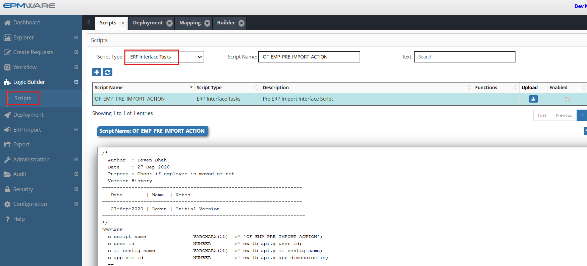
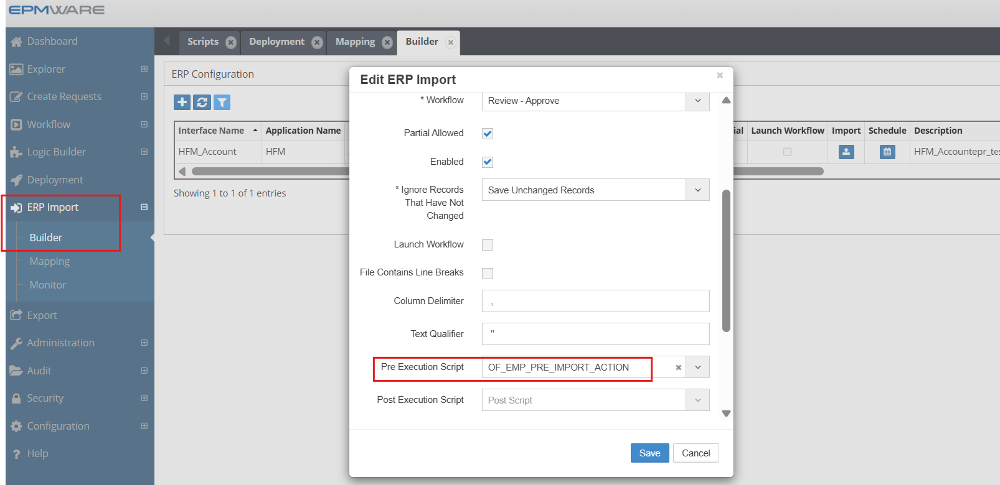

# 💡**ERP Interface Scripts Examples**

**Requirement** : Check if an Employee has moved in the ERP Interface table. If it has moved, then insert the move member action line in the interface table.

This is an example of a Pre ERP Interface-Logic Script. If the above check fails then the ERP Import will not proceed.


```sql

/* 
  Author  : Deven Shah
  Date    : 27-Sep-2020
  Purpose : Check if employee is moved or not
  Version History
--------------------------------------------------------------------
   Date        | Name  | Notes
--------------------------------------------------------------------
   27-Sep-2020 | Deven | Initial Version
---------------------------------------------------------------------
*/
DECLARE
  c_script_name                VARCHAR2(50)  := 'OF_EMP_PRE_IMPORT_ACTION';
  c_user_id                    NUMBER        := ew_lb_api.g_user_id;
  c_if_config_name             VARCHAR2(50)  := ew_lb_api.g_if_config_name;
  c_app_dim_id                 NUMBER        := ew_lb_api.g_app_dimension_id;
  --
  --
  PROCEDURE log (p_msg IN VARCHAR2)
  IS
  BEGIN
    ew_debug.log(p_text       => p_msg
                ,p_source_ref => c_script_name
                );
  END;
  --
  --
  PROCEDURE move_members
  IS
    l_prev_sibling_member_name VARCHAR2(100);
    --
    -- Select records where Employee Parent Member passed is different
    -- than the one in EPMWARE.. Hence, move the member
    --
    CURSOR cur
    IS
    SELECT DISTINCT
            e.if_exec_id,e.if_config_id,e.name
           ,e.request_date,e.due_date,e.description
           ,e.requested_by,e.requestor_user_name
           ,e.member_name , h.parent_member_name
           ,e.parent_member_name moved_to_parent_member
           ,e.property1 Emp_name
           ,e.created_by,e.last_updated_by
           ,NVL(e.line_num,1)-1 line_num
      FROM ew_if_lines            e
          ,ew_if_configs          i
          ,ew_hierarchy_details_v h
     WHERE 1=1
       AND e.name                = c_if_config_name
       AND e.status              = 'N'
       AND e.name                = i.name
       AND i.app_dimension_id    = h.app_dimension_id
       AND e.member_name         = h.member_name
       AND UPPER(e.parent_member_name) <> UPPER(h.parent_member_name)
       -- Ensure member is not already moved
       AND NOT EXISTS (SELECT 'Y'
                         FROM ew_hierarchy_details_v x
                        WHERE 1=1
                          AND x.member_id = h.member_id
                          AND UPPER(x.parent_member_name) = UPPER(e.parent_member_name)
                      )
     ORDER BY e.parent_member_name
             ,e.property1 DESC
     ;
  BEGIN
    FOR rec IN cur
    LOOP
      log('Move : '||rec.member_name||' to Parent '||rec.moved_to_parent_member);

    
      INSERT INTO ew_if_lines
      (if_config_id,if_line_id,name
      ,request_date,due_date,description
      ,requested_by,requestor_user_name
      ,member_name,parent_member_name,moved_to_parent_member
      ,prev_sibling_member
      ,action_code
      ,line_num
      ,creation_date,created_by,last_update_date,last_updated_by
      )
      VALUES
      (rec.if_config_id,ew_if_lines_s1.NEXTVAL,rec.name
      ,rec.request_date,rec.due_date,rec.description
      ,rec.requested_by,rec.requestor_user_name
      ,rec.member_name,rec.parent_member_name,rec.moved_to_parent_member
      ,l_prev_sibling_member_name
      ,'Move'
      ,rec.line_num -- Process Move Actions first
      ,SYSDATE,rec.created_by,SYSDATE,rec.last_updated_by
      )
      ;
    END LOOP;
  END move_members;
  --
BEGIN
  ew_lb_api.g_status := ew_lb_api.g_success;
  ew_lb_api.g_message := NULL;

  log('Check if Employee Last Name is changed OR not.');
  
  log('+  ERP Import Name : '||c_if_config_name);
  
  -- Move Members if the Inbound ERP Import has different
  -- Parent Member than the one already exists in EPMWARE
  
  move_members;

  COMMIT;
  
EXCEPTION
  WHEN OTHERS THEN
    ew_lb_api.g_status := ew_lb_api.g_error;
    ew_lb_api.g_message := SQLERRM;
    log(ew_lb_api.g_message);
END;


```

## Configuration

1.Create ERP Interface Task Logic Script as shown below:
<br/>

<br/>


2.Assign this Logic Script in the ERP Import -> Builder -> Pre/Post Execution Script , as shown below:
<br/>

<br/>


## Next Steps

- [On Submit Workflow Tasks](../on-submit-workflow-task/index.md) - On Submit Workflow Action Script Details
- [ERP Import APIs](../../api/packages/erp_import_api.md) - Supporting functions


