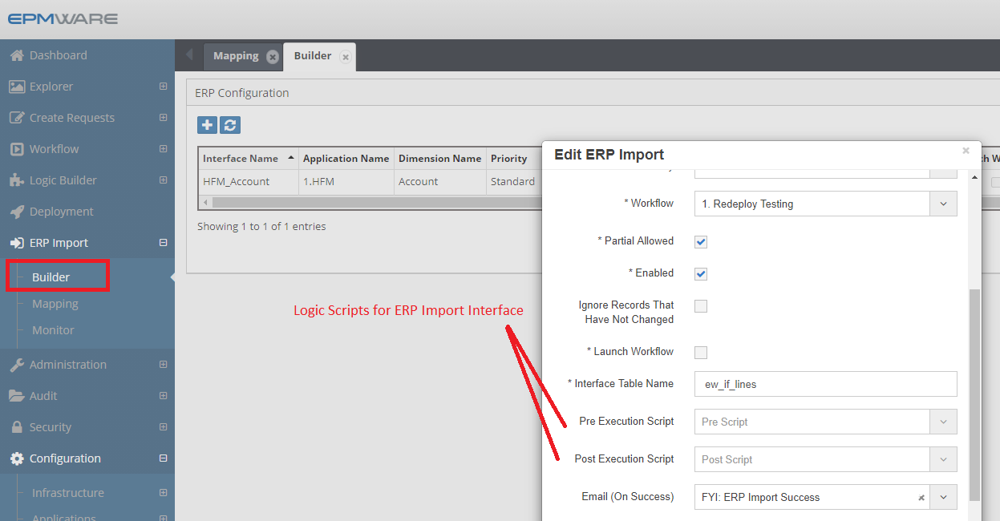

# :material-database-sync:{ .lg .middle } **ERP Interface Scripts**

There are two types of ERP Interface tasks (Pre-Import and Post Import) that are used by the ERP Import module. Pre-Import tasks are executed whenever new records for the ERP interface are found and before they are processed by the ERP Import execution. Post Import tasks are executed after records are processed for the ERP Interface.

ERP Interface scripts are triggered during:

- **Pre-Import**: Before ERP data is processed into EPMware
- **Post-Import**: After ERP data has been imported

These scripts are associated in the ERP Import -> Builder screen as shown below.

 

## Next Steps

- [ERP Interface Inout Parameters](input-parameters.md)
- [ERP Interface Output Parameters](output-parameters.md)
- [ERP Interface Examples](examples.md)
- [Export Tasks](../export-tasks/index.md)