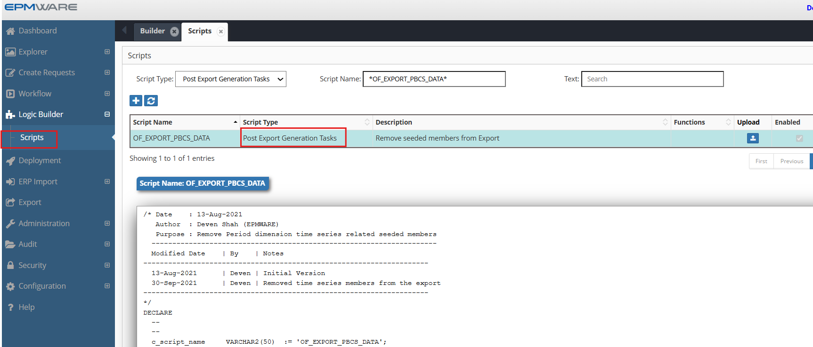
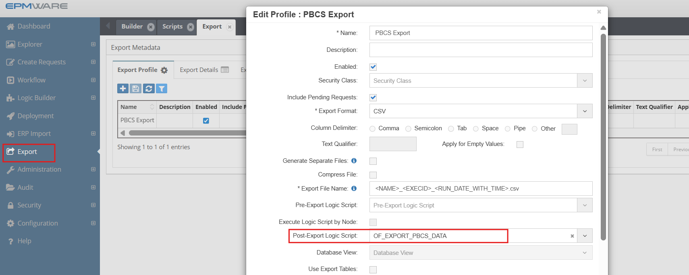

# 💡**Pre/Post Export Generation Task Script Examples**

**Requirement** : The PBCS application has seeded members for the Period Dimension that are not shown in the application but are included in the LCM Extract file and loaded in EPMWARE. For example, D-T-D, H-T-D, M-T-D, P-T-D. The Export should remove these members from the Export file.

```sql

/* Date    : 13-Aug-2021
   Author  : Deven Shah (EPMWARE)
   Purpose : Remove Period dimension time series related seeded members
  ---------------------------------------------------------------------
  Modified Date    | By    | Notes
---------------------------------------------------------------------
  13-Aug-2021      | Deven | Initial Version
  30-Sep-2021      | Deven | Removed time series members from the export
---------------------------------------------------------------------
*/
DECLARE
  --
  --
  c_script_name     VARCHAR2(50)  := 'OF_EXPORT_PBCS_DATA';
  C_EXP_ID          NUMBER := ew_lb_api.g_exp_id; 
  C_EXP_CONFIG_NAME VARCHAR2(50)  := ew_lb_api.g_exp_config_name;
   
  PROCEDURE log(p_msg IN VARCHAR2)
  IS
  BEGIN
    ew_debug.log(p_msg,ew_debug.show_always,c_script_name);
  END;
  
  PROCEDURE del_period_time_series_mems
  IS
  BEGIN
    log('Delete Time Series Members from the Period dimension');
    DELETE
    FROM ew_exp_members p
    WHERE 1=1
      AND p.exp_id = C_EXP_ID
      AND p.member_name IN ('D-T-D','H-T-D','M-T-D','P-T-D'
                           ,'Q-T-D','S-T-D','W-T-D','Y-T-D')
    ;
    log('# of time series members removed : '||SQL%ROWCOUNT);
  END del_period_time_series_mems;
BEGIN
  -- Default values for return code
  ew_lb_api.g_status  := ew_lb_api.g_success;
  ew_lb_api.g_message := NULL;
  
  log('Export ID : '||C_EXP_ID);
  log('Export Name : '||C_EXP_CONFIG_NAME);
  
  --  Delete Time Series members from the Period dimension
  --          For example, Y-T-D, H-T-D and so on 
  -- These members are not visible in the PBCS apps in the Metadata hierarchy
  -- but PBCS adds them in the LCM Extract file and hence gets loaded in the EPMWARE app as well.
  -- Hence, we need to remove it from the export to make it consistent for the downstream apps
  
   del_period_time_series_mems;
  
  COMMIT;
  
EXCEPTION
  WHEN OTHERS THEN
    ew_lb_api.g_status := ew_lb_api.g_error;
    ew_lb_api.g_message := 'Error in Logic Script ['||c_script_name||'] '||
                            SQLERRM;
    log(ew_lb_api.g_message);
END;


```

## Configuration

1.Create Export Generation Task type Logic Script as shown below:
<br/>

<br/>


2.Assign this Logic Script in the Export screen as shown below:
  
  Export -> Export Profile -> Select Export profile and assign script
<br/>

<br/>


## Next Steps

- [On Request Line Approval Task Script](../on-request-line-approval/index.md) - Pre/Post Export Tasks scripts Details
- [Export API Reference](../../api/packages/export_api.md) - Supporting functions


---

!!! tip "Best Practice"
    Always test derivation scripts with edge cases including NULL values, maximum lengths, and boundary conditions before deploying to production.