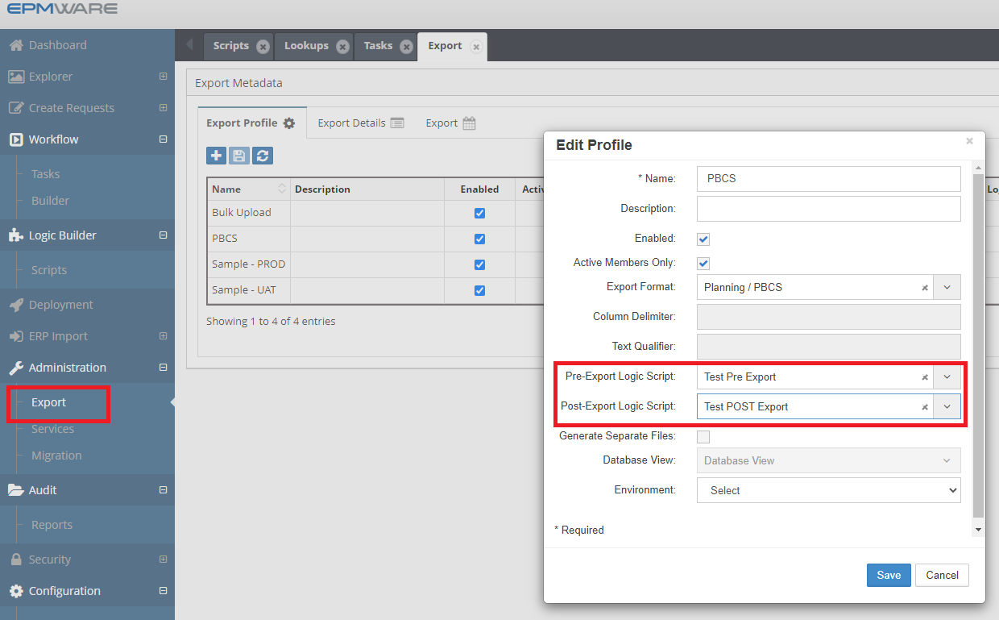

# :material-file-export:{ .lg .middle } **Pre/Post Export Generation Task Scripts**

Pre or Post Export Generation Tasks Logic Scripts are used to perform custom tasks while generating Export files.

Export scripts are triggered during the export process:

- **Pre-Export** : Before export file generation
- **Post-Export**: After export file creation

These scripts are associated in the Export -> Export Profile screen as shown below.
 

 
*Figure: Export Task Logic script Association*

## Next Steps

- [Export Task Script - Input Parameters](input-parameters.md)
- [Export Task Script - Output Parameters](output-parameters.md)
- [Export Task Script - Examples](examples.md)
- [Export API Reference](../../api/packages/export_api.md)