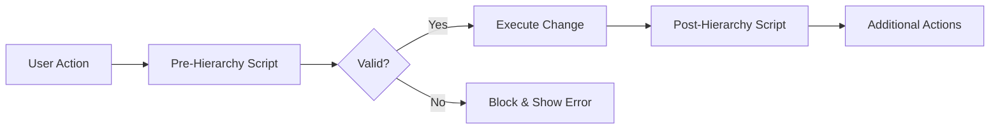

# Hierarchy Actions Scripts

Hierarchy Action scripts provide automated logic that executes before (Pre) or after (Post) hierarchy changes occur. These scripts enable validation, automation, and business rule enforcement during hierarchy maintenance operations.

## Overview

Hierarchy Actions provide control over:
- **Pre-Actions**: Validate and prepare before changes
- **Post-Actions**: Automate tasks after successful changes
- **Member Creation**: Control new member additions
- **Member Deletion**: Manage removal processes
- **Member Movement**: Handle reorganizations
- **Shared Members**: Manage alternate hierarchies


*Figure: Pre and Post hierarchy action execution flow*

## Action Types

### Hierarchy Action Codes

| Action Code | Description | Pre-Action Use | Post-Action Use |
|-------------|-------------|----------------|-----------------|
| CMC | Create Member as Child | Validate naming, check duplicates | Create related members, set defaults |
| CMS | Create Member as Sibling | Validate permissions, check rules | Update sibling relationships |
| DM | Delete Member | Check dependencies, prevent if in use | Clean up related data |
| RNM | Rename Member | Validate new name, check conflicts | Update references |
| ZC | Move Member (Change Parent) | Validate new structure | Recalculate rollups |
| ISMC | Insert Shared Member as Child | Check sharing rules | Update alternate hierarchies |
| ISMS | Insert Shared Member as Sibling | Validate shared placement | Sync shared properties |
| DSHM | Delete Shared Member | Check shared dependencies | Update primary hierarchy |

## How It Works



## Configuration

### Step 1: Create the Script

Navigate to **Configuration → Logic Builder**:

```sql
DECLARE
  c_script_name CONSTANT VARCHAR2(100) := 'PRE_VALIDATE_MEMBER';
BEGIN
  -- Initialize
  ew_lb_api.g_status := ew_lb_api.g_success;
  
  -- Validation logic
  IF ew_lb_api.g_action_code = 'CMC' THEN
    -- Validate new member creation
    IF NOT valid_member_name(ew_lb_api.g_new_member_name) THEN
      ew_lb_api.g_status := ew_lb_api.g_error;
      ew_lb_api.g_message := 'Invalid member name format';
    END IF;
  END IF;
END;
```

### Step 2: Configure Hierarchy Actions

Navigate to **Configuration → Dimension → Hierarchy Actions**:

1. Select application and dimension
2. Choose action type (Pre or Post)
3. Select hierarchy action codes
4. Assign Logic Script
5. Set execution order


*Figure: Configuring hierarchy action scripts*

## Pre vs Post Actions

### Pre-Hierarchy Actions
**Purpose**: Validate and prepare

**Common Uses**:
- Validate member names
- Check business rules
- Prevent invalid structures
- Verify permissions
- Check for duplicates

**Key Point**: Can prevent the action by setting error status

### Post-Hierarchy Actions  
**Purpose**: Automate and extend

**Common Uses**:
- Create related members
- Set default properties
- Update calculations
- Send notifications
- Synchronize systems

**Key Point**: Executes after successful change

## Input Parameters

### Common Parameters

| Parameter | Type | Available In | Description |
|-----------|------|--------------|-------------|
| `g_action_code` | VARCHAR2 | All | Action being performed |
| `g_app_id` | NUMBER | All | Application ID |
| `g_app_dimension_id` | NUMBER | All | Dimension ID |
| `g_member_id` | NUMBER | Most | Member being acted upon |
| `g_user_id` | NUMBER | All | User performing action |

### Action-Specific Parameters

| Parameter | Actions | Description |
|-----------|---------|-------------|
| `g_member_name` | All | Current member name |
| `g_new_member_name` | CMC, CMS, RNM | New member/renamed name |
| `g_parent_member_name` | CMC, CMS, ZC | Parent member |
| `g_old_parent_member_name` | ZC | Previous parent (move) |
| `g_sort_order` | CMC, CMS | Position in hierarchy |

## Output Parameters

| Parameter | Type | Description |
|-----------|------|-------------|
| `g_status` | VARCHAR2 | Success ('S') or Error ('E') |
| `g_message` | VARCHAR2 | User message |
| `g_out_new_member_name` | VARCHAR2 | Override member name |
| `g_out_parent_member_name` | VARCHAR2 | Override parent |

## Common Patterns

### Pattern 1: Validate Member Naming
```sql
-- Pre-action validation
IF ew_lb_api.g_action_code IN ('CMC', 'CMS', 'RNM') THEN
  IF NOT REGEXP_LIKE(ew_lb_api.g_new_member_name, 
                      '^[A-Z][A-Z0-9_]{2,49}$') THEN
    ew_lb_api.g_status := ew_lb_api.g_error;
    ew_lb_api.g_message := 'Member name must start with letter, ' ||
                            '3-50 chars, alphanumeric and underscore only';
  END IF;
END IF;
```

### Pattern 2: Prevent Deletion
```sql
-- Pre-action: Prevent deletion if member has data
IF ew_lb_api.g_action_code = 'DM' THEN
  IF member_has_data(ew_lb_api.g_member_name) THEN
    ew_lb_api.g_status := ew_lb_api.g_error;
    ew_lb_api.g_message := 'Cannot delete member with existing data';
  END IF;
END IF;
```

### Pattern 3: Auto-Create Related Members
```sql
-- Post-action: Create supporting members
IF ew_lb_api.g_action_code = 'CMC' THEN
  IF ew_lb_api.g_new_member_name LIKE 'DEPT_%' THEN
    -- Create cost center children
    create_member(p_parent => ew_lb_api.g_new_member_name,
                  p_name   => ew_lb_api.g_new_member_name || '_OPEX');
    create_member(p_parent => ew_lb_api.g_new_member_name,
                  p_name   => ew_lb_api.g_new_member_name || '_CAPEX');
  END IF;
END IF;
```

### Pattern 4: Validate Hierarchy Depth
```sql
-- Pre-action: Limit hierarchy depth
DECLARE
  l_depth NUMBER;
BEGIN
  IF ew_lb_api.g_action_code IN ('CMC', 'ZC') THEN
    l_depth := get_hierarchy_depth(ew_lb_api.g_parent_member_name);
    
    IF l_depth >= 10 THEN
      ew_lb_api.g_status := ew_lb_api.g_error;
      ew_lb_api.g_message := 'Maximum hierarchy depth (10 levels) exceeded';
    END IF;
  END IF;
END;
```

## Best Practices

### 1. Keep Pre-Actions Fast
```sql
-- Pre-actions block user interaction
-- Optimize for speed
IF quick_check_fails() THEN
  ew_lb_api.g_status := ew_lb_api.g_error;
  RETURN; -- Exit early
END IF;
```

### 2. Make Post-Actions Resilient
```sql
-- Post-actions should handle errors gracefully
BEGIN
  perform_post_action();
EXCEPTION
  WHEN OTHERS THEN
    -- Log but don't fail the hierarchy change
    ew_debug.log('Post-action warning: ' || SQLERRM);
END;
```

### 3. Use Clear Messages
```sql
-- Provide actionable feedback
ew_lb_api.g_message := 
  'Cannot create member "' || ew_lb_api.g_new_member_name || 
  '" - a member with this name already exists under parent "' || 
  ew_lb_api.g_parent_member_name || '"';
```

### 4. Handle All Action Codes
```sql
-- Always include ELSE clause
CASE ew_lb_api.g_action_code
  WHEN 'CMC' THEN handle_create();
  WHEN 'DM' THEN handle_delete();
  WHEN 'RNM' THEN handle_rename();
  ELSE 
    -- Log unexpected action
    ew_debug.log('Unhandled action: ' || ew_lb_api.g_action_code);
END CASE;
```

## Testing Hierarchy Actions

### Test Scenarios

1. **Create Member**
   - Valid name → Success
   - Duplicate name → Error
   - Invalid format → Error

2. **Delete Member**
   - Leaf member → Success
   - Parent with children → Error
   - Member with data → Error

3. **Move Member**
   - Valid new parent → Success
   - Circular reference → Error
   - Cross-dimension → Error

4. **Rename Member**
   - Unique new name → Success
   - Existing name → Error
   - Invalid characters → Error

## Common Issues

| Issue | Cause | Solution |
|-------|-------|----------|
| Action not triggered | Script not associated | Check hierarchy action configuration |
| Always fails | Logic error | Debug script, check parameters |
| Inconsistent behavior | Missing action codes | Handle all relevant actions |
| Performance issues | Complex pre-actions | Optimize queries, defer to post |

## Advanced Features

### Dynamic Action Control
```sql
-- Conditionally allow actions based on user role
IF ew_lb_api.g_action_code = 'DM' THEN
  IF NOT user_has_role('ADMIN') THEN
    ew_lb_api.g_status := ew_lb_api.g_error;
    ew_lb_api.g_message := 'Only administrators can delete members';
  END IF;
END IF;
```

### Cascade Operations
```sql
-- Post-action: Cascade updates to related dimensions
IF ew_lb_api.g_action_code = 'RNM' THEN
  update_related_dimensions(
    p_old_name => ew_lb_api.g_member_name,
    p_new_name => ew_lb_api.g_new_member_name
  );
END IF;
```

### Audit Trail
```sql
-- Post-action: Create audit record
INSERT INTO hierarchy_audit (
  action_code,
  member_name,
  parent_name,
  user_id,
  action_date,
  details
) VALUES (
  ew_lb_api.g_action_code,
  ew_lb_api.g_member_name,
  ew_lb_api.g_parent_member_name,
  ew_lb_api.g_user_id,
  SYSDATE,
  ew_lb_api.g_message
);
```

## Performance Considerations

- **Pre-Actions**: Keep lightweight, users waiting
- **Post-Actions**: Can be more complex, asynchronous
- **Caching**: Cache frequently used validation data
- **Early Exit**: Return immediately on first error
- **Bulk Operations**: Consider impact on imports

## Next Steps

- [Pre-Hierarchy Actions](pre-hierarchy.md) - Validation scripts
- [Post-Hierarchy Actions](post-hierarchy.md) - Automation scripts
- [Seeded Scripts](seeded-scripts.md) - Standard EPMware scripts

---

!!! tip "Best Practice"
    Test hierarchy action scripts thoroughly with all possible action codes. A script that works for member creation might fail for member movement if not properly designed.