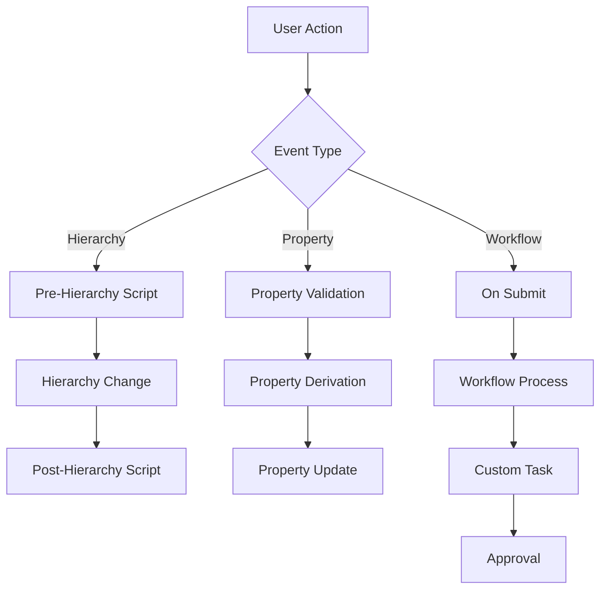

# Script Events Overview

Logic Scripts in EPMware are triggered by specific events that occur during normal system operations. Understanding these events and their execution context is crucial for developing effective automation solutions.

## Event Categories

Script events are organized into five main categories:


*Figure: Overview of Logic Script event categories*

### 1. Dimension & Hierarchy Events
- **[Dimension Mapping](dimension-mapping/)** - Synchronize hierarchies between applications
- **[Pre-Hierarchy Actions](hierarchy-actions/pre-hierarchy.md)** - Validate before hierarchy changes
- **[Post-Hierarchy Actions](hierarchy-actions/post-hierarchy.md)** - Automate after hierarchy changes

### 2. Property Events
- **[Property Mapping](property-mapping/)** - Map properties across applications
- **[Property Derivations](property-derivations/)** - Calculate property values
- **[Property Validations](property-validations/)** - Enforce business rules

### 3. Workflow Events
- **[On Submit Tasks](workflow/on-submit.md)** - Validate before workflow entry
- **[Custom Tasks](workflow/custom-tasks.md)** - Complex workflow logic
- **[Request Line Approval](workflow/request-line-approval.md)** - Pre-approval validations

### 4. Integration Events
- **[ERP Interface](erp-interface/)** - Pre/Post import processing
- **[Export Tasks](export/)** - Pre/Post export processing
- **[Deployment Tasks](deployment/)** - Pre/Post deployment logic

## Event Execution Flow

Understanding when scripts execute is critical for proper implementation:



## Event Context

Each event provides specific context through input parameters:

| Event Type | Key Context Information |
|------------|------------------------|
| Dimension Mapping | Source/target dimensions, action codes, member names |
| Property Events | Property name, old/new values, member context |
| Workflow Events | Request ID, workflow stage, task details |
| Integration Events | File information, import/export configuration |

## Script Association

Scripts must be associated with their corresponding events to execute:


*Figure: Script association configuration screens*

### Association Locations

| Script Type | Configuration Location |
|-------------|----------------------|
| Dimension Mapping | Configuration → Dimension → Mapping |
| Property Validation | Configuration → Properties → Validations |
| Property Derivation | Configuration → Properties → Derivations |
| Property Mapping | Configuration → Properties → Mapping |
| Hierarchy Actions | Configuration → Dimension → Hierarchy Actions |
| Workflow Tasks | Workflow → Builder / Tasks |
| ERP Interface | ERP Import → Builder |
| Export Tasks | Administration → Export |
| Deployment | Deployment Configuration |

## Input/Output Parameters

All script events follow a standard parameter model:

### Standard Input Parameters
```sql
-- Always available
ew_lb_api.g_user_id        -- Current user ID
ew_lb_api.g_session_id     -- Current session
ew_lb_api.g_app_id         -- Application ID
ew_lb_api.g_app_dimension_id -- Dimension ID

-- Event-specific parameters
ew_lb_api.g_member_name    -- Member being processed
ew_lb_api.g_prop_value     -- Property value
ew_lb_api.g_action_code    -- Action being performed
```

### Standard Output Parameters
```sql
-- Required outputs
ew_lb_api.g_status         -- Success/Error status
ew_lb_api.g_message        -- User message

-- Event-specific outputs
ew_lb_api.g_out_prop_value -- Modified property value
ew_lb_api.g_out_ignore_flag -- Skip standard processing
```

## Error Handling

All scripts should implement proper error handling:

```sql
EXCEPTION
  WHEN OTHERS THEN
    ew_lb_api.g_status  := ew_lb_api.g_error;
    ew_lb_api.g_message := 'Error: ' || SQLERRM;
    ew_debug.log('Script error: ' || SQLERRM);
END;
```

## Debugging Scripts

Use the debug API for troubleshooting:

```sql
-- Log debug messages
ew_debug.log(
  p_text       => 'Debug message here',
  p_source_ref => 'SCRIPT_NAME'
);
```

View debug messages through:
**Reports → Admin → Debug Messages**


*Figure: Debug Messages report for script troubleshooting*

## Performance Considerations

### High-Frequency Events
These events fire frequently and need optimization:
- Property Validations (every keystroke)
- Property Derivations (every field change)
- Pre-Hierarchy validations

### Low-Frequency Events
Can accommodate more complex logic:
- Deployment tasks
- Export generation
- Workflow custom tasks

### Optimization Tips
1. **Cache lookup data** in package variables
2. **Use bulk operations** for multiple records
3. **Minimize database calls** in loops
4. **Index custom tables** appropriately
5. **Test with production-like volumes**

## Event Selection Guide

Choose the right event for your requirements:

| Need to... | Use Event Type |
|------------|---------------|
| Validate data before saving | Property Validation |
| Calculate values automatically | Property Derivation |
| Sync between applications | Dimension/Property Mapping |
| Control hierarchy changes | Pre/Post Hierarchy Actions |
| Automate workflow decisions | Workflow Custom Task |
| Process import data | ERP Interface |
| Transform export data | Export Tasks |
| Validate before deployment | Deployment Tasks |

## Common Patterns

### Pattern 1: Conditional Processing
```sql
IF ew_lb_api.g_action_code = 'CMC' THEN
  -- Create member as child logic
ELSIF ew_lb_api.g_action_code = 'DM' THEN
  -- Delete member logic
END IF;
```

### Pattern 2: Lookup and Cache
```sql
DECLARE
  g_lookup_cache VARCHAR2(4000);
BEGIN
  IF g_lookup_cache IS NULL THEN
    -- Load cache once
    g_lookup_cache := load_lookup_data();
  END IF;
  -- Use cached data
END;
```

### Pattern 3: Validation with Multiple Checks
```sql
DECLARE
  l_errors VARCHAR2(4000);
BEGIN
  -- Accumulate all errors
  IF check1_fails THEN
    l_errors := l_errors || 'Check 1 failed; ';
  END IF;
  
  IF check2_fails THEN
    l_errors := l_errors || 'Check 2 failed; ';
  END IF;
  
  -- Return all errors at once
  IF l_errors IS NOT NULL THEN
    ew_lb_api.g_status := ew_lb_api.g_error;
    ew_lb_api.g_message := l_errors;
  END IF;
END;
```

## Testing Strategies

### Unit Testing
Test scripts in isolation:
1. Create test data
2. Execute script directly
3. Verify results
4. Check debug logs

### Integration Testing
Test scripts in context:
1. Perform actual user actions
2. Verify script triggers
3. Check downstream effects
4. Validate error handling

### Performance Testing
Ensure scripts scale:
1. Test with production volumes
2. Monitor execution times
3. Check database performance
4. Optimize as needed

## Next Steps

Explore specific event types in detail:

- [Dimension Mapping](dimension-mapping/) - Synchronize hierarchies
- [Property Validations](property-validations/) - Enforce rules
- [Workflow Tasks](workflow/) - Automate processes
- [ERP Interface](erp-interface/) - Integration logic

---

!!! info "Remember"
    Scripts only execute when properly associated with their events. Always verify script associations after creation.