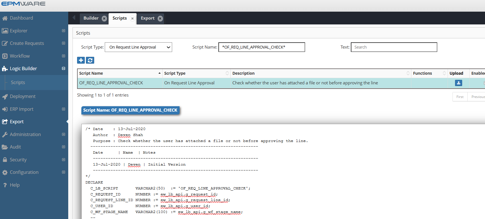
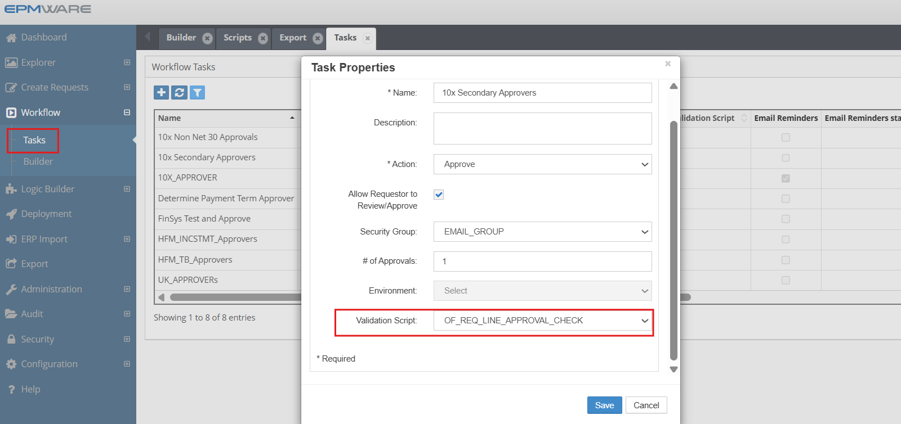

# 💡**On Request Line Approval Task Script Examples**

**Requirement** : Attach a file to the request before it proceeds to the next stage in the workflow.


```sql

/* Date    : 13-Jul-2020
   Author  : Deven Shah
   Purpose : Check whether the user has attached a file or not before approving the line.
  -------------------------------------------------------------------
   Date      | Name  | Notes
   ------------------------------------------------------------------
   13-Jul-2020 | Deven | Initial Version
   ------------------------------------------------------------------
*/
DECLARE
  C_LB_SCRIPT       VARCHAR2(50)  := 'OF_REQ_LINE_APPROVAL_CHECK';
  C_REQUEST_ID      NUMBER := ew_lb_api.g_request_id;
  C_REQUEST_LINE_ID NUMBER := ew_lb_api.g_request_line_id;
  C_USER_ID         NUMBER := ew_lb_api.g_user_id;
  C_WF_STAGE_NAME   VARCHAR2(100) := ew_lb_api.g_wf_stage_name; 
  --
  l_hfm_review_stage      VARCHAR2(100) := 'HFM Mapping Review and Approval';
  l_fin_mgr_review_stage  VARCHAR2(100) := 'Finance GL Manager Review';
  --
  l_error_ex          EXCEPTION;
  -- 
  PROCEDURE log(p_msg IN VARCHAR2)
  IS
  BEGIN
    ew_debug.log(p_msg,ew_debug.show_always,C_LB_SCRIPT);
  END;
  
  -- Add Message into Global Message
  PROCEDURE add_msg (p_msg IN VARCHAR2)
  IS
  BEGIN
    IF ew_lb_api.g_message IS NOT NULL
    THEN
      ew_lb_api.g_message := ew_lb_api.g_message || ' '|| CHR(10)||'<BR>';
    ELSE
      ew_lb_api.g_status  := ew_lb_api.g_error;
    END IF;
    
    ew_lb_api.g_message := ew_lb_api.g_message || p_msg;
    
  END add_msg;
  
  
  /* ********************************************************************
   Check if an attachment is added or not if the request has Company dimension changes.  *******************************************************************/
  PROCEDURE chk_attachments
  IS
    l_req_att VARCHAR2(1);
	l_HFM_mapping_comp VARCHAR2(100);
    l_Attachment_checkbox VARCHAR2(100);
    
    CURSOR cur
    IS
      SELECT l.*
      FROM ew_request_line_members_v l -- This view will provide details for all request lines 
          ,ew_req_line_wf_actions_v  w -- This view will check if user can approve line or not
      WHERE 1=1
        AND l.request_id  = c_request_id
        AND l.status      <> 'X' -- not cancelled lines
        AND l.app_name    = 'Oracle EBS'
        AND l.dim_name    = 'Company'
        -- Ensure current user is Approver for the request line
        AND l.request_line_id = w.request_line_id
        AND w.action_code     = 'A' -- Approve action
        AND w.action_allowed  = 'Y'
        AND w.user_id         = C_USER_ID        
        --
      ORDER BY l.line_num
      ;
  BEGIN
    -- Check whether request has any attachment or not
    -- (Y or N flag)
    l_req_att := ew_req_api.chk_req_has_attachments(C_REQUEST_ID);

    IF l_req_att = 'N'
    THEN
      log('Request does not have any attachments.. Check if there is any change for Company dimension..');
      FOR rec IN cur
      LOOP
        log('Line # '||rec.line_num||' Member name : '||rec.member_name);      
		l_attachment_checkbox := ew_lb_api.get_member_prop_value
                                     (p_member_id => rec.member_id
                                     ,p_prop_label => 'Attachment Required');
        
        log('Checkbox value: '||l_Attachment_checkbox);
        
		IF l_attachment_checkbox = 'Y'
        THEN
          add_msg ('Request needs attachment if Company dimension is modified. '||
                   'Check Line # '||rec.line_num ||'.');
		END IF;
      END LOOP;
    END IF;

  END chk_attachments;

BEGIN
  -- Default values for return code
  ew_lb_api.g_status  := ew_lb_api.g_success;
  ew_lb_api.g_message := NULL;
  
  log('Request ID : '||C_REQUEST_ID);
  log('Workflow Stage Name : '||C_WF_STAGE_NAME);
  
  chk_attachments;
  
  IF ew_lb_api.g_status = ew_lb_api.g_error
  THEN
    log(ew_lb_api.g_message);
  ELSE
    log('No Error..');
  END IF;

EXCEPTION
  WHEN l_error_ex THEN
    log(ew_lb_api.g_message);
  WHEN OTHERS THEN
    ew_lb_api.g_status := ew_lb_api.g_error;
    ew_lb_api.g_message := 'Error Executing Logic Script : '||SQLERRM;
    log(ew_lb_api.g_message);
END;


```

## Configuration

1.Create On Request Line Approval Logic Script as shown below:
<br/>

<br/>


2.Assign this Logic Script in the Workflow Tasks screen as shown below:
  
  WorkFlow -> Tasks -> Select Approver/Reviewer type task to assign the Logic Script
<br/>

<br/>


## Next Steps

- [API Reference](../../api/packages/index.md) - Supporting functions


---

!!! tip "Best Practice"
    Always test derivation scripts with edge cases including NULL values, maximum lengths, and boundary conditions before deploying to production.