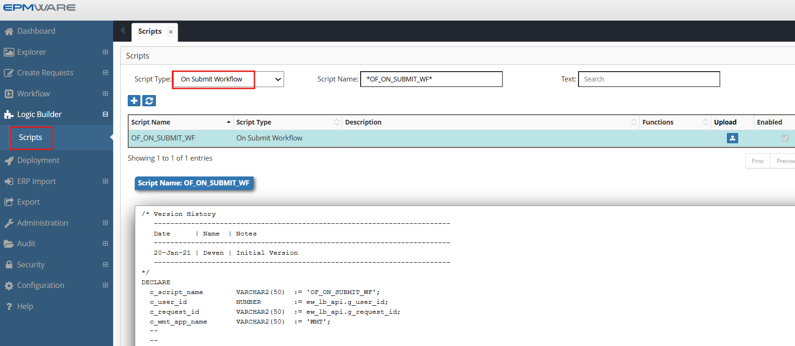
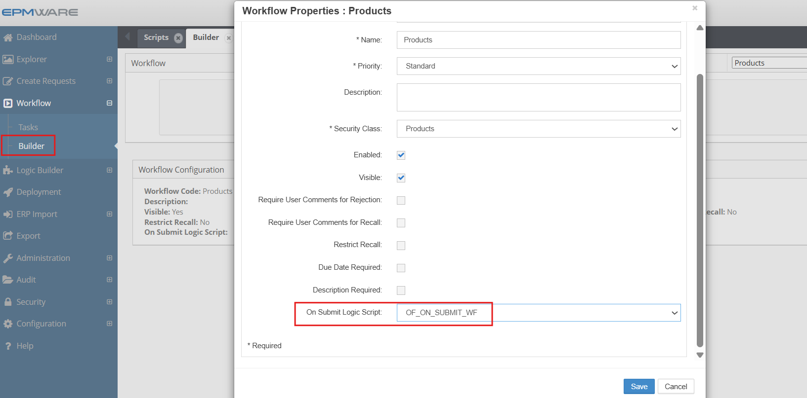

# 💡**On Submit Workflow Task Script Examples**

**Requirement** : Ensure Base Members under the Primary Branch have their shared instance under the Alternate branch. If not, then throw an error.


```sql

/* Version History  ---------------------------------------------------------------------
   Date      | Name  | Notes ---------------------------------------------------------------------
   20-Jan-21 | Deven | Initial Version ---------------------------------------------------------------------
*/
DECLARE
  c_script_name        VARCHAR2(50)  := 'OF_ON_SUBMIT_WF';
  c_user_id            NUMBER        := ew_lb_api.g_user_id;
  c_request_id         VARCHAR2(50)  := ew_lb_api.g_request_id;
  c_app_name           VARCHAR2(50)  := 'OF_HFM';
  --
  --
  PROCEDURE log (p_msg IN VARCHAR2)
  IS
  BEGIN
    ew_debug.log(p_text       => p_msg
                ,p_source_ref => c_script_name
                );
  END;
  --
  PROCEDURE add_err (p_line_num IN VARCHAR2, p_message IN VARCHAR2)
  IS
  BEGIN
     ew_lb_api.ins_req_val_rec
                           (p_line_num  => p_line_num
                           ,p_message   => p_message
                           ,p_qa_name   => c_script_name
                           );
     ew_lb_api.g_status := ew_lb_api.g_error;
  END add_err;
  --
  PROCEDURE chk_shared_members (p_dim_name   IN VARCHAR2
                               ,p_store_branch IN VARCHAR2
                               ,p_share_branch IN VARCHAR2
                               )
  IS
    CURSOR cur
    IS
      SELECT *
      FROM ew_request_line_members_v l
      WHERE 1=1
        AND l.request_id  = c_request_id
        AND l.status      <> 'X' -- not cancelled lines
        AND l.app_name    = c_wmt_app_name
        AND l.dim_name    = p_dim_name
        AND l.action_code IN ('CMC','CMS') -- Create member as Child or Sibling
        AND ew_hierarchy.is_base_member(l.member_id) = 'Y'
        -- Check whether the member exists under Primary branch
        AND ew_hierarchy.chk_primary_branch_exists
                  (p_app_dimension_id   => l.app_dimension_id
                  ,p_parent_member_name => p_store_branch
                  ,p_member_name        => l.member_name
                  )  = 'Y'
        -- But not under Alternate branch
        AND ew_hierarchy.chk_branch_exists
                  (p_app_dimension_id   => l.app_dimension_id
                  ,p_parent_member_name => p_share_branch
                  ,p_member_name        => l.member_name
                  )  = 'N'
      ORDER BY l.line_num  
      ;  
  BEGIN
    log('** Check Base '||p_dim_name||' missing Shared instance under '||p_share_branch||' branch');
    FOR rec IN cur
    LOOP
      log('Line # '||rec.line_num||' Member name : '||rec.member_name);
	  add_err(rec.line_num, p_dim_name||' Base Member must have a Shared Instance under '||p_share_branch||' branch.');
    END LOOP;
  END chk_shared_members;
  --
BEGIN
  
  ew_lb_api.g_status := ew_lb_api.g_success;
  ew_lb_api.g_message := NULL;
  
  log('** Start: Validations Request ID : '||c_request_id);  


  -- Check for missing Shared members in specified branches
  -- Parameters : Dimension Name 
  --              Primary Branch top Member name
  --              Alternate Branch top Member name
  --
  chk_shared_members ('Detail_Account','A101_1','PK_01');
  
  log('** End: Validations Request ID : '||c_request_id);  
   
END;

```

## Configuration

1.Create On Submit Workflow type Logic Script as shown below:
<br/>

<br/>


2.Assign this Logic Script in the Workflow screen as shown below:
  
  WorkFlow -> Builder -> Select Workflow from the list to assign the Logic Script
<br/>

<br/>


## Next Steps

- [Workflow Custom Task](../workflow-custom_task/index.md) - Workflow Custom Tasks scripts
- [API Reference](../../api/packages/workflow_api.md) - Supporting functions


---

!!! tip "Best Practice"
    Always test derivation scripts with edge cases including NULL values, maximum lengths, and boundary conditions before deploying to production.