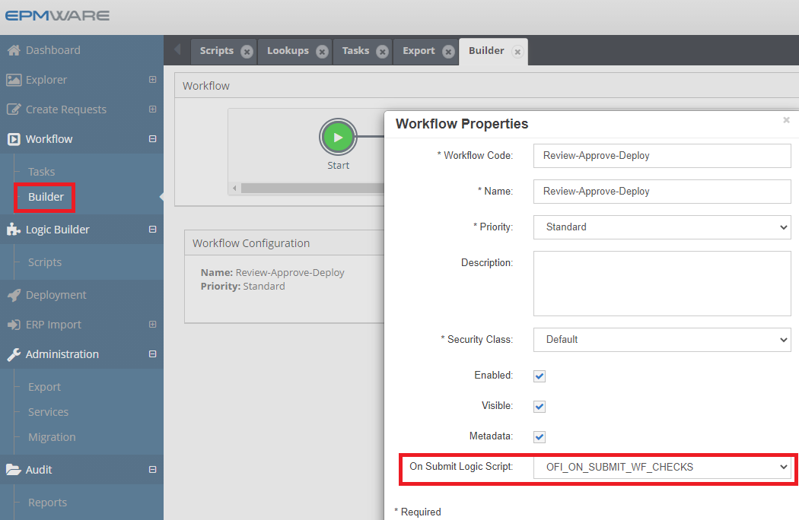

# :material-clipboard-check:{ .lg .middle } **On Submit Workflow Script**

On Submit Workflow custom tasks Logic Scripts can be used to perform custom tasks such as whether certain properties are populated for base members or parent members, or whether certain members have alternate (or shared) instances created.

It get execute before a request enters workflow, providing a validation gate to ensure request completeness and correctness. These scripts can prevent workflow initiation if validation fails.

These scripts are associated in the Workflow -> Builder screen as shown below.
 

 
*Figure: On Submit Workflow Task Script Association*

## Related Topics

- [On Submit Workflow Task Script - Input Parameters](input-parameters.md)
- [On Submit Workflow Task Script - Output Parameters](output-parameters.md)
- [On Submit Workflow Task Script - Examples](examples.md)
- [APIs References](../../api/packages/index.md)

