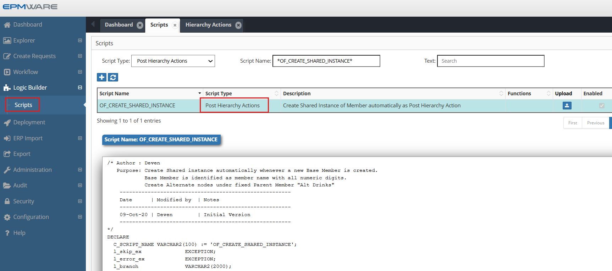
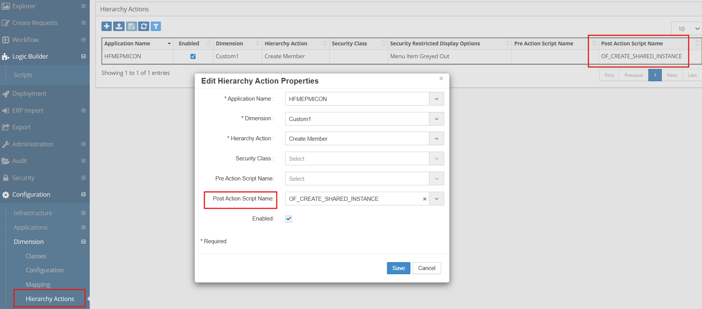

# 💡**Post Hierarchy Action Examples**

**Requirement** : Automatically create a Shared instance whenever a new Base Member is created.  A Base Member is identified when member name is having all numeric digits. Create Alternate nodes under fixed Parent Member "Alt Drinks"


```sql

/* Author : Deven
   Purpose: Create a Shared instance automatically whenever a new Base Member is created.
            Base Member is identified as the member name with all numeric digits. 
            Create Alternate nodes under fixed Parent Member "Alt Drinks"
    -------------------------------------------------------
    Date      | Modified by  | Notes
    -------------------------------------------------------
    09-Oct-20 | Deven        | Initial Version
    -------------------------------------------------------
*/
DECLARE
  C_SCRIPT_NAME VARCHAR2(100) := 'OF_CREATE_SHARED_INSTANCE';
  l_skip_ex              EXCEPTION;
  l_error_ex             EXCEPTION;
  l_branch               VARCHAR2(2000);
  l_sts                  VARCHAR2(1);
  l_hierarchy_id         NUMBER;
  l_shared_to_hierarcy_id NUMBER;
  l_member_name          VARCHAR2(100);
  l_parent_mem           VARCHAR2(100);
  l_prev_sibling_mem     VARCHAR2(100);
  l_member_id            NUMBER;
  l_app_dim_id           NUMBER; 
  l_line_created         VARCHAR2(1);
  --
  --
  -- Local Procedure to create debugging information
  PROCEDURE log (p_msg IN VARCHAR2)
  IS
  BEGIN
    ew_debug.log(p_text            => p_msg
                ,p_source_ref => c_script_name
                );
  END log;
BEGIN
  ew_lb_api.g_status  := ew_lb_api.g_success;
  ew_lb_api.g_message := NULL;
  
  
  -- Skip processing if Action is not create Member
  IF ew_lb_api.g_action_code NOT IN ('CMC','CMS') 
  THEN
    RAISE l_skip_ex;
  END IF;
  
  -- Skip processing if Member is not numeric
  IF ew_string.is_numeric(ew_lb_api.g_member_name) = 'N'
  THEN
    RAISE l_skip_ex;
  END IF;   
   
  -- Save current parent and prev. sibling member name
  -- to be used for Insert Shared member line after move member line
  l_app_dim_id       := ew_lb_api.g_app_dimension_id;
  l_parent_mem       := ew_lb_api.g_parent_member_name;
  l_member_name      := ew_lb_api.g_member_name;
  
  -- Get the Primary Hierarchy ID of the new member being created
  l_hierarchy_id := ew_hierarchy.get_primary_hierarchy_id
                         (l_app_dim_id
                         ,l_member_name
                         );
   
   l_parent_mem := 'Alt Drinks';
   
   -- Get the Primary Hirarchy ID of the InvBookGross Member
   l_shared_to_hierarcy_id := ew_hierarchy.get_primary_hierarchy_id
                              (l_app_dim_id
                              ,l_parent_mem
                              ); 
    
   log('Create line for Insert Shared Member');

   l_member_id := ew_hierarchy.get_member_id
                         (ew_lb_api.g_app_dimension_id
                         ,l_member_name
                         );
   
   l_sts := ew_req.create_shared_members
                 (p_user_id                 => ew_lb_api.g_user_id
                 ,p_request_id              => ew_lb_api.g_request_id
                 ,p_app_dimension_id        => l_app_dim_id
                 ,p_action_code             => 'ISMC' -- Insert Shared Member
                 ,p_hierarchy_id            => l_shared_to_hierarcy_id
                 ,p_member_id_list          => l_member_id
                 ,x_msg                     => ew_lb_api.g_message
                )
                ;

   IF l_sts = 'N' THEN
     RAISE l_error_ex;
   ELSE
     log('Member '||ew_lb_api.g_member_name||
         ' Inserted as Shared under '||l_parent_mem);
   END IF;
   
EXCEPTION
  WHEN l_skip_ex THEN
    NULL; 
  WHEN l_error_ex THEN
    ew_lb_api.g_status  := ew_lb_api.g_error;
    ew_debug.log('Logic Script Error : '||ew_lb_api.g_message); 
  WHEN OTHERS THEN
    ew_lb_api.g_status := ew_lb_api.g_error;
    ew_lb_api.g_message := SQLERRM;
END;


```

## Configuration

1.Create Post Hierarchy Action Logic Script as shown below:
<br/>

<br/>


2.Assign this Logic Script in the Hierarchy Action menu option is under Configuration -> Dimension menu screen as shown below:
<br/>

<br/>


## Next Steps

- [Seeded Script](seeded-scripts.md) - P Hierarchy Action Seeded Scripts Details
- [Post Hierarchy Action](../deployment-tasks/index.md) - Deployment Tasks Details
- [API Reference](../../api/packages/hierarchy_api.md) - Supporting functions


