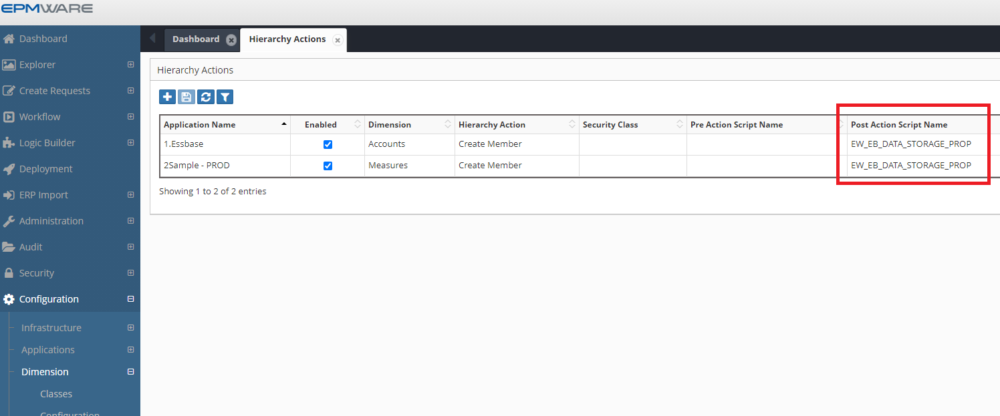

# :material-timeline-check:{ .lg .middle } **Post Hierarchy Actions Scripts**

Post Hierarchy Actions are used when custom logic needs to be invoked after an action has been successfully executed on the dimension and a request line is created. 

Like Pre- Hierarchy Action Logic scripts, Post Hierarchy action scripts must be associated with application, dimension and a specific hierarchy action. The same Logic Script can be assigned to multiple hierarchy actions. 
A Logic Script can leverage an Action Code or Action name if needed. Refer to [Appendix A](../../appendices/appendix_a_action-codes.md) for the Hierarchy Action Codes and their names.

These scripts are associated in the Dimension -> Hierarchy Actions screen as shown below.

---

!!! tip "Note:"
    If a record for Pre hierarchy action has already been assigned and you need to assign a Post Hierarchy Action to the same dimension and action then you can combine these two actions for the same record in the “Hierarchy Action” configuration page. 

 

 
*Figure: Post hierarchy action association*

## Next Steps

- [Input Parameters](input-parameters.md)
- [Output Parameters](output-parameters.md)
- [Examples](examples.md) 
- [Seeded Scripts](seeded-scripts.md)
- [API Reference](../../api/packages/hierarchy_api.md)

---

!!! tip "Best Practice"
    Test hierarchy action scripts thoroughly with all possible action codes. A script that works for member creation might fail for member movement if not properly designed.