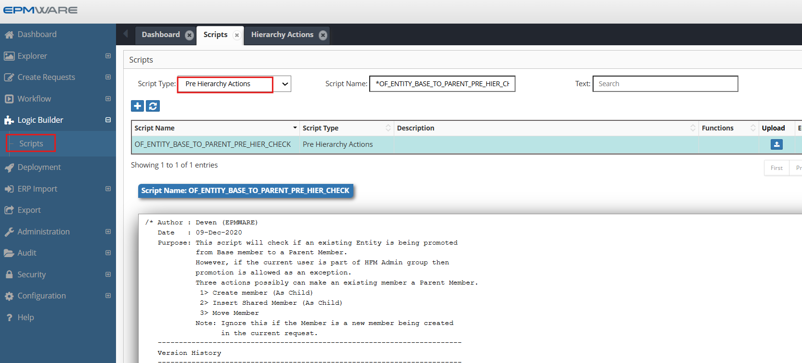
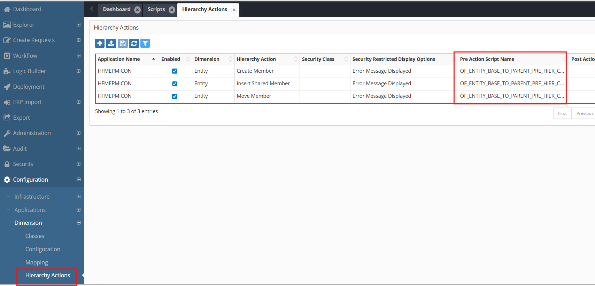

# 💡**Pre Hierarchy Action Examples**

**Requirement** : Prevent existing Members from being promoted to a Parent Member.


```sql
/* Author : Deven (EPMWARE)
   Date   : 09-Dec-2020
   Purpose: This script will check if an existing Entity is being promoted from a Base member to a Parent Member. However, if the current user is part of the HFM Admin group then promotion is allowed as an exception. Three actions can possibly make an existing member a Parent Member.
             1> Create Member
             2> Insert Shared Member
             3> Move Member
Note: Ignore this if the Member is a new member being created in the current request.
   ------------------------------------------------------------------
   Version History
   ------------------------------------------------------------------
   Date      | Name  | Notes
   ------------------------------------------------------------------
   09-Dec-20 | Deven | Initial Version
   ------------------------------------------------------------------
*/
DECLARE
  C_SCRIPT_NAME         VARCHAR2(50)  := 'OF_ENTITY_BASE_TO_PARENT_PRE_HIER_CHECK';
  C_REQUEST_ID          NUMBER        := ew_lb_api.g_request_id;
  C_USER_ID             NUMBER        := ew_lb_api.g_user_id;
  C_DIM_NAME            VARCHAR2(100) := ew_lb_api.g_dim_name;
  C_APP_DIM_ID          NUMBER        := ew_lb_api.g_app_dimension_id;  
  C_PARENT_MEMBER_NAME  VARCHAR2(100) := ew_lb_api.g_parent_member_name;
  C_PARENT_MEMBER_ID    NUMBER        := ew_lb_api.g_parent_member_id;
  C_MOVED_TO_MEMBER_ID  NUMBER        := ew_lb_api.g_moved_to_member_id;
  C_MOVED_TO_MEMBER_NAME  VARCHAR2(100)   := ew_lb_api.g_moved_to_member_name;
  C_MEMBER_NAME           VARCHAR2(100) := ew_lb_api.g_member_name;
  C_MEMBER_ID             NUMBER        := ew_lb_api.g_member_id;
  C_ACTION_CODE           VARCHAR2(10)  := ew_lb_api.g_action_code;
  --
  C_HFM_ADMIN_GROUP       VARCHAR2(30)  := 'OF_HFM_ADMIN'; 
  --
  l_new_mem_req_line_id NUMBER;
  l_parent_member_name  VARCHAR2(100);
  l_parent_member_id    NUMBER;
  l_error_ex            EXCEPTION;
  l_allow_ex            EXCEPTION;
  --
  PROCEDURE log (p_msg VARCHAR2)
  IS
  BEGIN
    ew_debug.log(p_msg,ew_debug.show_always,C_SCRIPT_NAME);
  END log;
  --
BEGIN
  -- Default values for return code
  ew_lb_api.g_status  := ew_lb_api.g_success;
  ew_lb_api.g_message := NULL;
  
  
  log('Check if Base Entity Member is being promoted to Parent. '||
       '[Dimension : '||C_DIM_NAME||'] '||
       '[Member : '||C_MEMBER_NAME||'] '||
       '[Parent : '||C_PARENT_MEMBER_NAME||'] '||
       '[Action Code : '||C_ACTION_CODE||'] '||
       '[Request ID : '||C_REQUEST_ID||'] '
      );
  
  -- First check if the user is HFM Admin or not
  IF ew_sec_api.is_user_in_group (p_group_name => C_HFM_ADMIN_GROUP
                                 ,p_user_id    => C_USER_ID
                                 ) = 'Y'
  THEN
    RAISE l_allow_ex;
  END IF;
  

  IF C_ACTION_CODE = 'ZC' -- move member
  THEN
    l_parent_member_id   := C_MOVED_TO_MEMBER_ID;
    l_parent_member_name := C_MOVED_TO_MEMBER_NAME;
  ELSIF C_ACTION_CODE IN ('CMC','ISMC')
  THEN
    l_parent_member_id   := C_MEMBER_ID;
    l_parent_member_name := C_MEMBER_NAME;
  ELSIF C_ACTION_CODE IN ('CMS','ISMS')
  THEN
    l_parent_member_id   := C_PARENT_MEMBER_ID;
    l_parent_member_name := C_PARENT_MEMBER_NAME;
  END IF;
  
  log('Check whether parent member id ['||l_parent_member_id||' is a base member or not');
  
  -- Check if the member is leaf or not
  -- if leaf member and NOT created in the current request then throw error
  IF ew_hierarchy.is_leaf(p_member_id        => l_parent_member_id
                         ,p_app_dimension_id => C_APP_DIM_ID
                         ) = 'Y'
  THEN
    l_new_mem_req_line_id := ew_req_api.get_req_line_id 
                  (p_request_id         => C_REQUEST_ID
                  ,p_app_dimension_id   => C_APP_DIM_ID
                  ,p_member_name        => l_parent_member_name
                  ,p_action_name        => 'Create Member'
                  );
    IF l_new_mem_req_line_id IS NULL
    THEN    
      IF C_ACTION_CODE = 'ZC' -- move member
      THEN
        ew_lb_api.g_message := 'Moved to Member ['||C_MOVED_TO_MEMBER_NAME ||
                               '] will become a parent member which is not allowed.';
      ELSE
        ew_lb_api.g_message := 'Base Member ['||C_PARENT_MEMBER_NAME ||
                               '] will become a parent member which is not allowed.';
      END IF;
      RAISE l_error_ex;
    ELSE
      log('No error. Parent member is a new member being created in the current request. ID : '||l_new_mem_req_line_id);
    END IF;
  END IF;
  
EXCEPTION
  WHEN l_allow_ex THEN
    log('Allow the action as the current user is in the Admin Group');
  WHEN l_error_ex THEN
    ew_lb_api.g_status  := ew_lb_api.g_error;
    log(ew_lb_api.g_message);
  WHEN OTHERS THEN
    ew_lb_api.g_status := ew_lb_api.g_error;
    ew_lb_api.g_message := 'Error Executing Logic Script : '||SQLERRM;
    log(ew_lb_api.g_message);  
END;

```

## Configuration

1.Define above Pre Hierarchy Action Logic Script as shown below:
<br/>

<br/>


2.Assign this Logic Script in the Hierarchy Action screen as shown below:
<br/>

<br/>


## Next Steps

- [Seeded Script](seeded-scripts.md) - Pre Hierarchy Action Seeded Scripts Details
- [Post Hierarchy Action](../post-hierarchy-actions/index.md) - Post Hierarchy Action Script Details
- [API Reference](../../api/packages/hierarchy_api.md) - Supporting functions


