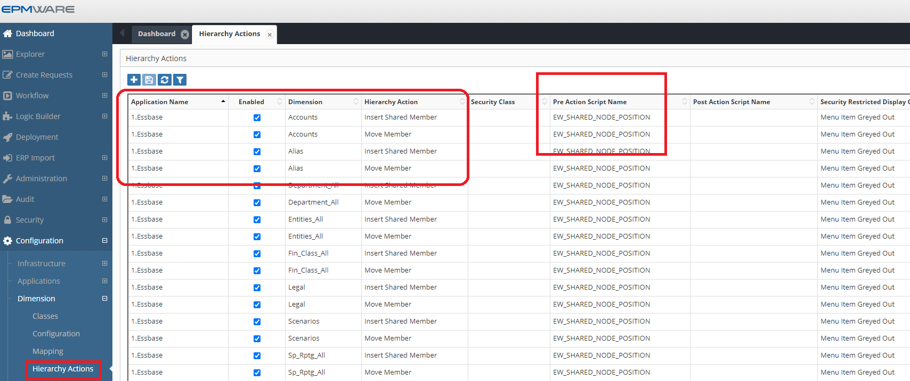

# :material-timeline-clock:{ .lg .middle } **Pre Hierarchy Actions Scripts**

Pre-Hierarchy Actions are used when a logic builder script needs to be triggered before a hierarchy action is executed on the dimension in a Request. Pre-Hierarchy Action Logic scripts are associated with an application, dimension and a specific hierarchy action. 

The same Logic Script can be assigned to multiple hierarchy actions as well. The Logic Script can leverage an Action Code or Action Name if needed. Refer to  for the Hierarchy Action Codes and there names. 

These scripts are associated in the Dimension -> Hierarchy Actions screen as shown below.
 

 
*Figure: Pre hierarchy action association*

## Next Steps

- [Input Parameters](input-parameters.md)
- [Output Parameters](output-parameters.md)
- [Examples](examples.md) 
- [Pre Hierarchy Action Seeded Scripts](seeded-scripts.md)
- [API Reference](../../api/packages/hierarchy_api.md)

---

!!! tip "Best Practice"
    Test hierarchy action scripts thoroughly with all possible action codes. A script that works for member creation might fail for member movement if not properly designed.