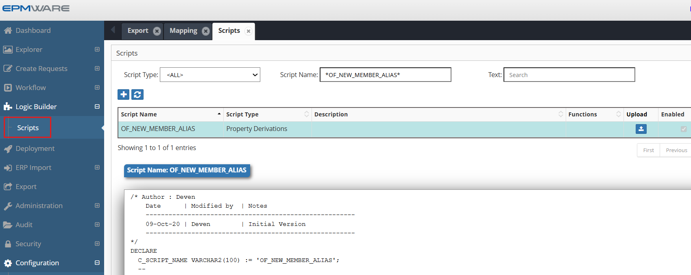
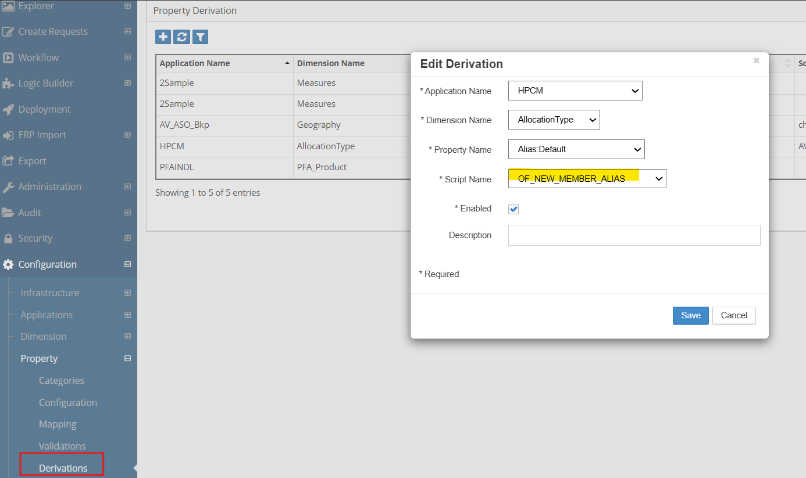

# 💡**Property Derivations Examples**

**Requirement** : Whenever a new member is created, assign the member name with a dash character in its alias. Users will then assign text to the end for the alias.

To achieve this automation, we will use the “Property Derivation” Logic Script.


```sql
/* Author : Deven
    Date      | Modified by  | Notes
    -------------------------------------------------------
    09-Oct-20 | Deven        | Initial Version
    -------------------------------------------------------
*/
DECLARE
  C_SCRIPT_NAME VARCHAR2(100) := 'OF_NEW_MEMBER_ALIAS';
  --
  -- Local Procedure to create debugging information
  PROCEDURE log (p_msg IN VARCHAR2)
  IS
  BEGIN
    ew_debug.log(p_text            => p_msg
                ,p_source_ref => c_script_name
                );
  END log;
BEGIN
  ew_lb_api.g_status := ew_lb_api.g_success;
  ew_lb_api.g_message := NULL;
  
  log('Derive Alias for member : '||ew_lb_api.g_member_name);
  
  -- If the member already has alias assigned then 
  -- no need to derive the alias. Otherwise assign default alias
  IF ew_lb_api.g_prop_value IS NULL
  THEN
    ew_lb_api.g_out_prop_value := ew_lb_api.g_member_name||' - ';
  ELSE
    ew_lb_api.g_out_prop_value := ew_lb_api.g_prop_value;
  END IF;
  
EXCEPTION
  WHEN OTHERS THEN
    log('Error : ' || SQLERRM);
    ew_lb_api.g_status := ew_lb_api.g_error;
    ew_lb_api.g_message := 'Unknown Error deriving Alias : '||SQLERRM;
END;

```

## Configuration

1.Define above Property derivation Logic Script as shown below:
<br/>

<br/>


2.Assign this Logic Script in the Property Derivations screen as shown below:
<br/>

<br/>


## Next Steps

- [Property Validations](../property-validations/index.md) - Property Validations scripts
- [API Reference](../../api/packages/index.md) - Supporting functions


---

!!! tip "Best Practice"
    Always test derivation scripts with edge cases including NULL values, maximum lengths, and boundary conditions before deploying to production.