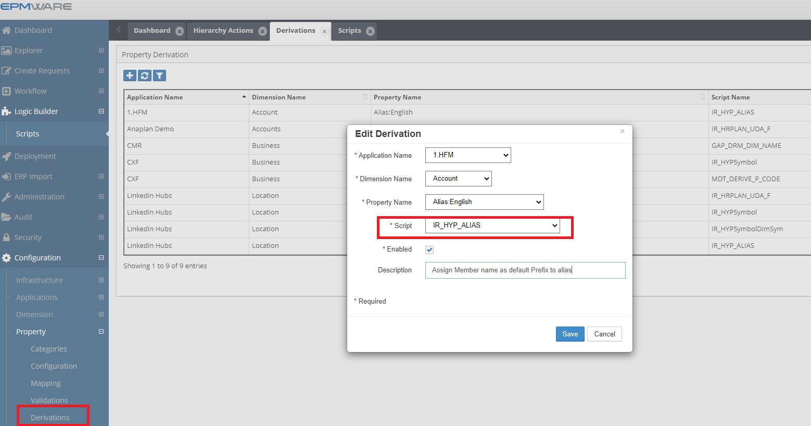

# :material-calculator:{ .lg .middle } **Property Derivations**

Property Derivation scripts allow properties to be derived whenever a new member is being created, or properties of an existing member are being updated.

Property Derivations execute when:

- A new member is created
- An existing member's properties are modified
- Properties need automatic calculation

These scripts are associated in the Property -> Derivations screen as shown below.
 

 
*Figure: Property Derivations Script Association*

## Related Topics

- [Property Derivations Input Parameters](input-parameters.md)
- [Property Derivations Output Parameters](output-parameters.md)
- [Property Derivations Examples](examples.md)
- [API Reference](../../api/packages/index.md)

