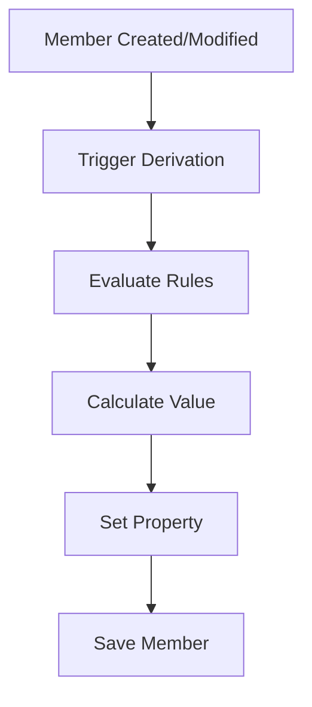

# Property Derivations

Property Derivation Logic Scripts automatically calculate or populate property values when members are created or modified. These scripts enable intelligent defaulting and automatic calculation of member properties based on business rules.

## Overview

Property Derivations execute when:
- A new member is created
- An existing member's properties are modified
- Properties need automatic calculation
- Default values need to be assigned


*Figure: Property Derivations automatically populate property values*

## Key Features

- **Automatic Defaulting**: Set default values for new members
- **Intelligent Calculation**: Derive values based on other properties
- **Pattern-Based Assignment**: Use naming conventions to set properties
- **Hierarchy-Based Logic**: Inherit properties from parents
- **Cross-Property Dependencies**: Calculate based on multiple properties

## Use Cases

### Common Scenarios

1. **Default Alias Assignment**
   - Auto-generate aliases with prefixes/suffixes
   - Create standardized descriptions

2. **Code Generation**
   - Generate entity codes from names
   - Create account numbers sequentially

3. **Property Inheritance**
   - Inherit parent properties
   - Apply hierarchy-based defaults

4. **Calculated Attributes**
   - Derive consolidation methods
   - Calculate data storage settings

5. **Smart Defaults**
   - Set properties based on member patterns
   - Apply dimension-specific rules

## How It Works

### Execution Flow



### Script Processing

1. User creates or modifies a member
2. EPMware triggers associated derivation scripts
3. Script evaluates current properties and context
4. Calculated value is returned
5. Property is updated with derived value

## Configuration

### Step 1: Create Logic Script

Create a Property Derivation script in Logic Builder:

```sql
DECLARE
  c_script_name CONSTANT VARCHAR2(100) := 'DERIVE_DEFAULT_ALIAS';
BEGIN
  -- Initialize
  ew_lb_api.g_status := ew_lb_api.g_success;
  
  -- Derive alias if not provided
  IF ew_lb_api.g_prop_value IS NULL THEN
    ew_lb_api.g_out_prop_value := ew_lb_api.g_member_name || ' - ';
  ELSE
    ew_lb_api.g_out_prop_value := ew_lb_api.g_prop_value;
  END IF;
END;
```

### Step 2: Configure Property Derivation

Navigate to **Configuration → Property → Derivations**:

1. Select application and dimension
2. Choose the property to derive
3. Assign your Logic Script
4. Set execution order (if multiple scripts)
5. Enable the derivation


*Figure: Configuring Property Derivations*

## Input Parameters

Property Derivation scripts receive:

| Parameter | Description |
|-----------|-------------|
| `g_member_name` | Member being processed |
| `g_parent_member_name` | Parent member name |
| `g_prop_name` | Property being derived |
| `g_prop_value` | Current property value (may be null) |
| `g_app_name` | Application name |
| `g_dim_name` | Dimension name |
| `g_action_code` | Action triggering derivation |
| `g_new_member_flag` | 'Y' if new member |

## Output Parameters

| Parameter | Required | Description |
|-----------|----------|-------------|
| `g_out_prop_value` | Yes | Derived property value |
| `g_status` | Yes | Success or Error status |
| `g_message` | Conditional | Error message if failed |

## Basic Examples

### Example 1: Default Value Assignment

```sql
BEGIN
  -- Set default if empty
  IF ew_lb_api.g_prop_value IS NULL THEN
    ew_lb_api.g_out_prop_value := 'DEFAULT_VALUE';
  ELSE
    ew_lb_api.g_out_prop_value := ew_lb_api.g_prop_value;
  END IF;
  
  ew_lb_api.g_status := ew_lb_api.g_success;
END;
```

### Example 2: Pattern-Based Derivation

```sql
BEGIN
  -- Derive account type from member name pattern
  IF ew_lb_api.g_member_name LIKE 'REV%' THEN
    ew_lb_api.g_out_prop_value := 'Revenue';
  ELSIF ew_lb_api.g_member_name LIKE 'EXP%' THEN
    ew_lb_api.g_out_prop_value := 'Expense';
  ELSIF ew_lb_api.g_member_name LIKE 'AST%' THEN
    ew_lb_api.g_out_prop_value := 'Asset';
  ELSE
    ew_lb_api.g_out_prop_value := 'Other';
  END IF;
  
  ew_lb_api.g_status := ew_lb_api.g_success;
END;
```

### Example 3: Inherit from Parent

```sql
DECLARE
  l_parent_value VARCHAR2(500);
BEGIN
  -- Get parent's property value
  l_parent_value := ew_hierarchy.get_member_prop_value(
    p_app_name    => ew_lb_api.g_app_name,
    p_dim_name    => ew_lb_api.g_dim_name,
    p_member_name => ew_lb_api.g_parent_member_name,
    p_prop_label  => ew_lb_api.g_prop_label
  );
  
  -- Use parent value as default
  ew_lb_api.g_out_prop_value := NVL(ew_lb_api.g_prop_value, l_parent_value);
  ew_lb_api.g_status := ew_lb_api.g_success;
END;
```

## Advanced Features

### Sequential Number Generation

Generate sequential codes or IDs:

```sql
DECLARE
  l_max_code NUMBER;
BEGIN
  -- Get maximum existing code
  SELECT NVL(MAX(TO_NUMBER(prop_value)), 0)
  INTO   l_max_code
  FROM   ew_member_properties_v
  WHERE  app_dimension_id = ew_lb_api.g_app_dimension_id
  AND    prop_name = 'ENTITY_CODE'
  AND    REGEXP_LIKE(prop_value, '^\d+$');
  
  -- Assign next number
  ew_lb_api.g_out_prop_value := LPAD(l_max_code + 1, 6, '0');
  ew_lb_api.g_status := ew_lb_api.g_success;
EXCEPTION
  WHEN OTHERS THEN
    ew_lb_api.g_out_prop_value := '000001';
    ew_lb_api.g_status := ew_lb_api.g_success;
END;
```

### Conditional Logic

Apply different rules based on conditions:

```sql
BEGIN
  IF ew_lb_api.g_new_member_flag = 'Y' THEN
    -- Logic for new members
    ew_lb_api.g_out_prop_value := 'NEW_' || ew_lb_api.g_member_name;
  ELSIF ew_lb_api.g_action_code = 'R' THEN
    -- Logic for renames
    ew_lb_api.g_out_prop_value := 'RENAMED_' || ew_lb_api.g_member_name;
  ELSE
    -- Keep existing value
    ew_lb_api.g_out_prop_value := ew_lb_api.g_prop_value;
  END IF;
  
  ew_lb_api.g_status := ew_lb_api.g_success;
END;
```

## Best Practices

### 1. Handle Null Values

Always check for null values:

```sql
IF ew_lb_api.g_prop_value IS NULL THEN
  -- Derive value
ELSE
  -- Preserve existing value
END IF;
```

### 2. Respect User Input

Don't override user-provided values unless necessary:

```sql
-- Only derive if user didn't provide value
IF ew_lb_api.g_prop_value IS NULL OR 
   ew_lb_api.g_new_member_flag = 'Y' THEN
  -- Derive
ELSE
  -- Keep user value
  ew_lb_api.g_out_prop_value := ew_lb_api.g_prop_value;
END IF;
```

### 3. Add Debug Logging

Include logging for troubleshooting:

```sql
ew_debug.log('Deriving ' || ew_lb_api.g_prop_label || 
             ' for ' || ew_lb_api.g_member_name ||
             ': ' || ew_lb_api.g_out_prop_value,
             'DERIVATION_SCRIPT');
```

### 4. Error Handling

Implement proper error handling:

```sql
BEGIN
  -- Derivation logic
EXCEPTION
  WHEN NO_DATA_FOUND THEN
    -- Set default
    ew_lb_api.g_out_prop_value := 'DEFAULT';
    ew_lb_api.g_status := ew_lb_api.g_success;
  WHEN OTHERS THEN
    ew_lb_api.g_status := ew_lb_api.g_error;
    ew_lb_api.g_message := SQLERRM;
END;
```

## Performance Considerations

- **Cache Lookups**: Store frequently accessed data
- **Minimize Database Calls**: Batch operations when possible
- **Optimize Queries**: Use appropriate indexes
- **Avoid Complex Logic**: Keep derivations simple and fast

## Troubleshooting

### Common Issues

| Issue | Cause | Solution |
|-------|-------|----------|
| Value not derived | Script not assigned | Check configuration |
| Wrong value derived | Logic error | Review script logic |
| Performance issues | Complex queries | Optimize database calls |
| Null values appearing | Error in script | Check error handling |

### Debug Techniques

1. Enable comprehensive logging
2. Test with various input scenarios
3. Monitor Debug Messages report
4. Verify script assignment

## Related Topics

- [Configuration Guide](configuration.md)
- [Examples](examples.md)
- [Property Validations](../property-validations/)
- [API Reference](../../api/packages/hierarchy.md)