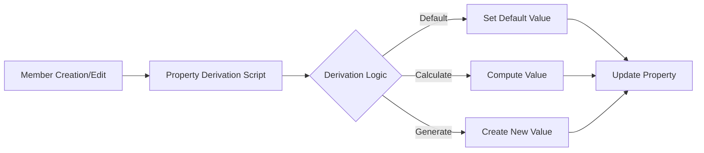

# Property Derivations Scripts

Property Derivation scripts automatically calculate or populate property values when members are created or modified. These scripts ensure consistency and reduce manual data entry by deriving values based on business logic.

## Overview

Property Derivations provide automatic value generation:
- **Default Values**: Set standard values for new members
- **Calculated Fields**: Derive values from other properties
- **Auto-Generated Codes**: Create unique identifiers
- **Inherited Values**: Copy values from parent members
- **Conditional Logic**: Apply different rules based on context


*Figure: Property derivation automatic value generation*

## When to Use

Property Derivation scripts are ideal for:
- Setting default values for new members
- Auto-generating sequential codes or IDs
- Calculating derived attributes
- Implementing business rules for property values
- Maintaining data consistency across properties
- Reducing manual data entry errors

## How It Works



## Configuration

### Step 1: Create the Script

Navigate to **Configuration → Logic Builder**:

```sql
DECLARE
  c_script_name CONSTANT VARCHAR2(100) := 'DERIVE_DEFAULT_VALUES';
  l_derived_value VARCHAR2(500);
BEGIN
  -- Initialize
  ew_lb_api.g_status := ew_lb_api.g_success;
  
  -- Derivation logic based on property
  CASE ew_lb_api.g_prop_name
    WHEN 'Creation_Date' THEN
      l_derived_value := TO_CHAR(SYSDATE, 'MM/DD/YYYY');
      
    WHEN 'Created_By' THEN
      l_derived_value := USER;
      
    WHEN 'Status' THEN
      l_derived_value := 'Active';
      
    WHEN 'Currency' THEN
      -- Derive from parent
      l_derived_value := ew_hierarchy.get_member_prop_value(
        p_app_name    => ew_lb_api.g_app_name,
        p_dim_name    => ew_lb_api.g_dim_name,
        p_member_name => ew_lb_api.g_parent_member_name,
        p_prop_label  => 'Currency'
      );
      
    ELSE
      l_derived_value := ew_lb_api.g_prop_value;
  END CASE;
  
  -- Set output
  ew_lb_api.g_out_prop_value := NVL(l_derived_value, ew_lb_api.g_prop_value);
END;
```

### Step 2: Configure Property Derivation

Navigate to **Configuration → Property → Derivations**:

1. Select application and dimension
2. Choose property to derive
3. Select "Logic Script"
4. Choose your derivation script
5. Set execution options


*Figure: Property derivations configuration screen*

## Input Parameters

Key parameters available in derivation scripts:

| Parameter | Type | Description |
|-----------|------|-------------|
| `g_app_id` | NUMBER | Application ID |
| `g_app_dimension_id` | NUMBER | Dimension ID |
| `g_member_name` | VARCHAR2 | Member being processed |
| `g_parent_member_name` | VARCHAR2 | Parent member (if applicable) |
| `g_prop_name` | VARCHAR2 | Property being derived |
| `g_prop_value` | VARCHAR2 | Current property value |
| `g_action_code` | VARCHAR2 | Action triggering derivation |

## Output Parameters

Control the derived value:

| Parameter | Type | Description |
|-----------|------|-------------|
| `g_out_prop_value` | VARCHAR2 | Derived property value |
| `g_status` | VARCHAR2 | Success/Error status |
| `g_message` | VARCHAR2 | User message |

## Common Derivation Patterns

### Pattern 1: Sequential Number Generation
```sql
DECLARE
  l_next_number NUMBER;
BEGIN
  -- Generate next sequential number
  SELECT NVL(MAX(TO_NUMBER(prop_value)), 0) + 1
  INTO l_next_number
  FROM ew_member_properties
  WHERE app_dimension_id = ew_lb_api.g_app_dimension_id
  AND prop_name = 'Sequence_Number';
  
  ew_lb_api.g_out_prop_value := LPAD(l_next_number, 6, '0');
  ew_lb_api.g_status := ew_lb_api.g_success;
END;
```

### Pattern 2: Concatenated Code Generation
```sql
BEGIN
  -- Generate code from multiple sources
  ew_lb_api.g_out_prop_value := 
    SUBSTR(ew_lb_api.g_parent_member_name, 1, 3) || '_' ||
    SUBSTR(ew_lb_api.g_member_name, 1, 5) || '_' ||
    TO_CHAR(SYSDATE, 'YYYYMMDD');
    
  ew_lb_api.g_status := ew_lb_api.g_success;
END;
```

### Pattern 3: Lookup-Based Derivation
```sql
DECLARE
  l_lookup_value VARCHAR2(100);
BEGIN
  -- Derive value from lookup table
  SELECT property_value
  INTO l_lookup_value
  FROM derivation_rules
  WHERE member_pattern = SUBSTR(ew_lb_api.g_member_name, 1, 3)
  AND property_name = ew_lb_api.g_prop_name;
  
  ew_lb_api.g_out_prop_value := l_lookup_value;
  ew_lb_api.g_status := ew_lb_api.g_success;
  
EXCEPTION
  WHEN NO_DATA_FOUND THEN
    -- Use default if no rule found
    ew_lb_api.g_out_prop_value := 'DEFAULT';
    ew_lb_api.g_status := ew_lb_api.g_success;
END;
```

### Pattern 4: Calculated Derivation
```sql
DECLARE
  l_base_amount NUMBER;
  l_rate NUMBER;
BEGIN
  IF ew_lb_api.g_prop_name = 'Budget_Amount' THEN
    -- Get base amount from another property
    l_base_amount := TO_NUMBER(
      ew_hierarchy.get_member_prop_value(
        p_app_name    => ew_lb_api.g_app_name,
        p_dim_name    => ew_lb_api.g_dim_name,
        p_member_name => ew_lb_api.g_member_name,
        p_prop_label  => 'Base_Amount'
      )
    );
    
    -- Apply rate based on member type
    l_rate := CASE 
                WHEN ew_lb_api.g_member_name LIKE 'CORP_%' THEN 1.1
                WHEN ew_lb_api.g_member_name LIKE 'FIELD_%' THEN 0.9
                ELSE 1.0
              END;
    
    ew_lb_api.g_out_prop_value := TO_CHAR(l_base_amount * l_rate);
  END IF;
  
  ew_lb_api.g_status := ew_lb_api.g_success;
END;
```

## Best Practices

### 1. Handle NULL Values
```sql
-- Always check for NULL before deriving
IF ew_lb_api.g_prop_value IS NULL THEN
  -- Derive value
  ew_lb_api.g_out_prop_value := derive_value();
ELSE
  -- Keep existing value
  ew_lb_api.g_out_prop_value := ew_lb_api.g_prop_value;
END IF;
```

### 2. Validate Derived Values
```sql
-- Ensure derived value is valid
l_derived := calculate_value();

IF is_valid_value(l_derived) THEN
  ew_lb_api.g_out_prop_value := l_derived;
ELSE
  ew_lb_api.g_status := ew_lb_api.g_error;
  ew_lb_api.g_message := 'Invalid derived value: ' || l_derived;
END IF;
```

### 3. Consider Performance
```sql
-- Cache frequently used data
IF g_cached_data IS NULL THEN
  load_cache();
END IF;

-- Use cached data for derivation
ew_lb_api.g_out_prop_value := derive_from_cache();
```

### 4. Log Derivations
```sql
-- Log for audit trail
ew_debug.log('Derived ' || ew_lb_api.g_prop_name || 
             ' = ' || ew_lb_api.g_out_prop_value || 
             ' for ' || ew_lb_api.g_member_name);
```

## Derivation Execution Order

When multiple properties have derivations:

1. **System Properties** (Creation Date, Created By)
2. **Parent-Inherited Properties** (Currency, Region)
3. **Calculated Properties** (Budget, Forecast)
4. **User-Defined Properties** (Custom fields)

## Testing Strategies

### Test New Member Creation
```sql
-- Test derivation for new members
1. Create new member
2. Verify all derived properties populated
3. Check derivation logic executed correctly
4. Validate derived values
```

### Test Existing Member Updates
```sql
-- Test derivation on updates
1. Clear property value
2. Trigger derivation
3. Verify correct value derived
4. Check no unintended side effects
```

## Common Issues

| Issue | Cause | Solution |
|-------|-------|----------|
| Values not derived | Script not associated | Check property derivation configuration |
| Wrong values | Incorrect logic | Debug derivation calculations |
| Performance slow | Complex queries | Optimize lookups, use caching |
| Circular dependencies | Properties depend on each other | Review derivation order |

## Advanced Features

### Conditional Derivation
```sql
-- Only derive under certain conditions
IF ew_lb_api.g_action_code = 'CMC' THEN
  -- Only for new members
  derive_initial_values();
ELSIF ew_lb_api.g_action_code = 'P' AND 
      ew_lb_api.g_prop_value IS NULL THEN
  -- Only when property cleared
  derive_default_value();
END IF;
```

### Multi-Property Derivation
```sql
-- Derive multiple related properties
IF ew_lb_api.g_prop_name = 'Country' THEN
  -- Also set currency and timezone
  set_related_properties(
    p_currency => get_country_currency(ew_lb_api.g_out_prop_value),
    p_timezone => get_country_timezone(ew_lb_api.g_out_prop_value)
  );
END IF;
```

## Next Steps

- [Configuration](configuration.md) - Detailed setup guide
- [Examples](examples.md) - Real-world scenarios
- [Property Validations](../property-validations/) - Related validation scripts

---

!!! tip "Best Practice"
    Test derivation scripts thoroughly with various scenarios including new members, updates, and edge cases before deploying to production.