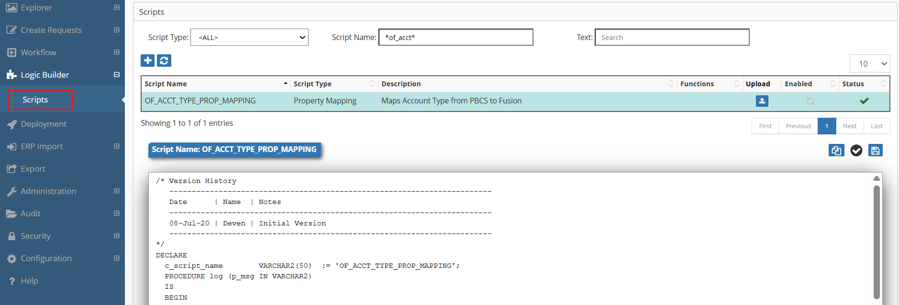
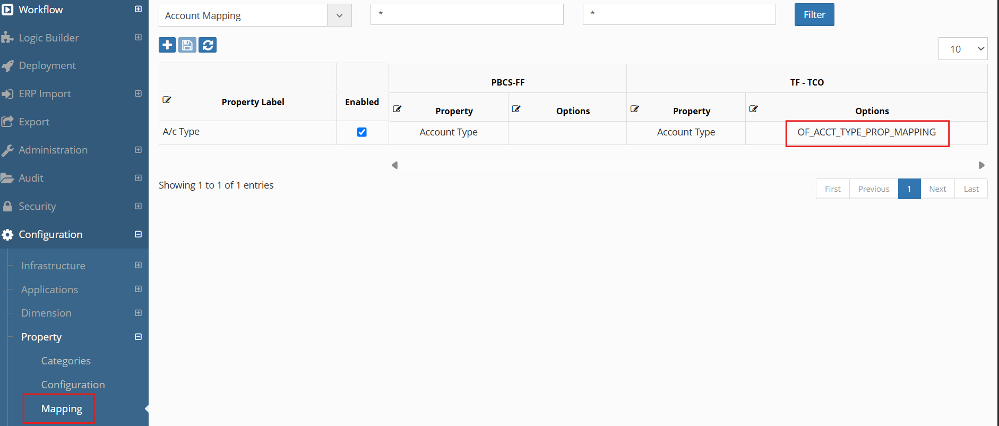

# 💡**Property Mapping Examples**

Requirement: Assign Account type property value to the members of the Fusion Application based on the Account Type assigned to the PBCS application.


```sql
/* Version History   
--------------------------------------------------------------
   Date      | Name  | Notes  
--------------------------------------------------------------
   08-Jul-20 | Deven | Initial Version 
--------------------------------------------------------------
*/
DECLARE
  c_script_name        VARCHAR2(50)  := 'OF_ACCT_TYPE_PROP_MAPPING';
  PROCEDURE log (p_msg IN VARCHAR2)
  IS
  BEGIN
    ew_debug.log(p_text            => p_msg
                ,p_source_ref      => c_script_name
                );
  END;
BEGIN
  IF ew_lb_api.g_prop_value = 'Asset'
  THEN
    ew_lb_api.g_out_prop_value := 'A';
  ELSIF ew_lb_api.g_prop_value = 'Liability'
  THEN
    ew_lb_api.g_out_prop_value := 'L';
  ELSIF ew_lb_api.g_prop_value = 'Equity'
  THEN
    ew_lb_api.g_out_prop_value := 'O';
  ELSIF ew_lb_api.g_prop_value = 'Expense'
  THEN
    ew_lb_api.g_out_prop_value := 'E';
  ELSIF ew_lb_api.g_prop_value = 'Revenue'
  THEN
    ew_lb_api.g_out_prop_value := 'R';
  ELSE
    ew_lb_api.g_out_prop_value := '';
  END IF;
  ew_debug.log('Set Fusion Account Type to :  '||ew_lb_api.g_out_prop_value);
END;

```

## Configuration

1.Create Property Mapping Logic Script as shown below:
<br/>

<br/>


2.Assign this Logic Script in the Property ->  Mappings screen as shown below:
<br/>

<br/>


## Next Steps

- [Property Derivations](../property-derivations/index.md) -Property Derivations Details
- [API Reference](../../api/packages/index.md) - Supporting functions
- [Property Validations](../property-validations/index.md) - Related validation scripts

---

!!! warning "Important"
    Always test property mappings in a development environment before deploying to production.