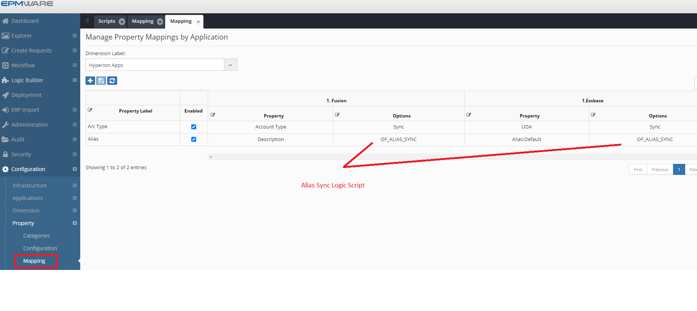
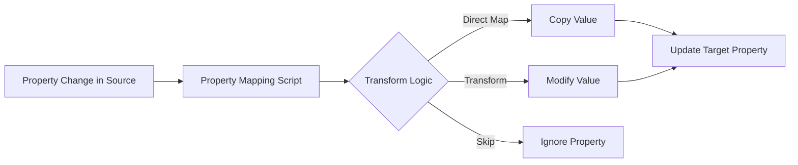

# Property Mapping Scripts

Property Mapping scripts enable automatic synchronization of member properties between applications. These scripts execute when properties are updated in a source dimension that has property mapping rules configured.

## Overview

Property Mapping provides intelligent property synchronization:
- **Direct Mapping**: Copy properties as-is between applications
- **Transform Values**: Modify property values during synchronization
- **Conditional Sync**: Map properties based on business rules
- **Cross-Reference**: Use lookup tables for value translation


*Figure: Property mapping between source and target applications*

## When to Use

Property Mapping scripts are ideal for:
- Keeping member attributes synchronized across applications
- Transforming property values (e.g., codes to descriptions)
- Maintaining consistency in multi-application environments
- Implementing business logic for property synchronization
- Creating derived properties in target systems

## How It Works



## Configuration Steps

### Step 1: Create the Script

Navigate to **Configuration → Logic Builder**:

```sql
DECLARE
  c_script_name CONSTANT VARCHAR2(100) := 'MAP_PROPERTY_VALUES';
BEGIN
  -- Initialize status
  ew_lb_api.g_status := ew_lb_api.g_success;
  
  -- Property mapping logic
  IF ew_lb_api.g_prop_name = 'COST_CENTER_TYPE' THEN
    -- Transform value
    ew_lb_api.g_out_prop_value := 
      CASE ew_lb_api.g_prop_value
        WHEN 'CC' THEN 'Cost Center'
        WHEN 'PC' THEN 'Profit Center'
        WHEN 'RC' THEN 'Revenue Center'
        ELSE ew_lb_api.g_prop_value
      END;
  ELSE
    -- Direct mapping
    ew_lb_api.g_out_prop_value := ew_lb_api.g_prop_value;
  END IF;
END;
```

### Step 2: Configure Property Mapping

Navigate to **Configuration → Property → Mapping**:

1. Select source application and dimension
2. Select target application and dimension
3. Choose properties to map
4. Select mapping type:
   - **Direct**: Copy value as-is
   - **Logic Script**: Apply custom logic
5. Assign your Logic Script


*Figure: Property mapping configuration screen*

## Input Parameters

Key input parameters for property mapping scripts:

| Parameter | Type | Description |
|-----------|------|-------------|
| `g_app_id` | NUMBER | Application ID |
| `g_app_dimension_id` | NUMBER | Dimension ID |
| `g_member_name` | VARCHAR2 | Member being updated |
| `g_prop_name` | VARCHAR2 | Property name |
| `g_prop_value` | VARCHAR2 | New property value |
| `g_old_prop_value` | VARCHAR2 | Previous value |

## Output Parameters

Control the mapping behavior:

| Parameter | Type | Description |
|-----------|------|-------------|
| `g_out_prop_value` | VARCHAR2 | Transformed property value |
| `g_out_ignore_flag` | VARCHAR2 | Skip mapping ('Y'/'N') |
| `g_status` | VARCHAR2 | Success/Error status |
| `g_message` | VARCHAR2 | User message |

## Common Patterns

### Pattern 1: Value Transformation
```sql
BEGIN
  -- Transform codes to descriptions
  ew_lb_api.g_out_prop_value := 
    CASE ew_lb_api.g_prop_value
      WHEN 'A' THEN 'Active'
      WHEN 'I' THEN 'Inactive'
      WHEN 'P' THEN 'Pending'
      ELSE ew_lb_api.g_prop_value
    END;
  
  ew_lb_api.g_status := ew_lb_api.g_success;
END;
```

### Pattern 2: Conditional Mapping
```sql
BEGIN
  -- Only map certain properties
  IF ew_lb_api.g_prop_name IN ('ALIAS', 'DESCRIPTION', 'STATUS') THEN
    ew_lb_api.g_out_prop_value := ew_lb_api.g_prop_value;
  ELSE
    -- Skip other properties
    ew_lb_api.g_out_ignore_flag := 'Y';
  END IF;
  
  ew_lb_api.g_status := ew_lb_api.g_success;
END;
```

### Pattern 3: Lookup Table Mapping
```sql
DECLARE
  l_mapped_value VARCHAR2(100);
BEGIN
  -- Use lookup table for mapping
  BEGIN
    SELECT target_value
    INTO l_mapped_value
    FROM property_mapping_xref
    WHERE source_prop = ew_lb_api.g_prop_name
    AND source_value = ew_lb_api.g_prop_value;
    
    ew_lb_api.g_out_prop_value := l_mapped_value;
    
  EXCEPTION
    WHEN NO_DATA_FOUND THEN
      -- No mapping found, use original
      ew_lb_api.g_out_prop_value := ew_lb_api.g_prop_value;
  END;
  
  ew_lb_api.g_status := ew_lb_api.g_success;
END;
```

### Pattern 4: Calculated Properties
```sql
DECLARE
  l_base_value VARCHAR2(100);
  l_multiplier NUMBER;
BEGIN
  -- Calculate derived property
  IF ew_lb_api.g_prop_name = 'BUDGET_AMOUNT' THEN
    -- Get base amount
    l_base_value := ew_hierarchy.get_member_prop_value(
      p_app_name    => ew_lb_api.g_src_app_name,
      p_dim_name    => ew_lb_api.g_src_dim_name,
      p_member_name => ew_lb_api.g_member_name,
      p_prop_label  => 'BASE_AMOUNT'
    );
    
    -- Get multiplier
    l_multiplier := TO_NUMBER(ew_hierarchy.get_member_prop_value(
      p_app_name    => ew_lb_api.g_src_app_name,
      p_dim_name    => ew_lb_api.g_src_dim_name,
      p_member_name => ew_lb_api.g_member_name,
      p_prop_label  => 'MULTIPLIER'
    ));
    
    -- Calculate budget
    ew_lb_api.g_out_prop_value := 
      TO_CHAR(TO_NUMBER(l_base_value) * l_multiplier);
  END IF;
  
  ew_lb_api.g_status := ew_lb_api.g_success;
END;
```

## Best Practices

### 1. Validate Property Values
```sql
-- Check for valid values
IF ew_lb_api.g_prop_name = 'STATUS' THEN
  IF ew_lb_api.g_prop_value NOT IN ('A', 'I', 'P') THEN
    ew_lb_api.g_status := ew_lb_api.g_error;
    ew_lb_api.g_message := 'Invalid status value: ' || ew_lb_api.g_prop_value;
    RETURN;
  END IF;
END IF;
```

### 2. Handle NULL Values
```sql
-- Handle NULLs appropriately
IF ew_lb_api.g_prop_value IS NULL THEN
  -- Decide: map NULL, set default, or skip
  ew_lb_api.g_out_prop_value := 'DEFAULT';
ELSE
  ew_lb_api.g_out_prop_value := ew_lb_api.g_prop_value;
END IF;
```

### 3. Log Property Changes
```sql
-- Log for audit trail
ew_debug.log('Property Change: ' || 
  'Member=' || ew_lb_api.g_member_name || 
  ', Property=' || ew_lb_api.g_prop_name || 
  ', Old=' || ew_lb_api.g_old_prop_value || 
  ', New=' || ew_lb_api.g_prop_value);
```

### 4. Performance Optimization
```sql
-- Cache frequently used lookups
DECLARE
  TYPE t_lookup IS TABLE OF VARCHAR2(100) INDEX BY VARCHAR2(100);
  g_cached_lookups t_lookup;
BEGIN
  IF NOT g_cached_lookups.EXISTS(ew_lb_api.g_prop_value) THEN
    -- Load from database
    g_cached_lookups(ew_lb_api.g_prop_value) := 
      get_mapped_value(ew_lb_api.g_prop_value);
  END IF;
  
  ew_lb_api.g_out_prop_value := g_cached_lookups(ew_lb_api.g_prop_value);
END;
```

## Testing

### Test Scenarios

1. **Single Property Update**: Update one property, verify mapping
2. **Bulk Updates**: Update multiple properties simultaneously
3. **NULL Values**: Test NULL property values
4. **Invalid Values**: Test error handling
5. **Performance**: Test with large volumes

### Validation Steps

1. Update property in source application
2. Check Debug Messages for script execution
3. Verify property value in target application
4. Review any error messages

## Troubleshooting

| Issue | Cause | Solution |
|-------|-------|----------|
| Properties not syncing | Script not associated | Verify property mapping configuration |
| Wrong values in target | Incorrect transformation logic | Debug script logic |
| Performance issues | Complex lookups | Implement caching |
| Partial updates | Some properties fail | Check error handling |

## Advanced Features

### Multi-Property Dependencies
```sql
-- Update related properties together
IF ew_lb_api.g_prop_name = 'COUNTRY' THEN
  -- Also update currency based on country
  UPDATE ew_members_props
  SET prop_value = 
    CASE ew_lb_api.g_out_prop_value
      WHEN 'USA' THEN 'USD'
      WHEN 'UK' THEN 'GBP'
      WHEN 'EU' THEN 'EUR'
    END
  WHERE member_id = ew_lb_api.g_member_id
  AND prop_name = 'CURRENCY';
END IF;
```

### Bi-Directional Sync
```sql
-- Prevent sync loops
IF ew_lb_api.g_src_app_name = 'APP1' AND 
   ew_lb_api.g_tgt_app_name = 'APP2' THEN
  -- Mark to prevent reverse sync
  INSERT INTO sync_tracking (member_name, prop_name, sync_time)
  VALUES (ew_lb_api.g_member_name, ew_lb_api.g_prop_name, SYSDATE);
END IF;
```

## Next Steps

- [Configuration](configuration.md) - Detailed setup guide
- [Examples](examples.md) - Real-world scenarios
- [API Reference](../../api/packages/hierarchy.md) - Supporting APIs

---

!!! tip "Best Practice"
    Test property mappings with a small set of members first. Monitor performance impact before enabling for all properties.