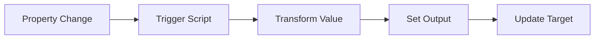

# Property Mapping

Property Mapping Logic Scripts enable synchronization of property values between dimensions across applications. These scripts execute when properties are modified in the source dimension and need to be reflected in mapped dimensions.

## Overview

Property Mapping provides automated synchronization of member properties across related dimensions, ensuring consistency of attributes like aliases, account types, consolidation methods, and custom properties.


*Figure: Property Mapping synchronizes attributes between source and target dimensions*

## When to Use Property Mapping

Use Property Mapping when you need to:

- **Synchronize Aliases**: Keep member descriptions consistent across applications
- **Map Property Values**: Transform property values between different formats
- **Maintain Attributes**: Ensure business attributes stay synchronized
- **Transform Data Types**: Convert between different property formats
- **Apply Business Rules**: Implement complex property transformation logic

## How It Works

### Execution Flow

1. User modifies a property value in the source dimension
2. EPMware triggers the Property Mapping Logic Script
3. Script receives property context and values
4. Script transforms or validates the property value
5. Output parameters determine the target property value
6. EPMware updates the property in the mapped dimension



## Configuration Steps

### Step 1: Create the Logic Script

Navigate to **Configuration → Logic Builder** and create a new Property Mapping script:

```sql
DECLARE
  c_script_name CONSTANT VARCHAR2(100) := 'MAP_ACCOUNT_PROPERTIES';
BEGIN
  -- Initialize
  ew_lb_api.g_status := ew_lb_api.g_success;
  
  -- Transform property value
  IF ew_lb_api.g_prop_name = 'ACCOUNT_TYPE' THEN
    -- Map account types between applications
    ew_lb_api.g_out_prop_value := 
      CASE ew_lb_api.g_prop_value
        WHEN 'Revenue' THEN 'REV'
        WHEN 'Expense' THEN 'EXP'
        WHEN 'Asset' THEN 'AST'
        WHEN 'Liability' THEN 'LIAB'
        ELSE ew_lb_api.g_prop_value
      END;
  ELSE
    -- Pass through other properties
    ew_lb_api.g_out_prop_value := ew_lb_api.g_prop_value;
  END IF;
END;
```

### Step 2: Configure Property Mapping

Navigate to **Configuration → Property → Mapping**:

1. Select source and target applications
2. Choose dimensions to map
3. Select properties to synchronize
4. Assign your Logic Script
5. Enable the mapping


*Figure: Property Mapping configuration screen*

### Step 3: Test the Mapping

1. Modify a property value in the source dimension
2. Verify the transformed value appears in the target
3. Check Debug Messages for execution details

## Script Components

### Input Parameters

Property Mapping scripts receive extensive context about the property being mapped:

| Parameter | Description |
|-----------|-------------|
| `g_member_name` | Member whose property is being mapped |
| `g_prop_name` | Internal property name |
| `g_prop_label` | Display label of the property |
| `g_prop_value` | Current property value |
| `g_app_name` | Source application name |
| `g_dim_name` | Source dimension name |
| `g_mapped_app_name` | Target application name |
| `g_mapped_dim_name` | Target dimension name |

### Output Parameters

| Parameter | Required | Description |
|-----------|----------|-------------|
| `g_out_prop_value` | Yes | Transformed property value for target |
| `g_out_ignore_flag` | No | Set to 'Y' to skip this property |
| `g_status` | Yes | Success ('S') or Error ('E') |
| `g_message` | Conditional | Error message if status is 'E' |

## Common Use Cases

### 1. Alias Synchronization

Synchronize member aliases with formatting:

```sql
-- Add prefix to aliases
ew_lb_api.g_out_prop_value := 'HFM: ' || ew_lb_api.g_prop_value;
```

### 2. Code Transformation

Map verbose values to codes:

```sql
-- Convert full names to codes
CASE ew_lb_api.g_prop_value
  WHEN 'Full Consolidation' THEN 'FULL'
  WHEN 'Proportional Consolidation' THEN 'PROP'
  WHEN 'Equity Method' THEN 'EQUITY'
  WHEN 'Not Consolidated' THEN 'NONE'
END;
```

### 3. Conditional Mapping

Map properties based on member characteristics:

```sql
-- Only map properties for certain members
IF member_is_base_level() THEN
  ew_lb_api.g_out_prop_value := transform_value(ew_lb_api.g_prop_value);
ELSE
  ew_lb_api.g_out_ignore_flag := 'Y';
END IF;
```

### 4. Validation Before Mapping

Validate property values before synchronization:

```sql
-- Validate before mapping
IF NOT is_valid_value(ew_lb_api.g_prop_value) THEN
  ew_lb_api.g_status := ew_lb_api.g_error;
  ew_lb_api.g_message := 'Invalid property value: ' || ew_lb_api.g_prop_value;
  RETURN;
END IF;
```

## Best Practices

### 1. Handle All Properties

Always include logic for unexpected properties:

```sql
IF ew_lb_api.g_prop_name IN ('KNOWN_PROP1', 'KNOWN_PROP2') THEN
  -- Specific handling
ELSE
  -- Default handling
  ew_lb_api.g_out_prop_value := ew_lb_api.g_prop_value;
END IF;
```

### 2. Use Debug Logging

Add comprehensive logging for troubleshooting:

```sql
ew_debug.log('Mapping property ' || ew_lb_api.g_prop_label || 
             ' from ' || ew_lb_api.g_prop_value || 
             ' to ' || ew_lb_api.g_out_prop_value,
             'PROP_MAP_SCRIPT');
```

### 3. Validate Input

Check for null or invalid values:

```sql
IF ew_lb_api.g_prop_value IS NULL THEN
  ew_lb_api.g_out_prop_value := 'DEFAULT_VALUE';
END IF;
```

### 4. Consider Performance

Optimize for properties that change frequently:

```sql
-- Cache lookups for repeated use
IF NOT g_lookup_loaded THEN
  load_lookup_cache();
  g_lookup_loaded := TRUE;
END IF;
```

## Troubleshooting

### Common Issues

| Issue | Cause | Solution |
|-------|-------|----------|
| Properties not syncing | Script not assigned | Verify script assignment in configuration |
| Wrong values in target | Transformation logic error | Review script logic and test cases |
| Performance issues | Complex lookups | Optimize queries, use caching |
| Partial synchronization | Ignore flag set incorrectly | Check conditional logic |

### Debug Techniques

1. **Enable Debug Logging**: Add extensive logging to track execution
2. **Test Individual Properties**: Isolate property-specific issues
3. **Verify Configuration**: Ensure mapping is properly configured
4. **Check Target Permissions**: Confirm write access to target properties

## Related Topics

- [Configuration Details](configuration.md)
- [Property Mapping Examples](examples.md)
- [Property Derivations](../property-derivations/)
- [API Reference - Properties](../../api/packages/hierarchy.md)