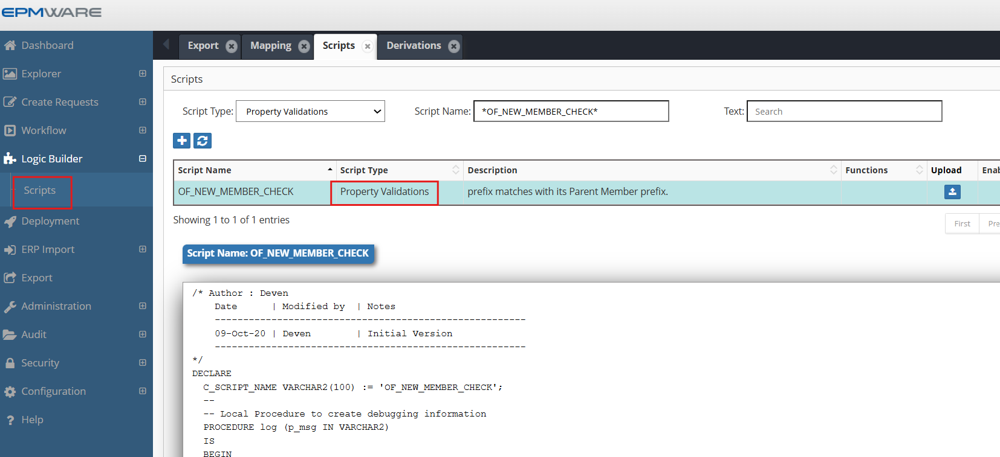
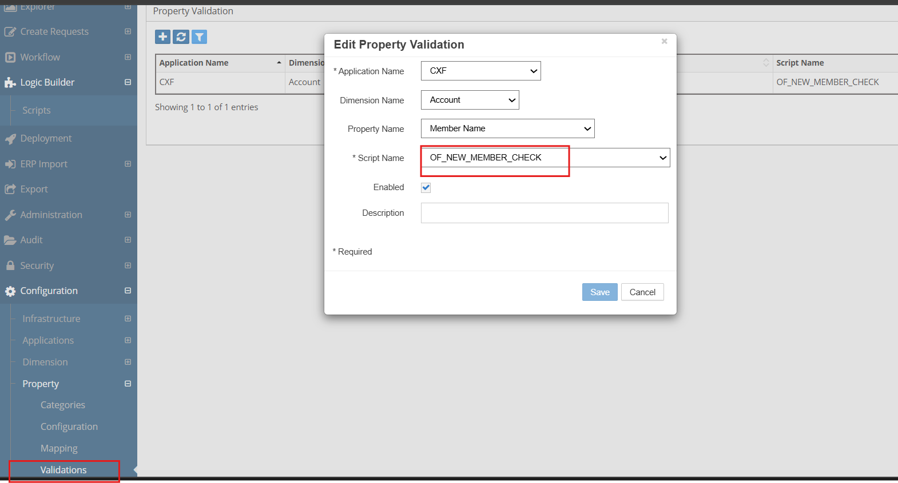

# 💡**Property Validation Examples**

**Requirement** : Whenever a new member is created, ensure its prefix matches with its Parent Member prefix.

To achieve this automation, we will use the “Property Validation” Logic Script. This script will be assigned to the “Member Name” property of the dimension.

```sql
/* Author : Deven
    Date      | Modified by  | Notes
    -------------------------------------------------------
    09-Oct-20 | Deven        | Initial Version
    -------------------------------------------------------
*/
DECLARE
  C_SCRIPT_NAME VARCHAR2(100) := 'OF_NEW_MEMBER_CHECK';
  --
  -- Local Procedure to create debugging information
  PROCEDURE log (p_msg IN VARCHAR2)
  IS
  BEGIN
    ew_debug.log(p_text       => p_msg
                ,p_source_ref => c_script_name
                );
  END log;
BEGIN
  ew_lb_api.g_status := ew_lb_api.g_success;
  ew_lb_api.g_message := NULL;
  
  log('Validate member : '||ew_lb_api.g_new_member_name);

  IF SUBSTR(ew_lb_api.g_parent_member_name,1,3) <> 
       SUBSTR(ew_lb_api.g_new_member_name,1,3)
 THEN
    ew_lb_api.g_message := 'Member Name Prefix does not match with its parent member prefix';
    ew_lb_api.g_status := ew_lb_api.g_error;
  END IF;

  
EXCEPTION
  WHEN OTHERS THEN
    log('Error : ' || SQLERRM);
    ew_lb_api.g_status := ew_lb_api.g_error;
    ew_lb_api.g_message := 'Unknown Error deriving Alias : '||SQLERRM;
END;

```

## Configuration

1.Define above Property validation Logic Script as shown below:
<br/>

<br/>


2.Assign this Logic Script in the Property Derivations screen as shown below:
<br/>

<br/>


## Next Steps

- [Standard Validations](standard-validations.md) - Built-in validation types
- [API Reference](../../api/packages/index.md) - Supporting functions
- [Property Derivations](../property-derivations/index.md) - Related derivation scripts

---

!!! warning "Performance Note"
    Remember that validation scripts execute on every keystroke for real-time validation. Keep the logic lightweight and optimize database queries to maintain UI responsiveness.