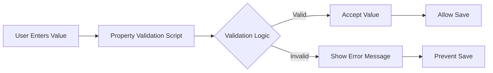

# Property Validation Scripts

Property Validation scripts enforce business rules and data quality standards for member properties. These scripts execute in real-time as users enter or modify property values, providing immediate feedback on data validity.

## Overview

Property Validations ensure data integrity through:
- **Format Validation**: Enforce specific patterns (emails, phone numbers, codes)
- **Range Checking**: Validate numeric values within acceptable ranges
- **Required Fields**: Ensure mandatory properties are populated
- **Cross-Field Validation**: Validate relationships between properties
- **Business Rules**: Implement complex validation logic
- **Real-Time Feedback**: Immediate validation as users type


*Figure: Real-time property validation in action*

## When to Use

Property Validation scripts are essential for:
- Enforcing data quality standards
- Preventing invalid data entry
- Implementing business rule validation
- Ensuring consistency across applications
- Validating format requirements
- Checking referential integrity

## How It Works



## Validation Execution

Validations trigger on:
- **Keystroke**: Real-time validation as user types
- **Field Exit**: When user leaves the field
- **Form Submit**: Before saving changes
- **Bulk Import**: During data import operations

## Configuration

### Step 1: Create Validation Script

Navigate to **Configuration → Logic Builder**:

```sql
DECLARE
  c_script_name CONSTANT VARCHAR2(100) := 'VALIDATE_EMAIL_FORMAT';
  c_email_pattern CONSTANT VARCHAR2(200) := 
    '^[A-Za-z0-9._%+-]+@[A-Za-z0-9.-]+\.[A-Za-z]{2,}$';
    
BEGIN
  -- Initialize
  ew_lb_api.g_status := ew_lb_api.g_success;
  ew_lb_api.g_message := NULL;
  
  -- Skip if NULL (unless required)
  IF ew_lb_api.g_prop_value IS NULL THEN
    RETURN;
  END IF;
  
  -- Validate email format
  IF NOT REGEXP_LIKE(ew_lb_api.g_prop_value, c_email_pattern) THEN
    ew_lb_api.g_status := ew_lb_api.g_error;
    ew_lb_api.g_message := 'Invalid email format. Example: user@domain.com';
  END IF;
END;
```

### Step 2: Configure Property Validation

Navigate to **Configuration → Properties → Validations**:

1. Select application and dimension
2. Choose property to validate
3. Select validation type:
   - **Standard**: Use built-in validations
   - **Logic Script**: Custom validation logic
4. Configure validation parameters
5. Set error message


*Figure: Configuring property validation rules*

## Input Parameters

Key parameters in validation scripts:

| Parameter | Type | Description |
|-----------|------|-------------|
| `g_app_id` | NUMBER | Application ID |
| `g_app_dimension_id` | NUMBER | Dimension ID |
| `g_member_name` | VARCHAR2 | Member being edited |
| `g_prop_name` | VARCHAR2 | Property being validated |
| `g_prop_value` | VARCHAR2 | New property value |
| `g_old_prop_value` | VARCHAR2 | Previous value |

## Output Parameters

Control validation results:

| Parameter | Type | Description |
|-----------|------|-------------|
| `g_status` | VARCHAR2 | 'S' for success, 'E' for error |
| `g_message` | VARCHAR2 | Error message to display |

## Common Validation Patterns

### Pattern 1: Format Validation
```sql
BEGIN
  -- Validate phone number format
  IF NOT REGEXP_LIKE(ew_lb_api.g_prop_value, 
                      '^\([0-9]{3}\) [0-9]{3}-[0-9]{4}$') THEN
    ew_lb_api.g_status := ew_lb_api.g_error;
    ew_lb_api.g_message := 'Phone format must be: (XXX) XXX-XXXX';
  END IF;
END;
```

### Pattern 2: Range Validation
```sql
DECLARE
  l_value NUMBER;
BEGIN
  l_value := TO_NUMBER(ew_lb_api.g_prop_value);
  
  IF l_value < 0 OR l_value > 100 THEN
    ew_lb_api.g_status := ew_lb_api.g_error;
    ew_lb_api.g_message := 'Value must be between 0 and 100';
  END IF;
EXCEPTION
  WHEN VALUE_ERROR THEN
    ew_lb_api.g_status := ew_lb_api.g_error;
    ew_lb_api.g_message := 'Must be a valid number';
END;
```

### Pattern 3: Required Field
```sql
BEGIN
  IF ew_lb_api.g_prop_value IS NULL OR 
     TRIM(ew_lb_api.g_prop_value) IS NULL THEN
    ew_lb_api.g_status := ew_lb_api.g_error;
    ew_lb_api.g_message := 'This field is required';
  END IF;
END;
```

### Pattern 4: Cross-Field Validation
```sql
DECLARE
  l_start_date DATE;
  l_end_date DATE;
BEGIN
  IF ew_lb_api.g_prop_name = 'End_Date' THEN
    -- Get start date
    l_start_date := TO_DATE(
      ew_hierarchy.get_member_prop_value(
        p_app_name    => ew_lb_api.g_app_name,
        p_dim_name    => ew_lb_api.g_dim_name,
        p_member_name => ew_lb_api.g_member_name,
        p_prop_label  => 'Start_Date'
      ), 'MM/DD/YYYY'
    );
    
    l_end_date := TO_DATE(ew_lb_api.g_prop_value, 'MM/DD/YYYY');
    
    IF l_end_date < l_start_date THEN
      ew_lb_api.g_status := ew_lb_api.g_error;
      ew_lb_api.g_message := 'End date must be after start date';
    END IF;
  END IF;
END;
```

### Pattern 5: Lookup Validation
```sql
DECLARE
  l_valid VARCHAR2(1);
BEGIN
  -- Check if value exists in valid list
  BEGIN
    SELECT 'Y'
    INTO l_valid
    FROM valid_codes_table
    WHERE code_type = 'COST_CENTER'
    AND code_value = ew_lb_api.g_prop_value
    AND active_flag = 'Y';
  EXCEPTION
    WHEN NO_DATA_FOUND THEN
      ew_lb_api.g_status := ew_lb_api.g_error;
      ew_lb_api.g_message := 'Invalid code. Please select from the list.';
  END;
END;
```

## Validation Types

### 1. Synchronous Validation
- Executes immediately
- Blocks user progress
- Provides instant feedback

### 2. Asynchronous Validation
- Runs in background
- Non-blocking
- For complex validations

### 3. Warning vs Error
```sql
-- Error: Prevents saving
ew_lb_api.g_status := ew_lb_api.g_error;
ew_lb_api.g_message := 'Invalid value';

-- Warning: Allows override (custom implementation)
ew_lb_api.g_status := ew_lb_api.g_warning;
ew_lb_api.g_message := 'Value may be incorrect';
```

## Best Practices

### 1. Clear Error Messages
```sql
-- Good: Specific and actionable
ew_lb_api.g_message := 'Email must contain @ symbol and valid domain';

-- Bad: Vague
ew_lb_api.g_message := 'Invalid input';
```

### 2. Performance Optimization
```sql
-- Cache validation data
DECLARE
  g_valid_codes VARCHAR2(4000) := 'A,B,C,D,E';
BEGIN
  IF INSTR(g_valid_codes, ew_lb_api.g_prop_value) = 0 THEN
    ew_lb_api.g_status := ew_lb_api.g_error;
    ew_lb_api.g_message := 'Invalid code';
  END IF;
END;
```

### 3. User-Friendly Validation
```sql
-- Provide examples in error messages
ew_lb_api.g_message := 'Invalid format. Example: ABC-123-XYZ';

-- Allow common variations
l_cleaned := UPPER(REPLACE(REPLACE(ew_lb_api.g_prop_value, '-', ''), ' ', ''));
```

### 4. Consistent Validation
```sql
-- Use constants for reusable patterns
c_email_regex CONSTANT VARCHAR2(200) := '^[A-Za-z0-9._%+-]+@[A-Za-z0-9.-]+\.[A-Za-z]{2,}$';
c_phone_regex CONSTANT VARCHAR2(100) := '^\+?[1-9]\d{1,14}$';
c_date_format CONSTANT VARCHAR2(20) := 'MM/DD/YYYY';
```

## Testing Validations

### Test Cases
1. **Valid Values**: Ensure acceptance
2. **Invalid Values**: Verify rejection
3. **Edge Cases**: Boundary values
4. **NULL Values**: Empty field handling
5. **Special Characters**: Unicode, symbols
6. **Length Limits**: Maximum field length

### Debug Validation
```sql
-- Add debug logging
ew_debug.log('Validating: ' || ew_lb_api.g_prop_name || 
             ' = ' || ew_lb_api.g_prop_value);
             
IF validation_fails THEN
  ew_debug.log('Validation failed: ' || reason);
END IF;
```

## Common Issues

| Issue | Cause | Solution |
|-------|-------|----------|
| Validation not firing | Script not associated | Check property configuration |
| Always fails | Logic error | Debug script logic |
| Performance lag | Complex validation | Optimize queries, use caching |
| Inconsistent behavior | Race conditions | Review execution order |

## Advanced Features

### Conditional Validation
```sql
-- Only validate if certain conditions met
IF ew_lb_api.g_member_name LIKE 'CORP_%' THEN
  -- Apply corporate validation rules
  validate_corporate_rules();
ELSE
  -- Standard validation
  validate_standard_rules();
END IF;
```

### Multi-Level Validation
```sql
-- Different validation levels
CASE get_user_level()
  WHEN 'BASIC' THEN
    perform_basic_validation();
  WHEN 'ADVANCED' THEN
    perform_advanced_validation();
  WHEN 'ADMIN' THEN
    -- Admins can bypass certain validations
    NULL;
END CASE;
```

### Custom Validation Messages
```sql
-- Dynamic error messages
ew_lb_api.g_message := 
  'Value ' || ew_lb_api.g_prop_value || 
  ' is not valid for ' || ew_lb_api.g_member_name ||
  '. Valid range is ' || l_min || ' to ' || l_max;
```

## Performance Considerations

- **Minimize Database Calls**: Cache frequently used data
- **Optimize Regular Expressions**: Use simple patterns when possible
- **Batch Validation**: Validate multiple fields together
- **Asynchronous for Complex Logic**: Don't block UI for heavy validations

## Next Steps

- [Standard Validations](standard-validations.md) - Built-in validation types
- [Examples](examples.md) - Real-world validation scenarios
- [API Reference](../../api/packages/hierarchy.md) - Supporting functions

---

!!! warning "Important"
    Validation scripts execute on every keystroke for real-time validation. Keep logic lightweight to maintain responsive user experience.