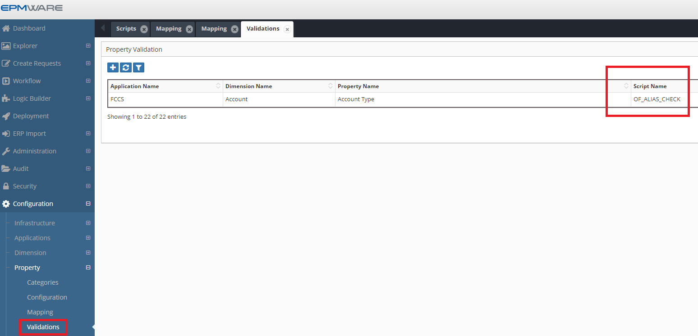

# :material-shield-check:{ .lg .middle }  **Property Validation**

Property Validation scripts are invoked whenever the user modifies property values 
of a member that requires custom validation such as length or prefix of the member name, etc..

These scripts are associated in the Property -> Validations screen as shown below.
 

  

## Next Steps

- [Input Parameters](input-parameters.md)
- [Output Parameters](output-parameters.md)
- [Examples](examples.md) 
- [API Reference](../../api/packages/hierarchy_api.md) - Supporting functions
