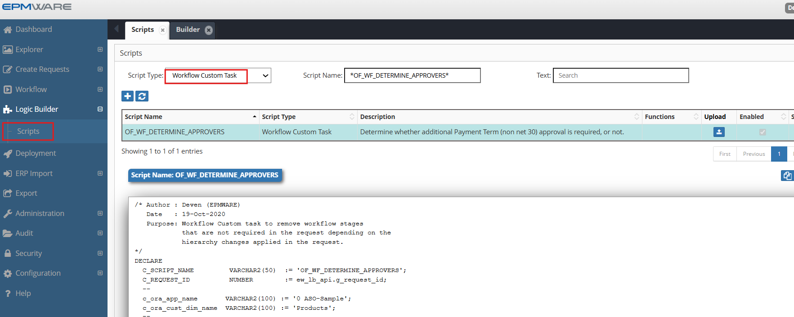
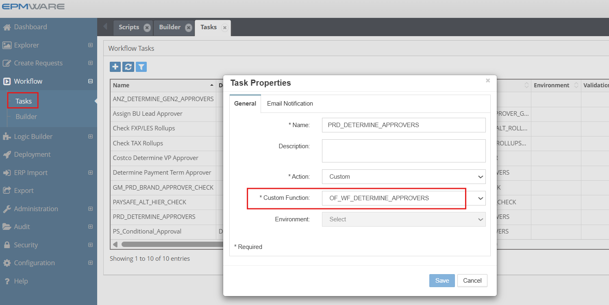

# 💡**Workflow Custom Task Script Examples**

**Requirement** : Users are managing a customer dimension for an application called “Oracle EBS” where users specify Payment Terms for all customers. If the members (Customer records in this case) have standard Payment Terms such as (Net 30) then there is no need to receive approval from the Payment Term Approval team. In other words, special approval is needed only if the Payment Term is not Net 30 which is default for all new customers.

```sql

/* Author : Deven (EPMWARE)
   Date   : 19-Oct-2020
   Purpose: Workflow Custom task to remove workflow stages
            that are not required in the request depending on the
            hierarchy changes applied in the request.
*/
DECLARE
  C_SCRIPT_NAME VARCHAR2(50)  := 'OF_WF_DETERMINE_APPROVERS';
  C_REQUEST_ID  NUMBER        := ew_lb_api.g_request_id;
  --
  c_ora_app_name            VARCHAR2(100) := 'Oracle EBS';
  c_ora_cust_dim_name       VARCHAR2(100) := 'Customers'; 
  l_wf_stages_to_be_removed ew_global.g_char_tbl;
  l_sts                     VARCHAR2(1);
  l_msg                     VARCHAR2(2000);
  l_error_ex                EXCEPTION;
  l_keep_task               BOOLEAN := FALSE;
  --
  PROCEDURE log (p_msg VARCHAR2)
  IS
  BEGIN
    ew_debug.log(p_msg,ew_debug.show_always,C_SCRIPT_NAME);
  END log;
  --
  PROCEDURE chk_payment_term
  IS
    CURSOR cur
    IS
      SELECT l.*
      FROM ew_request_line_members_v l
          ,ew_member_props_all_v     p      
      WHERE 1=1
        AND l.request_id  = c_request_id
        AND l.status      <> 'X' -- not cancelled lines
        AND l.app_name    = c_ora_app_name
        AND l.dim_name    = c_ora_cust_dim_name
        AND l.action_code IN ('CMC','CMS','P') -- Create member OR Edit properties
        AND l.member_id   = p.member_id
        AND p.prop_label  = 'Payment Terms'
        AND p.prop_value  <> 'NET30'
      ORDER BY l.line_num
      ;
  BEGIN
    log('** Check customers having Special Payment Terms..');
    FOR rec IN cur
    LOOP
      log('Line # '||rec.line_num||
               ' Member name : '||rec.member_name);
      l_keep_task := TRUE;
    END LOOP;
  END chk_payment_term;
BEGIN
  -- Default values for return code
  ew_lb_api.g_status  := ew_lb_api.g_success;
  ew_lb_api.g_message := NULL;
  
  log('Determine Payment Term for Request ID : '|| C_REQUEST_ID);
  
  chk_payment_term;
  
  IF NOT l_keep_task
  THEN
    -- Remove approver task as there is no request line 
    -- with Special Payment Term ( other than NET 30)
    ew_req_api.upd_wf_stage_task_approval_cnt
            (p_request_id       => C_REQUEST_ID
            ,p_wf_stage_name    => 'Primary Approver'
            ,p_wf_task_name     => '10x Non Net 30 Approvals'
            ,p_num_of_approvals => 0
            ,x_sts              => l_sts
            ,x_msg              => l_msg
            );
    IF l_sts = ew_constants.g_err_code
    THEN
      ew_lb_api.g_message := l_msg;
      RAISE l_error_ex;
    ELSE
      log('Workflow Task Removed');
    END IF;
  END IF;
  
EXCEPTION
  WHEN l_error_ex THEN
    ew_lb_api.g_status  := ew_lb_api.g_error;
    log(ew_lb_api.g_message);
  WHEN OTHERS THEN
    ew_lb_api.g_status := ew_lb_api.g_error;
    ew_lb_api.g_message := 'Error Executing Logic Script : '||SQLERRM;
    log(ew_lb_api.g_message);  
END;


```

## Configuration

1.Create Workflow Custom Task type Logic Script as shown below:
<br/>

<br/>


2.Assign this Logic Script in the Workflow screen as shown below:
  
  WorkFlow -> Tasks -> Select the task which has action type as "Custom"
<br/>

<br/>


## Next Steps

- [Pre/Post Export Tasks](../export-tasks/index.md) - Pre/Post Export Tasks scripts Details
- [API Reference](../../api/packages/index.md) - Supporting functions


---

!!! tip "Best Practice"
    Always test derivation scripts with edge cases including NULL values, maximum lengths, and boundary conditions before deploying to production.