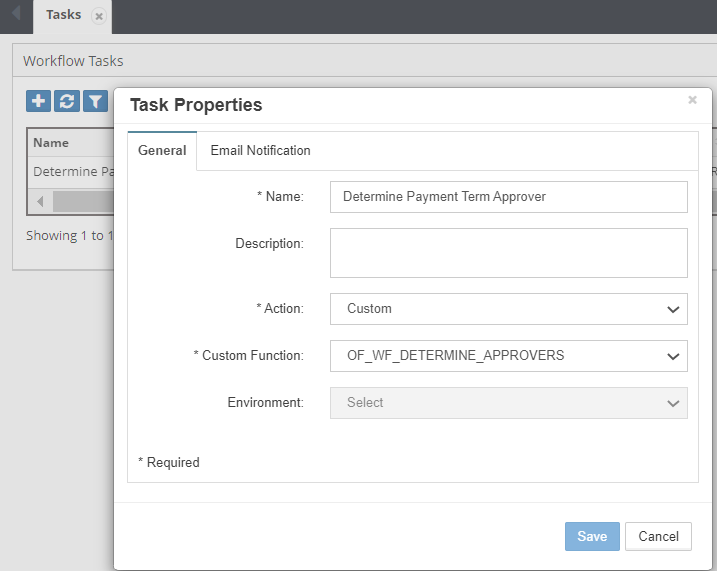

# :material-playlist-check:{ .lg .middle } **Workflow Custom Task Scripts**

Workflow Custom Tasks Logic Scripts are used to perform custom tasks such as determining if a workflow stage should be removed based on certain conditions, perform specific validations, send emails if certain conditions satisfy or any other complex task that needs to be performed in the workflow in a specific stage.

This task has one special parameter (out type) which you can optionally set to recall the request in the workflow to a prior stage.

These scripts are associated in the Workflow -> Tasks screen as shown below.
 

 
*Figure: Workflow Custom Task script Association*

## Next Steps

- [Workflow Custom Task Script - Input Parameters](input-parameters.md)
- [Workflow Custom Task Script - Output Parameters](output-parameters.md)
- [Workflow Custom Task Script - Examples](examples.md)
- [API Reference](../../api/packages/index.md)

---

!!! tip "Best Practice"
    Workflow scripts should enhance, not complicate, the approval process. Keep logic transparent and provide clear feedback to users about routing decisions and requirements.