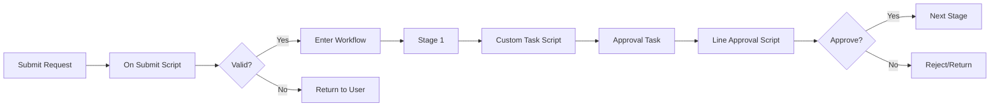

# Workflow Task Scripts

Workflow Task scripts provide custom logic within EPMware's workflow engine, enabling dynamic routing, validation, automation, and complex approval processes. These scripts execute at various stages of the workflow lifecycle.

## Overview

Workflow scripts enable:
- **Dynamic Routing**: Route based on conditions
- **Validation**: Check before workflow entry
- **Automation**: Auto-approve or escalate
- **Notifications**: Custom email alerts
- **Integration**: Call external systems
- **Decision Logic**: Complex approval rules


*Figure: Workflow script execution points*

## Workflow Script Types

### 1. On Submit Tasks
**When**: Before request enters workflow
**Purpose**: Validate complete request
**Can Block**: Yes - prevent workflow entry

### 2. Custom Workflow Tasks
**When**: At specific workflow stages
**Purpose**: Complex processing and decisions
**Can Block**: No - but can route/reassign

### 3. Request Line Approval
**When**: Before approval action
**Purpose**: Validate before approval
**Can Block**: Yes - prevent approval

## Workflow Context

Scripts have access to:
- Request information
- Workflow stage and task details
- User and role information
- Request line items
- Historical workflow data

## How It Works



## Key Capabilities

### Dynamic Stage Management
- Add/remove workflow stages
- Skip stages conditionally
- Modify approval requirements
- Change task assignments

### Workflow Control
- Approve/reject programmatically
- Recall to previous stages
- Escalate to higher levels
- Reassign to different users

### Data Manipulation
- Modify request attributes
- Update line items
- Set workflow variables
- Calculate derived values

## Input Parameters

### Common Parameters

| Parameter | Type | Description |
|-----------|------|-------------|
| `g_request_id` | NUMBER | Current request ID |
| `g_wf_stage_id` | NUMBER | Current workflow stage |
| `g_wf_stage_name` | VARCHAR2 | Stage name |
| `g_wf_task_id` | NUMBER | Current task ID |
| `g_wf_task_name` | VARCHAR2 | Task name |
| `g_user_id` | NUMBER | Current user |
| `g_action` | VARCHAR2 | Action being performed |

### Request Context

| Parameter | Type | Description |
|-----------|------|-------------|
| `g_request_type` | VARCHAR2 | Type of request |
| `g_request_status` | VARCHAR2 | Current status |
| `g_requester_id` | NUMBER | Request creator |
| `g_request_date` | DATE | Submission date |
| `g_priority` | VARCHAR2 | Request priority |

## Output Parameters

| Parameter | Type | Description |
|-----------|------|-------------|
| `g_status` | VARCHAR2 | Success/Error status |
| `g_message` | VARCHAR2 | User message |
| `g_wf_recall_stage` | VARCHAR2 | Stage to recall to |
| `g_wf_task_rec` | RECORD | Task modifications |

## Common Patterns

### Pattern 1: Conditional Validation
```sql
-- On Submit: Validate based on request type
IF ew_lb_api.g_request_type = 'HIGH_VALUE' THEN
  IF get_total_amount() > 1000000 THEN
    IF NOT has_required_attachments() THEN
      ew_lb_api.g_status := ew_lb_api.g_error;
      ew_lb_api.g_message := 'Attachments required for high-value requests';
    END IF;
  END IF;
END IF;
```

### Pattern 2: Auto-Approval Logic
```sql
-- Custom Task: Auto-approve based on criteria
IF ew_lb_api.g_wf_stage_name = 'Manager_Approval' THEN
  IF get_request_amount() < 5000 AND 
     is_pre_approved_vendor() THEN
    -- Auto-approve
    ew_workflow.approve_task(
      p_task_id => ew_lb_api.g_wf_task_id,
      p_comments => 'Auto-approved per policy'
    );
  END IF;
END IF;
```

### Pattern 3: Dynamic Routing
```sql
-- Custom Task: Route based on amount
DECLARE
  l_amount NUMBER;
BEGIN
  l_amount := get_request_amount();
  
  IF l_amount > 100000 THEN
    -- Add executive approval stage
    ew_workflow.add_stage(
      p_request_id => ew_lb_api.g_request_id,
      p_stage_name => 'Executive_Approval',
      p_after_stage => ew_lb_api.g_wf_stage_name
    );
  ELSIF l_amount < 1000 THEN
    -- Skip detailed review
    ew_workflow.remove_stage(
      p_request_id => ew_lb_api.g_request_id,
      p_stage_name => 'Detailed_Review'
    );
  END IF;
END;
```

### Pattern 4: Escalation
```sql
-- Custom Task: Escalate if pending too long
DECLARE
  l_days_pending NUMBER;
BEGIN
  l_days_pending := SYSDATE - get_task_assigned_date();
  
  IF l_days_pending > 3 THEN
    -- Escalate to manager
    ew_workflow.reassign_task(
      p_task_id => ew_lb_api.g_wf_task_id,
      p_to_user => get_manager_of(ew_lb_api.g_assigned_to),
      p_reason  => 'Auto-escalated after 3 days'
    );
    
    -- Send notification
    send_escalation_email();
  END IF;
END;
```

## Best Practices

### 1. Clear Messages
```sql
-- Provide actionable feedback
ew_lb_api.g_message := 
  'Request requires CFO approval because amount ($' || 
  TO_CHAR(l_amount, '999,999') || 
  ') exceeds threshold ($100,000)';
```

### 2. Audit Trail
```sql
-- Log workflow decisions
ew_workflow.add_comment(
  p_request_id => ew_lb_api.g_request_id,
  p_comment    => 'Routing decision: ' || l_decision || 
                  ' based on amount: ' || l_amount
);
```

### 3. Error Handling
```sql
BEGIN
  -- Workflow logic
  process_workflow_task();
EXCEPTION
  WHEN OTHERS THEN
    -- Log error but don't block workflow
    log_error(SQLERRM);
    -- Set warning message
    ew_lb_api.g_message := 'Warning: ' || SQLERRM;
    -- Allow workflow to continue
    ew_lb_api.g_status := ew_lb_api.g_success;
END;
```

### 4. Performance
```sql
-- Cache frequently used data
IF g_request_cache.EXISTS(ew_lb_api.g_request_id) THEN
  l_data := g_request_cache(ew_lb_api.g_request_id);
ELSE
  l_data := load_request_data();
  g_request_cache(ew_lb_api.g_request_id) := l_data;
END IF;
```

## Workflow Script Configuration

### Configuration Steps

1. **Create Script** in Logic Builder
2. **Choose Script Type** (Workflow Task)
3. **Associate with Workflow**:
   - For On Submit: Workflow Builder
   - For Custom Task: Workflow Tasks
   - For Line Approval: Approval configuration

### Execution Order

When multiple scripts exist:
1. Scripts execute in configured sequence
2. First error stops execution
3. All scripts must succeed for action to proceed

## Testing Workflow Scripts

### Test Scenarios

1. **Normal Flow**: Standard approval path
2. **Edge Cases**: Boundary values, special conditions
3. **Error Conditions**: Missing data, invalid states
4. **Performance**: Large requests, multiple lines
5. **Concurrency**: Multiple users, parallel approvals

### Debug Techniques
```sql
-- Add debug logging
ew_debug.log('=== Workflow Script Debug ===');
ew_debug.log('Request ID: ' || ew_lb_api.g_request_id);
ew_debug.log('Stage: ' || ew_lb_api.g_wf_stage_name);
ew_debug.log('Task: ' || ew_lb_api.g_wf_task_name);
ew_debug.log('User: ' || ew_lb_api.g_user_id);
```

## Common Issues

| Issue | Cause | Solution |
|-------|-------|----------|
| Workflow blocked | Script error | Check script logs |
| Wrong routing | Logic error | Debug decision logic |
| Performance slow | Heavy processing | Optimize queries, defer processing |
| Missing context | Incorrect parameters | Verify workflow configuration |

## Advanced Features

### Parallel Processing
```sql
-- Create parallel approval tasks
ew_workflow.create_parallel_tasks(
  p_request_id => ew_lb_api.g_request_id,
  p_assignees  => 'USER1,USER2,USER3',
  p_type      => 'ALL_MUST_APPROVE'
);
```

### Conditional Stages
```sql
-- Add stage only if needed
IF requires_legal_review() THEN
  ew_workflow.insert_stage(
    p_request_id  => ew_lb_api.g_request_id,
    p_stage_name  => 'Legal_Review',
    p_after_current => 'Y'
  );
END IF;
```

### External Integration
```sql
-- Call external approval system
l_external_status := call_sap_approval(
  p_request => ew_lb_api.g_request_id
);

IF l_external_status = 'APPROVED' THEN
  ew_workflow.complete_task(
    p_task_id => ew_lb_api.g_wf_task_id,
    p_action  => 'APPROVE'
  );
END IF;
```

## Performance Considerations

- **On Submit**: Keep validation fast
- **Custom Tasks**: Can be more complex
- **Line Approval**: Optimize for bulk approvals
- **Caching**: Store frequently accessed data
- **Async Processing**: Queue heavy operations

## Next Steps

- [On Submit Tasks](on-submit.md) - Pre-workflow validation
- [Custom Tasks](custom-tasks.md) - Complex workflow logic
- [Request Line Approval](request-line-approval.md) - Approval validation

---

!!! tip "Best Practice"
    Workflow scripts should enhance, not complicate, the approval process. Keep logic transparent and provide clear feedback to users about routing decisions and requirements.