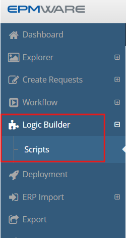
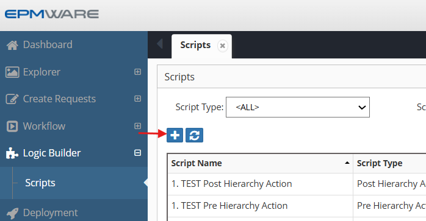
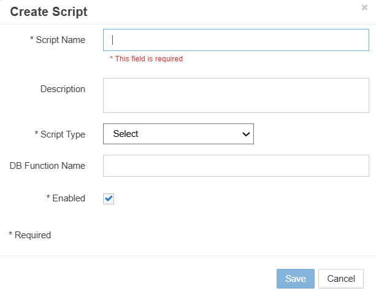
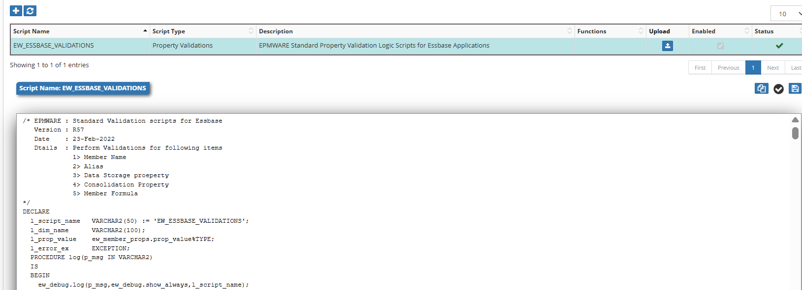

# :material-puzzle:{ .lg .middle }**Creating Logic Builder Scripts**

This guide walks through the process of creating new Logic Scripts in EPMware, from initial creation to testing and deployment.

## Accessing Logic Builder

Navigate to the Logic Builder module through the Configuration menu:

 
*Figure: Accessing Logic Builder from the Configuration menu*

## 📝 Creating a New Script

### Step 1: Open New Script Dialog

Click the plus sign (➕) in the Scripts menu to create a new Logic Script:

 
*Figure: Plus icon for creating new scripts*

### Step 2: Configure Script Properties

Enter the following information in the script creation dialog:

 
*Figure: New Script configuration dialog*

1. **Script Name** (Required)
    - Enter the name of the script. 
    - Must be unique across all script types and can be up to 50 characters long. 
    - All EPMware out of the box Logic Scripts will have a prefix of “EW_”.
      Please use a common prefix for all your custom Logic Scripts.

2. **Description** (Optional)
    - Provide meaningful description of script purpose
   
3. **Script Type** (Required)
    - Select from dropdown list
    - Determines when and how the script executes
    - Cannot be changed after creation

4. **DB Function Name** (Optional)
    - Reference to stored Oracle Procedure name OR stored packaged procedure
    - If this field is populated, then the Script Editor gets disabled for this record
    - This option is available for On Prem Customers only. 
      For All Cloud customers this option should not be used

5. **Enabled**
    - This checkbox enables or disables this script. 
    - If the script is disabled, then it will not be executed.

## 🧪 Script Editor Interface

Once the script is created, the Script Editor opens:

  
*Figure: Logic Builder Script Editor with syntax highlighting*

## Next Steps

- [Logic Script Types](script-types.md)
- [Logic Script Associations](logic-script-associations.md)
- [Logic Script Usage Report](logic-script-usage-report.md)
- [Logic Script Body](logic-script-body.md)