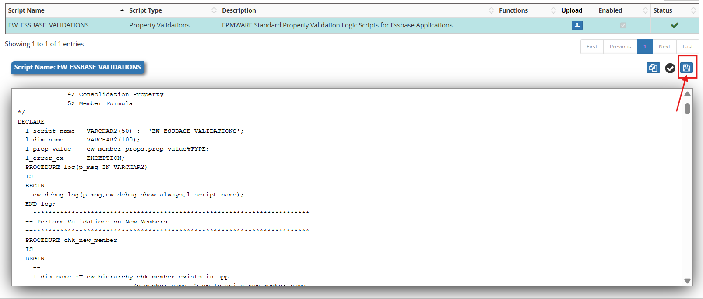
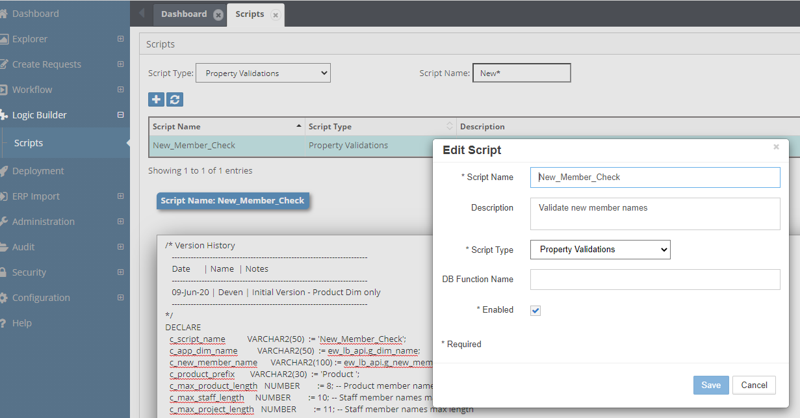
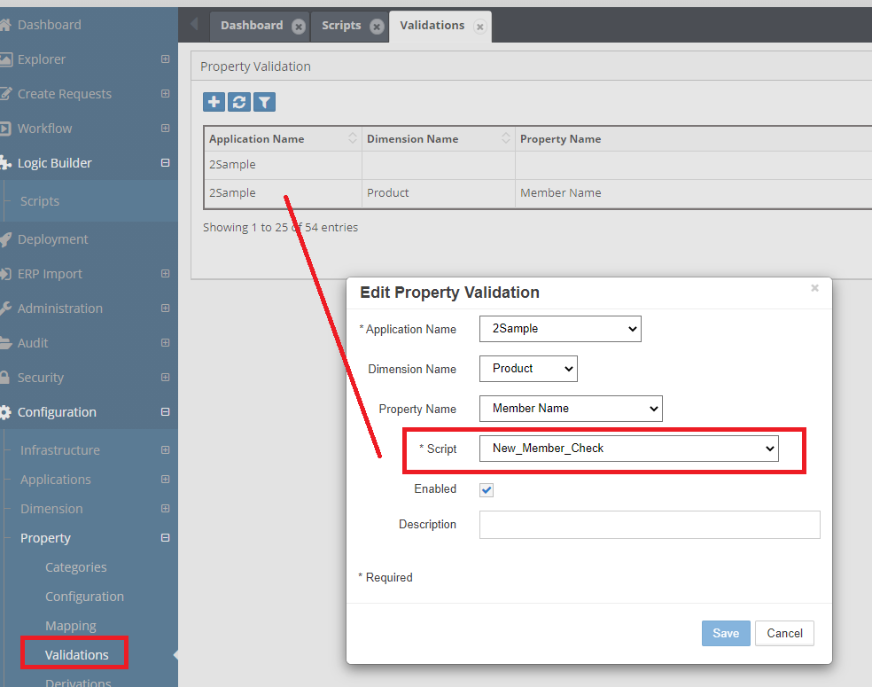
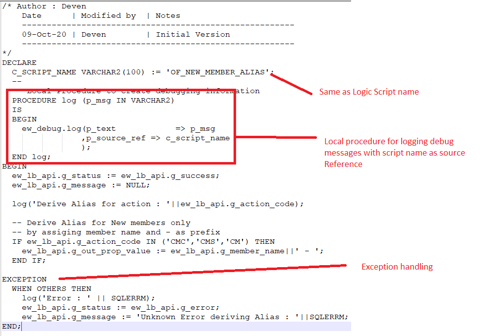
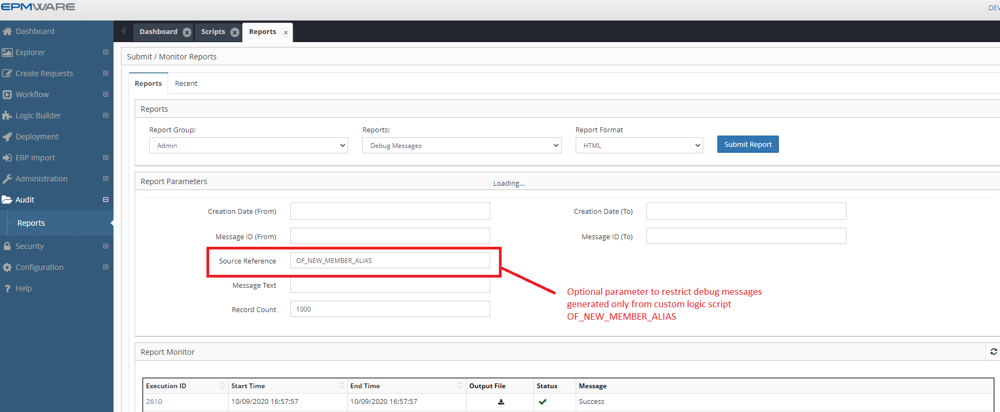
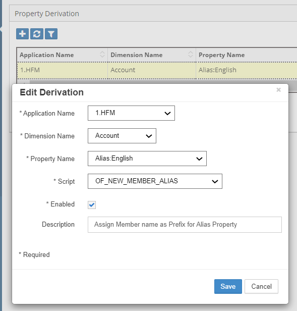

# :material-code-braces:{ .lg .middle } Logic Builder Script Body


Logic Builder scripts can be created in one of the following ways:

1. **Stored Database Procedure (On-Prem only)**  
   Create a stored procedure (or packaged procedure) and reference it in the **DB Function Name** field of the script record.

2. **Script Editor (All environments)**  
   Write the script directly using the built-in Script Editor.

!!! note
    For all **Cloud applications**, the stored DB function option is **not available**.

<br/>

<br/>
*Figure: Build In Logic Script Editor*


## 🧱**Logic Script Structure**

Logic Scripts are written in **Oracle PL/SQL**.  
EPMware provides a rich **API library** that helps reduce script size and supports complex business logic.

Refer to the [Appendix A](../appendices/appendix_a_action-codes.md) for the full API reference.


Depending on the script type, input parameters are provided through global variables in package:

Package: EW_LB_API

Examples:

- `g_member_name`
- `g_action_code`
- `g_app_name`

!!! info
    Not all input variables are populated for every script type. Values depend on the triggering event.
    

Each Logic Script must return:

- Status
- Message

If not explicitly set:

  - Status defaults to Success (`S`)
  - Message defaults to NULL

---

### **Basic Script Structure**`

Every Logic Script follows this basic structure:

```sql
DECLARE
  -- Constants and Variables
  c_script_name VARCHAR2(100) := 'YOUR_SCRIPT_NAME';
  
  -- Local procedures
  PROCEDURE log(p_msg IN VARCHAR2) IS
  BEGIN
    ew_debug.log(p_text      => p_msg,
                 p_source_ref => c_script_name);
  END log;
  
BEGIN
  -- Initialize return status
  ew_lb_api.g_status  := ew_lb_api.g_success;
  ew_lb_api.g_message := NULL;
  
  -- Your logic here
  log('Script execution started');
  
  -- Implement your business logic
  
EXCEPTION
  WHEN OTHERS THEN
    ew_lb_api.g_status  := ew_lb_api.g_error;
    ew_lb_api.g_message := 'Error: ' || SQLERRM;
    log('Exception occurred: ' || SQLERRM);
END;
```


## ✅**Validate Logic Scripts**

Clicking the *Save* icon automatically validates the script for any PL/SQL syntax errors. Business logic will still need to be tested by performing transactions in the application where the relevant Logic Script is applied.

!!! warning
    Business logic must still be tested by executing the real application event.


Example:

  Property Validation: Change property value to test validation.
<br/>

<br/>


### 🔗Logic Script Type Assignments

Once scripts are created in the Logic Builder Module, they must be assigned to relevant events (except for On Request Line approvals). Until a Logic Script is assigned, it will not be executed by the EPMware rules engine.

For example, a custom Logic Script is created to validate member names as shown below.
<br/>

<br/>


This script needs to be assigned to the property "Member Name" :

*Go to Configuration Menu -> Property -> Property Validation*
<br/>

<br/>


### Debug and logging and Exceptions Handling

It is highly recommended to use the *“EW_DEBUG.LOG”* procedure to record debug messages in the centralized debug table.

Debug messages can also be downloaded from the Report module :<br/>
*Admin -> Reports -> Debug messages*


In this example, a default value is assigned to a member alias when a new member is created. The following Logic Script illustrates how to log debug messages.
<br/>

<br/>

Script Text

```sql
/* Author : Deven
    Date      | Modified by  | Notes
    -------------------------------------------------------
    09-Oct-20 | Deven        | Initial Version
    -------------------------------------------------------
*/
DECLARE
  C_SCRIPT_NAME VARCHAR2(100) := 'OF_NEW_MEMBER_ALIAS';
  --
  -- Local Procedure to create debugging information
  PROCEDURE log (p_msg IN VARCHAR2)
  IS
  BEGIN
    ew_debug.log(p_text       => p_msg
                ,p_source_ref => c_script_name
                );
  END log;
BEGIN
  ew_lb_api.g_status := ew_lb_api.g_success;
  ew_lb_api.g_message := NULL;
  
  log('Derive Alias for action : '||ew_lb_api.g_action_code);
  
  -- Derive Alias for New members only
  -- by assigning member name and - as prefix
  IF ew_lb_api.g_action_code IN ('CMC','CMS','CM') THEN
    ew_lb_api.g_out_prop_value := ew_lb_api.g_member_name||' - ';
  END IF;

EXCEPTION
  WHEN OTHERS THEN
    log('Error : ' || SQLERRM);
    ew_lb_api.g_status := ew_lb_api.g_error;
    ew_lb_api.g_message := 'Exception : '||SQLERRM;
END;
```


### Debug Message Retrieval

Once debug messages have been tagged using script names as a reference (OF_NEW_MEMBER_ALIAS), running the Debug Messages report will provide debug messages specifically from the script as shown below.

  1. Navigate to Admin → Reports → Debug Messages
  2. Filter by Source Reference (script name) (eg.OF_NEW_MEMBER_ALIAS)
  3. Set date range.
  4. Export results if needed.
  
<br/>
<br/>


Note: Source Reference is for an optional parameter to restrict the debug messages generated from the custom Logic Script, OF_NEW_MEMBER_ALIAS

### Input Parameters


Depending on the Logic Script type, various input parameters may be populated.
All input parameters are declared in the **`EW_LB_API`** package.

For example, if the Logic Script type is **Property Validation**, it may be necessary to know:

- The value entered by the user  
- The member name  
- The parent member name  

This information is required to perform complex validations.

Depending on the script type, input parameters are automatically populated into the global variables of the `EW_LB_API` package.

In addition, various APIs can be used to fetch metadata information (for example, to determine whether a member is a base member or belongs to a specific branch of a dimension).

!!! info
    Refer to [Script Event Types](../events/index.md) for full list of input parameters can be used based on event types.
    
    Refer to [Database Package APIs](../api/packages/index.md) for more details on available metadata APIs.
    
    


### **Output Parameters**

Depending on the Logic Script type, various output parameters can be populated to determine the outcome of the transaction.

All output parameters are declared in the EW_LB_API package.

  - Some output parameters are mandatory
  - Others are optional

!!! warning
    If mandatory output parameters are not populated, it may fail or produce unexpected results.

    For example, if the Logic script type is Property Derivation and it is assigned to the Member Name property of the dimension, then it is expected that the “g_out_new_member_name” output parameter will be populated with a value else the request action will fail.


**Example Scenario:** Whenever a new member is created, Assign member name with a dash character (-) in its alias. Users will then assign text at the end later on..

To achieve this automation, we will use the “Property Derivation” Logic Script.


```sql
/* Author : Deven
    Date      | Modified by  | Notes
    -------------------------------------------------------
    09-Oct-20 | Deven        | Initial Version
    -------------------------------------------------------
*/
DECLARE
  C_SCRIPT_NAME VARCHAR2(100) := 'OF_NEW_MEMBER_ALIAS';
  --
  -- Local Procedure to create debugging information
  PROCEDURE log (p_msg IN VARCHAR2)
  IS
  BEGIN
    ew_debug.log(p_text       => p_msg
                ,p_source_ref => c_script_name
                );
  END log;
BEGIN
  ew_lb_api.g_status := ew_lb_api.g_success;
  ew_lb_api.g_message := NULL;
  
  log('Derive Alias for member : '||ew_lb_api.g_member_name);
  
  -- If the member already has alias assigned then 
  -- no need to derive the alias. Otherwise assign default alias
  IF ew_lb_api.g_prop_value IS NULL
  THEN
    ew_lb_api.g_out_prop_value := ew_lb_api.g_member_name||' - ';
  ELSE
    ew_lb_api.g_out_prop_value := ew_lb_api.g_prop_value;
  END IF;
  
EXCEPTION
  WHEN OTHERS THEN
    log('Error : ' || SQLERRM);
    ew_lb_api.g_status := ew_lb_api.g_error;
    ew_lb_api.g_message := 'Unknown Error deriving Alias : '||SQLERRM;
END;
```
<br/>


Assign this Logic Script to the Property Derivation configuration as shown below.
<br/>

<br/>


### **Common Parameters**

The following Parameters are common across all Logic Script Types.


| Output Parameter | Description |
| --- | --- |
| g_status | Status Values are either ‘S’ for Success or ‘E’ for Error.<br><br>Alternatively use the following method to set values in your code.<br><br>ew_lb_api.g_status  := ew_lb_api.g_success<br>OR<br>ew_lb_api.g_status  := ew_lb_api.g_error |
| g_message | Pass an Error Message if the status is Error. |
| g_out_ignore_flag | Y or N to indicate whether action needs to be ignored in the mapped dimension or not.  Default value is N. |


All scripts must set these status parameters:

```sql
-- Status (Required)
ew_lb_api.g_status := ew_lb_api.g_success;  -- or g_error

-- Message (Required on error)
ew_lb_api.g_message := 'Error description';

-- Ignore flag (Optional)
ew_lb_api.g_out_ignore_flag := 'Y';  -- Skip this action
```

### Script-Specific Output Parameters

#### Dimension Mapping
```sql
g_out_member_name               -- Mapped member name
g_out_parent_member_name        -- Mapped parent name
g_out_new_member_name           -- New member for target
g_out_moved_to_member_name      -- Target parent for moves
g_out_shared_members_tbl        -- Array for shared members
```

#### Property Derivation
```sql
g_out_prop_value                -- Derived property value
```

#### Workflow Custom Tasks
```sql
g_out_rewind_stages             -- Number of stages to rewind
```

## Next Steps

- [Explore specific script types](../events/index.md)
- [Logic Builder API Guide](../api/index.md)