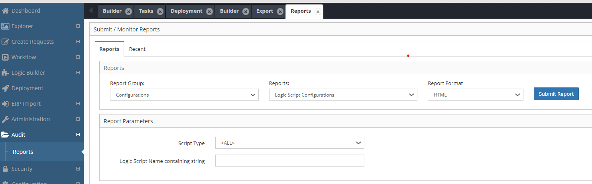
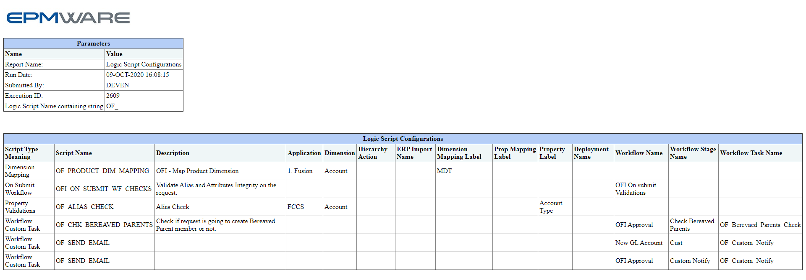

# :material-file-chart:{ .lg .middle } **Logic Script Usage Report**

A standard report is available to view all Logic Scripts configured and where it is applied in the application under the Audit module. Below is an example on how to run this report.

## Report Exeuction Steps
  - Expand the Audit menu from the sidebar and click Reports.
  - Select Report Group: Configurations
  - Select Report Name: Logic Script Configurations
  - (Optional) You can also filter the report using search parameters such as: Script Type or Script Name

  
Report Execution :

 

 
Sample Report output is as shown below :

 

## Next Steps

- [Understand Script structure](logic-script-body.md)
- [Explore Script Events](../events/index.md)
