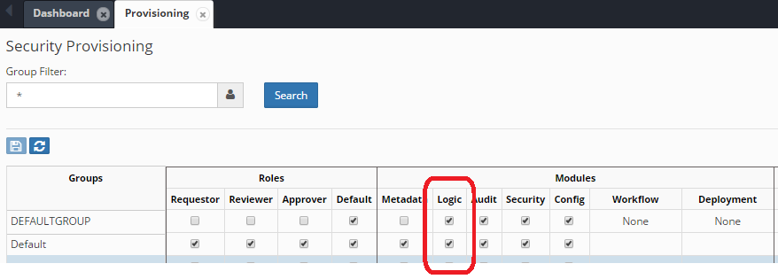

# Security Provisioning for Logic Builder

Before users can create or modify Logic Scripts, appropriate security access must be configured. This section covers the security setup required for the Logic Builder module.

## Security Model Overview

The Logic Builder module follows EPMware's standard security model with role-based access control:

- **Read Access** - View existing scripts and configurations
- **Write Access** - Create, modify, and delete scripts
- **Module Access** - Overall access to the Logic Builder module

## Configuring Access

### Step 1: Navigate to Security Provisioning

Access the Security Provisioning screen through:
**Configuration → Security → Security Provisioning**


*Figure: Accessing Security Provisioning from the Configuration menu*

### Step 2: Select Security Group

Choose the appropriate security group that needs Logic Builder access:


*Figure: Security Provisioning screen showing group selection*

### Step 3: Enable Logic Builder Module

1. Locate the Logic Builder module in the modules list
2. Check the appropriate access level:
   - **Read** - For users who only need to view scripts
   - **Write** - For developers who will create and modify scripts
3. Click **Save** to apply changes


*Figure: Enabling Logic Builder module with Write access for the selected security group*

## Access Levels

### Read Access
Users with read access can:
- View existing Logic Scripts
- Review script configurations
- Access debug messages
- Run usage reports

### Write Access
Users with write access can:
- Create new Logic Scripts
- Modify existing scripts
- Delete scripts (if not in use)
- Configure script associations
- Enable/disable scripts

!!! warning "Important"
    Write access should be limited to trained developers and administrators who understand PL/SQL and EPMware's architecture

## Security Best Practices

### 1. Role Segregation

Create specific security groups for Logic Builder developers:

```
- LOGIC_BUILDER_DEVELOPERS (Write Access)
- LOGIC_BUILDER_VIEWERS (Read Access)
- LOGIC_BUILDER_ADMINS (Full Access)
```

### 2. Approval Workflow

Implement a review process for script changes:

1. Developers create scripts in development environment
2. Scripts reviewed by technical lead
3. Tested in UAT environment
4. Promoted to production with approvals

### 3. Audit Trail

All script changes are automatically logged:
- User who created/modified the script
- Timestamp of changes
- Previous versions maintained in audit tables

## Verifying Access

### For Current User

Check your Logic Builder access:

1. Navigate to Configuration menu
2. Look for "Logic Builder" option
3. If visible, you have at least read access
4. Try creating a new script to verify write access

### For Other Users

Administrators can verify user access through:

```sql
-- Query to check Logic Builder access
SELECT u.user_name,
       g.group_name,
       m.module_name,
       p.access_type
FROM   ew_users u,
       ew_user_groups ug,
       ew_groups g,
       ew_group_privileges p,
       ew_modules m
WHERE  u.user_id = ug.user_id
AND    ug.group_id = g.group_id
AND    g.group_id = p.group_id
AND    p.module_id = m.module_id
AND    m.module_name = 'Logic Builder'
ORDER BY u.user_name;
```

## Database Function Access (On-Premise Only)

For on-premise installations, additional database privileges may be required:

### Required Privileges

```sql
-- Grant execute privileges on EPMware packages
GRANT EXECUTE ON ew_lb_api TO logic_builder_user;
GRANT EXECUTE ON ew_hierarchy TO logic_builder_user;
GRANT EXECUTE ON ew_req_api TO logic_builder_user;
GRANT EXECUTE ON ew_debug TO logic_builder_user;
```

### Creating Stored Functions

If using stored database functions (DB Function Name field):

```sql
-- Grant create procedure privilege
GRANT CREATE PROCEDURE TO logic_builder_user;

-- Grant debug privilege for development
GRANT DEBUG CONNECT SESSION TO logic_builder_user;
GRANT DEBUG ANY PROCEDURE TO logic_builder_user;
```

!!! info "Cloud Deployments"
    Stored database functions are not available in cloud deployments. All logic must be implemented within the Script Editor interface.

## Troubleshooting Access Issues

### Common Issues and Solutions

| Issue | Cause | Solution |
|-------|-------|----------|
| Logic Builder menu not visible | No module access | Grant at least read access via Security Provisioning |
| Cannot create scripts | Read-only access | Upgrade to write access for the user's group |
| Cannot save scripts | Database permissions | Verify database grants (on-premise) |
| Scripts not executing | Script disabled | Enable script in properties |
| Cannot see debug messages | Missing debug access | Grant access to Debug Messages report |

### Access Verification Checklist

- [ ] User belongs to appropriate security group
- [ ] Security group has Logic Builder module access
- [ ] Access type (Read/Write) is correct
- [ ] User has logged out and back in after changes
- [ ] Database privileges granted (on-premise only)

## Integration with Other Modules

Logic Builder access often requires coordination with other module permissions:

| Related Module | Why Needed |
|---------------|------------|
| Configuration | To associate scripts with dimensions/properties |
| Workflow | To create workflow custom tasks |
| Deployment | To configure pre/post deployment scripts |
| ERP Import | To assign ERP interface scripts |
| Export | To configure export generation scripts |

Ensure users have appropriate access to related modules based on their Logic Builder responsibilities.

## Next Steps

Once security is configured:
1. [Create your first script](creating-scripts.md)
2. [Understand script types](script-types.md)
3. [Learn the script structure](script-structure.md)