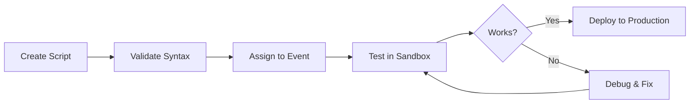

# Getting Started with Logic Builder

The Logic Builder Module enables you to build custom logic throughout EPMware to provide solutions for custom requirements such as property validations, workflow automation, and system integration.

## Introduction

EPMware's Logic Builder utilizes Oracle PL/SQL as its programming language, with scripts residing within the EPMware database. This powerful framework allows you to automate processes, enforce business rules, and extend standard functionality without exposing business logic in the front-end.

!!! info "Deployment Options"
    - **Cloud Customers**: Scripts must be created in the Logic Builder editor
    - **On-Premise Customers**: Can optionally create stored database procedures and reference them in Logic Scripts
    
    The DB Function Name field is only available for On-Premise installations.

## Quick Navigation

<div class="grid cards">
  <div class="card">
    <h3>🔐 Security Setup</h3>
    <p>Configure user access to Logic Builder module</p>
    <a href="security-provisioning.md" class="md-button">Configure Access →</a>
  </div>
  
  <div class="card">
    <h3>📝 Create Scripts</h3>
    <p>Build your first logic script</p>
    <a href="creating-scripts.md" class="md-button">Start Building →</a>
  </div>
  
  <div class="card">
    <h3>📋 Script Types</h3>
    <p>Understand different script categories</p>
    <a href="script-types.md" class="md-button">Learn More →</a>
  </div>
  
  <div class="card">
    <h3>🏗️ Script Structure</h3>
    <p>Master PL/SQL script organization</p>
    <a href="script-structure.md" class="md-button">View Structure →</a>
  </div>
</div>

## The Two-Step Process

Logic Script execution follows a two-step process:

1. **Create the Logic Script** - Build the script in the Logic Builder module
2. **Assign to Configuration** - Reference it in the related configuration page

Scripts execute when specific events occur. For example:
- Dimension mapping scripts execute when new lines are created in requests
- Property validation scripts trigger when properties are modified
- Workflow scripts run during stage transitions

## Available Script Types

The Logic Builder supports 13 different script types, each designed for specific use cases:

| # | Script Type | Purpose | Configuration Location |
|---|-------------|---------|------------------------|
| 1 | **Dimension Mapping** | Synchronize hierarchies across applications | Configuration → Dimension → Mapping |
| 2 | **Property Mapping** | Synchronize property values using custom logic | Configuration → Property → Mapping |
| 3 | **Pre Hierarchy Actions** | Execute logic *before* hierarchy actions | Configuration → Dimension → Hierarchy Actions |
| 4 | **Post Hierarchy Actions** | Execute logic *after* hierarchy actions | Configuration → Dimension → Hierarchy Actions |
| 5 | **Property Derivations** | Calculate and derive property values | Configuration → Property → Derivations |
| 6 | **Property Validations** | Validate property values against business rules | Configuration → Property → Validations |
| 7 | **On Submit Workflow** | Validate before workflow submission | Workflow → Builder |
| 8 | **Pre Request Line Approval** | Validate before line approval | Workflow → Tasks |
| 9 | **Workflow Custom Task** | Perform custom workflow tasks | Workflow → Tasks |
| 10 | **Deployment Tasks** | Pre/post deployment operations | Deployment Configuration |
| 11 | **ERP Interface Tasks** | Pre/post ERP import execution | ERP Import → Builder |
| 12 | **Pre Export Generation** | Execute before export file generation | Administration → Export |
| 13 | **Post Export Generation** | Execute after export file generation | Administration → Export |

## Core Concepts

### Script Execution Context

Logic Scripts have access to:
- **Input Parameters** - Context data provided by EPMware
- **Output Parameters** - Values your script returns
- **EPMware APIs** - Rich library of functions
- **Database Views** - Direct access to EPMware data model

### Global Variables

All scripts access parameters through the `EW_LB_API` package:
- `g_member_name` - Current member being processed
- `g_action_code` - Hierarchy action code
- `g_app_name` - Application name
- `g_request_id` - Current request ID

### Status and Error Handling

Every script must set:
- `ew_lb_api.g_status` - Success ('S') or Error ('E')
- `ew_lb_api.g_message` - Error message when status is 'E'

## Development Workflow



## Best Practices Summary

### Naming Conventions
- Use descriptive names (max 50 characters)
- Apply consistent prefixes for custom scripts
- Avoid "EW_" prefix (reserved for standard scripts)
- Group related scripts with common prefixes

### Script Organization
```sql
/* 
   Author: Implementation Team
   Date: YYYY-MM-DD
   Purpose: Clear description of script purpose
   
   Version History:
   ================
   Date       | Modified By | Notes
   -----------|-------------|------------------
   2025-01-01 | Dev Team    | Initial version
*/

DECLARE
    -- Constants
    c_script_name VARCHAR2(50) := 'MY_SCRIPT_NAME';
    
    -- Local procedures for logging
    PROCEDURE log(p_msg IN VARCHAR2) IS
    BEGIN
        ew_debug.log(p_text => p_msg, 
                    p_source_ref => c_script_name);
    END log;
    
BEGIN
    -- Initialize status
    ew_lb_api.g_status := ew_lb_api.g_success;
    ew_lb_api.g_message := NULL;
    
    -- Your logic here
    
EXCEPTION
    WHEN OTHERS THEN
        ew_lb_api.g_status := ew_lb_api.g_error;
        ew_lb_api.g_message := 'Error: ' || SQLERRM;
        log(ew_lb_api.g_message);
END;
```

## Prerequisites Checklist

Before creating Logic Scripts, ensure you have:

- ✅ **Access Rights** - Logic Builder module enabled via Security Provisioning
- ✅ **PL/SQL Knowledge** - Understanding of Oracle PL/SQL syntax
- ✅ **EPMware Training** - Familiarity with EPMware data model
- ✅ **Test Environment** - Sandbox for script validation
- ✅ **Documentation** - Access to API reference guide

## Getting Help

### Resources
- **API Reference** - Complete documentation of available functions
- **Example Scripts** - Templates for common use cases
- **Debug Tools** - Built-in logging and debugging features
- **Support Team** - support@epmware.com

### Common Questions

??? question "Can I modify standard EPMware scripts?"
    No, never modify scripts with "EW_" prefix. Instead, create a copy with a different name and modify the copy.

??? question "How do I debug my scripts?"
    Use `ew_debug.log()` extensively and check Debug Messages in the Audit module.

??? question "What permissions do I need?"
    Your security group needs the Logic Builder module enabled in Security Provisioning.

??? question "Can scripts call external systems?"
    Yes, through Agent API functions for on-premise installations with proper configuration.

## Next Steps

Ready to start building? Follow this learning path:

1. **[Configure Security Access](security-provisioning.md)** - Set up user permissions
2. **[Create Your First Script](creating-scripts.md)** - Step-by-step tutorial
3. **[Understand Script Types](script-types.md)** - Choose the right script type
4. **[Master Script Structure](script-structure.md)** - Learn PL/SQL best practices
5. **[Debug and Test](debugging.md)** - Validate your scripts
6. **[Review Examples](../examples/)** - Learn from real-world scripts

!!! tip "Start Simple"
    Begin with a basic property validation script before attempting complex dimension mappings or workflow automations.

---

## Quick Reference

### Common Status Codes
```sql
-- Success
ew_lb_api.g_status := ew_lb_api.g_success;  -- or 'S'

-- Error
ew_lb_api.g_status := ew_lb_api.g_error;    -- or 'E'
```

### Essential APIs
```sql
-- Logging
ew_debug.log(p_text => 'Message', p_source_ref => 'SCRIPT_NAME');

-- Check member exists
ew_hierarchy.chk_member_exists(p_app_dimension_id => 100, 
                               p_member_name => 'Member1');

-- Get property value
ew_hierarchy.get_member_prop_value(p_app_dimension_id => 100,
                                   p_member_name => 'Member1',
                                   p_prop_name => 'AccountType');
```

### Action Codes Quick Reference
| Code | Action |
|------|--------|
| CMC | Create Member - As Child |
| CMS | Create Member - As Sibling |
| DM | Delete Member |
| P | Edit Properties |
| RM | Rename Member |
| ZC | Move Member |

---

*Continue to [Security Provisioning](security-provisioning.md) →*